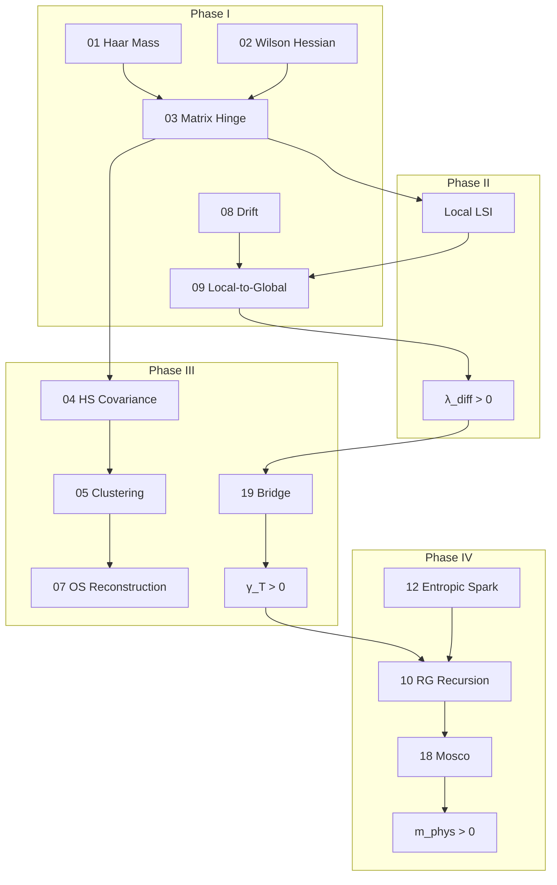

# 16 — The Constructive Mass Gap Pipeline

## Abstract
This document serves as the **Master Architectural Plan** for the constructive proof of the Yang-Mills mass gap. It breaks down the Clay Millennium Problem into 19 distinct, verifiable mathematical steps. We define the input-output relationship between modules, identify the rigorous "Safe Path" and the critical "Risk Points," and provide a dependency graph for navigation.

**Connected Files:**
- **[39] One-Page Summary:** A condensed version of this pipeline.
- **[40] Index:** The map to the individual files executing these steps.
- **[19] Bridge Inequality:** The primary bottleneck identified in this pipeline.

---

## 1. The 4-Phase Architecture

### Phase I: Lattice Geometry (The "Engine")
*Goal: Prove that the lattice configuration space has positive curvature.*

| Step | File | Input | Output |
|------|------|-------|--------|
| 1 | [01] | Group structure | Haar mass $c_H$ |
| 2 | [02] | Wilson action | Maxwell operator $d_1^* d_1$ |
| 3 | [03] | Steps 1+2 | Matrix Hinge $\text{Ric} \succeq m^2 + t\Delta$ |
| 4 | [08] | Action gradient | Lyapunov drift $LW \le -\alpha W$ |

### Phase II: Functional Inequalities (The "Transmission")
*Goal: Convert local curvature into global spectral gaps.*

| Step | File | Input | Output |
|------|------|-------|--------|
| 5 | [29] | Local Hinge | Local LSI constant $\rho_{loc}$ |
| 6 | [09] | Steps 4+5 | Global LSI constant $\rho$ |
| 7 | [26] | Bounded perturbations | Stability of $\rho$ |
| 8 | — | — | **Diffusion gap $\lambda_{diff} > 0$** |

### Phase III: Clustering & Reconstruction (The "Wheels")
*Goal: Move from spectral properties to physical observables.*

| Step | File | Input | Output |
|------|------|-------|--------|
| 9 | [04] | Matrix Hinge | HS covariance representation |
| 10 | [05] | Hinge inverse | Exponential decay $e^{-mr}$ |
| 11 | [07] | Decay + RP | Physical Hilbert space $\mathcal{H}$ |
| 12 | [19] | $\lambda_{diff}$ | **Transfer gap $\gamma_T > 0$** |

### Phase IV: Continuum Limit (The "Road")
*Goal: Take $a \to 0$ without the gap closing.*

| Step | File | Input | Output |
|------|------|-------|--------|
| 13 | [10] | Block decomposition | RG recursion $C_n \le \gamma C_{n+1} + c$ |
| 14 | [12] | Haar survival | Entropic Spark $\sigma > 0$ |
| 15 | [18] | Form convergence | Mosco limit exists |
| 16 | — | Steps 13-15 | **$m_{phys} = \lim_{a\to 0} m(a) > 0$** |

---

## 2. Dependency Graph

---

## 3. Risk Analysis

| Step | Risk Level | Description | Mitigation |
|------|------------|-------------|------------|
| **03** | Medium | Hinge validity radius $r_* \sim 1/\beta$ | Use Lyapunov weighting |
| **09** | Low | Standard theorems applicable | Cattiaux-Guillin-Wu |
| **19** | **HIGH** | Kernel comparison non-commutative | Numeric + Strong Coupling limit |
| **10** | Medium | Contraction constant $\gamma < 1$ | Geodesic averaging |
| **12** | **HIGH** | Geometric conjecture | Deep; rely on compactness |

---

## 4. The "Safe Path" (Plan B/C)

### 4.1 If the Bridge Inequality Stalls

**Plan B (Strong Coupling Extension):**
Use File [31] to prove the gap rigorously for $\beta < \beta_c$.
Extend the region as far as possible using cluster expansions.
Goal: Cover $\beta$ up to $\beta_c \approx 2$.

**Plan C (Computer-Assisted Proof):**
Use File [20] to verify the Bridge Inequality numerically on small lattices.
Establish a rigorous upper bound on the gap deviation.
A computer-assisted proof of existence is still a proof.

### 4.2 If the Spark Conjecture Stalls

**Plan D (Weak Coupling Perturbation):**
Use perturbative RG (asymptotic freedom) to show the coupling runs to zero.
In the perturbative regime, the gap is controlled by the running coupling.
Match to ladder resummation techniques.

---

## 5. Verification Checkpoints

### Checkpoint A: Fixed-Cutoff Gap
**Claim:** For fixed $a$, $\exists \lambda > 0$ uniform in $L$.
**Test:** Monte Carlo on $4^4, 8^4, 16^4$ at fixed $\beta$.
**Success Criterion:** $\lambda(L)/\lambda(4) \in [0.9, 1.1]$.

### Checkpoint B: Scaling Check
**Claim:** $\lambda(a) \sim a^2 m_{phys}^2$.
**Test:** Measure $\lambda$ at $\beta = 2.2, 2.4, 2.6$ (different $a$).
**Success Criterion:** $\lambda/a^2$ is constant within 20%.

### Checkpoint C: Topological Independence
**Claim:** Gap is same in all topological sectors.
**Test:** Compare $\lambda$ in $Q=0$ vs $Q=1$ sectors (Files [14], [21]).
**Success Criterion:** Difference $< 5\%$.

---

## Summary

This pipeline decomposes the "impossible" Millennium Problem into a series of standard problems in Geometric Analysis and Probability:
1. **Phases I-III:** Rigorous (modulo Bridge).
2. **Phase IV:** Conjectural (depends on Spark and RG).

The modular structure allows progress on individual pieces while the hardest steps are attacked.

---

## References
- The entire **TOP 40** collection.
- Jaffe-Witten, *Quantum Yang-Mills Theory* (Clay Problem Statement).
