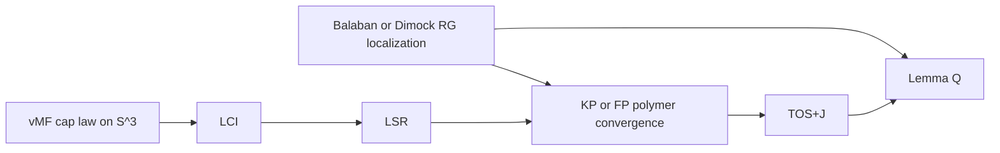

# Literature map for Lemma Q and block source-stability in SU(2) lattice gauge theory

## Executive summary

For **SWB** (source-weighted Balaban expansion), the strongest rigorous backbone is still the **Balaban/Dimock constructive RG line**: Balaban’s original gauge papers isolate background fields, small/large field decompositions, localized effective actions, and cluster expansions, while Dimock’s trilogy is the cleanest expository entry point for adapting that machinery analytically. For **LSR** and **TOS+J**, the nearest rigorous analogues are not in Yang–Mills itself but in **abstract polymer/correlation expansions** and **random-current source calculus**, especially Ueltschi’s correlation-function cluster expansion and Duminil‑Copin’s source-set/switching-lemma viewpoint. For **LCI**, the right local geometry is the Fisher/vMF law on \(S^3\), combined with finite-dimensional spherical-convex tools and explicit intersecting-cap formulas. For **coefficient bounds**, modern zero-free/Barvinok papers are the natural “Cauchy extraction” analogue, but I did **not** find a direct, primary paper that already proves a **source-weighted Balaban/Dimock expansion** or a **positive-real extraction lemma specialized to gauge polymers**; that remains an open gap to fill in your program. citeturn35search4turn34search0turn33search2turn33search10turn23search0turn26search4turn27search2turn32search0turn31search5turn29search2turn30search0turn37search10turn16search0turn28search4turn28search1

## Reduction map

I use your abbreviations as follows: **SWB** = source-weighted Balaban expansion; **LSR** = local source rarity / marked-block suppression; **TOS+J** = tilted one-source stability plus normalized source influence/Jacobian decay; **LCI** = local cap-intersection input.

```mermaid
flowchart TD
    A[SU(2) single-link conditional law] --> B[vMF or Fisher law on S^3 after staple alignment]
    B --> C[Cap and cap-intersection asymptotics]
    C --> D[LSR for marked bad blocks]
    D --> E[Source-weighted polymer activities]
    E --> F[KP or FP convergence with marks]
    F --> G[TOS+J and rooted cumulant decay]
    G --> H[Lemma Q block source-stability]
    A --> I[Balaban background-field localization]
    I --> E
```



The reduction is well aligned with the literature, but the **middle bridge** “Balaban + marks/sources” is precisely where the literature is thinnest. The geometry and the polymer technology exist; the missing theorem is their source-weighted synthesis in a gauge-RG setting. citeturn35search4turn34search0turn23search0turn26search4turn32search0turn31search5turn29search2turn30search0

## Prioritized sources

*Citations are clickable source URLs. I flag primary sources with **Primary**.*

1. **Primary** J. Dimock, *The Renormalization Group According to Balaban I. Small Fields*, **Reviews in Mathematical Physics** 25 (2013). Best entry for the local small-field RG algebra you would need to re-run with source tags. Covers **1**. citeturn0search0turn18search16

2. **Primary** J. Dimock, *The Renormalization Group According to Balaban II. Large Fields*, **Journal of Mathematical Physics** 54, 092301 (2013). The most relevant expository source for large-field decomposition and how bad regions are isolated before polymer control. Covers **1,5**. citeturn0search1turn18search15

3. **Primary** J. Dimock, *The Renormalization Group According to Balaban III. Convergence*, **Annales Henri Poincaré** 15 (2014), 2133–2175. Gives the convergence/stability endgame for the Balaban scheme; structurally closest to what SWB would need to imitate. Covers **1,2**. citeturn0search10turn18search13

4. **Primary** T. Balaban, *Ultraviolet Stability of Three-Dimensional Lattice Pure Gauge Field Theories*, **Communications in Mathematical Physics** 102(2) (1985), 255–275. The original pure-gauge stability milestone: indispensable for understanding what “stability” means in constructive gauge RG. Covers **1**. citeturn35search4turn35search0

5. **Primary** T. Balaban, *The Variational Problem and Background Fields in Renormalization Group Method for Lattice Gauge Theories*, **Communications in Mathematical Physics** 102(2) (1985), 277–309. This is the key source for the background-field minimizer/localization map; for your program it is the natural progenitor of local support-height/cap geometry. Covers **1,4**. citeturn34search0turn34search1

6. **Primary** T. Balaban, *Renormalization Group Approach to Lattice Gauge Field Theories I. Generation of Effective Actions in a Small Field Approximation and a Coupling Constant Renormalization in Four Dimensions*, **Communications in Mathematical Physics** 109(2) (1987), 249–301. Shows how localized effective actions are generated in one RG step. Covers **1**. citeturn33search2turn33search8

7. **Primary** T. Balaban, *Renormalization Group Approach to Lattice Gauge Field Theories II. Cluster Expansions*, **Communications in Mathematical Physics** 116(1) (1988), 1–22. The single most relevant Balaban paper for your SWB goal, because it is exactly where “cluster expansion inside gauge RG” becomes explicit. Covers **1,2**. citeturn25search14turn33search10

8. **Primary** R. Kotecký and D. Preiss, *Cluster Expansion for Abstract Polymer Models*, **Communications in Mathematical Physics** 103 (1986), 491–498. Canonical KP criterion for polymer convergence; your marked/source-weighted polymer gas will ultimately need a KP- or FP-type verification. Covers **2**. citeturn23search0turn23search4

9. **Primary** D. Ueltschi, *Cluster Expansions and Correlation Functions*, **Moscow Mathematical Journal** 4(2) (2004), 511–522. This is the closest standard reference to “marked” expansions: not source-weighted Balaban, but explicit cluster-expansion control of correlation functions/insertions. Covers **2,7**. citeturn26search4turn26search17

10. **Primary** R. Fernández and A. Procacci, *Cluster Expansion for Abstract Polymer Models. New Bounds from an Old Approach*, **Communications in Mathematical Physics** 274(1) (2007), 123–140. Improves KP/Dobrushin and is valuable if your marked activities need sharper convergence margins than naive KP. Covers **2**. citeturn27search2turn27search0

11. **Primary** R. A. Fisher, *Dispersion on a Sphere*, **Proceedings of the Royal Society A** 217(1130) (1953), 295–305. The foundational spherical distribution underlying the \(S^3\) heat-bath after staple alignment. Covers **3,4**. citeturn32search0turn32search3

12. **Primary** A. D. Kennedy and B. J. Pendleton, *Improved Heatbath Method for Monte Carlo Calculations in Lattice Gauge Theories*, **Physics Letters B** 156(5–6) (1985), 393–399. Essential because it makes the exact SU(2) heat-bath law operational; analytically, it identifies the one-link conditional distribution you want to bound by caps. Covers **3**. citeturn31search2turn31search5

13. **Primary** A. Banerjee, I. S. Dhillon, J. Ghosh, and S. Sra, *Clustering on the Unit Hypersphere using von Mises-Fisher Distributions*, **Journal of Machine Learning Research** 6 (2005), 1345–1382. Not a gauge-theory paper, but one of the cleanest modern references for vMF normalization, concentration, and parameterization on spheres. Covers **3**. citeturn36search7turn36search0

14. **Primary** F. Besau and E. M. Werner, *The Spherical Convex Floating Body*, **Advances in Mathematics** 301 (2016), 867–901. Useful for finite-dimensional spherical support functions and local convex geometry; conceptually closest to the geometric part of **LCI**. Covers **4**. citeturn29search2turn29search0

15. **Primary** O. Mazonka, *Solid Angle of Conical Surfaces, Polyhedral Cones, and Intersecting Spherical Caps* (arXiv:1205.1396, 2012). The most directly usable explicit source for intersecting-cap formulas and solid-angle computations. Covers **4**. citeturn30search0turn30search7

16. **Review / Primary** H. Duminil-Copin, *Random Currents Expansion of the Ising Model*, in **European Congress of Mathematics** (EMS Press, 2018), pp. 869–889. This is the cleanest rigorous source-set calculus in a nearby model; it is the closest conceptual analogue of “marked/source polymers”. Covers **2,5,7**. citeturn37search10turn37search1

17. **Primary** M. P. Forsström and F. Viklund, *Free Energy and Quark Potential in Ising Lattice Gauge Theory via Cluster Expansion* (arXiv:2304.08286; published 2025). Best modern, rigorous lattice-gauge cluster-expansion paper I found; although abelian, it is a serious guide for gauge-side rare-event and Wilson-loop asymptotics. Covers **5**. citeturn16search2turn16search3

18. **Primary** M. P. Forsström and F. Viklund, *A Current Expansion for Ising Lattice Gauge Theory* (arXiv:2502.19942, 2025). Particularly relevant because it imports explicit **source sets** and a switching-lemma style mechanism into lattice gauge theory. Covers **5,7**. citeturn16search0turn24search8

19. **Primary** V. Patel and G. Regts, *Deterministic Polynomial-Time Approximation Algorithms for Partition Functions and Graph Polynomials*, **SIAM Journal on Computing** 46(6) (2017), 1893–1919. This is a standard “zero-free \(\Rightarrow\) Taylor/Cauchy extraction” source and is the best rigorous comparator for your coefficient-bounding discussion. Covers **6**. citeturn28search4turn28search2

20. **Primary** J. Liu, A. Sinclair, and P. Srivastava, *Fisher Zeros and Correlation Decay in the Ising Model*, **Journal of Mathematical Physics** 60(10) (2019), 103304. Most relevant modern paper connecting zero-free regions and correlation decay; analytically valuable if you want a complex-analytic fallback to positive-real extraction. Covers **6,7**. citeturn28search1turn28search6

## Comparison table and next-read ordering

**Legend:** D = direct; A = analogue; – = mainly background. “Source-wtd?” means explicit marked/source-set control in the paper itself.

| # | Year | Type | SWB | LSR | TOS+J | LCI | Source-wtd? | Access |
|---|---:|---|---|---|---|---|---|---|
| 1 | 2013 | paper | D | – | – | – | N | OA |
| 2 | 2013 | paper | D | A | – | – | N | OA |
| 3 | 2014 | paper | D | A | – | – | N | mixed |
| 4 | 1985 | paper | D | A | – | – | N | OA |
| 5 | 1985 | paper | D | A | A | A | N | mixed |
| 6 | 1987 | paper | D | A | – | – | N | OA |
| 7 | 1988 | paper | D | D | A | – | N | OA |
| 8 | 1986 | paper | A | D | A | – | N | mixed |
| 9 | 2004 | paper | A | D | D | – | P | OA |
| 10 | 2007 | paper | A | D | A | – | N | OA |
| 11 | 1953 | paper | – | A | A | D | N | mixed |
| 12 | 1985 | paper | – | D | A | A | N | mixed |
| 13 | 2005 | paper | – | A | A | D | N | OA |
| 14 | 2016 | paper | – | A | A | D | N | OA |
| 15 | 2012 | preprint | – | A | A | D | N | arXiv |
| 16 | 2018 | review | A | A | D | – | Y | OA |
| 17 | 2023/25 | paper | A | D | A | – | N | arXiv + journal |
| 18 | 2025 | preprint | A | A | D | – | Y | arXiv |
| 19 | 2017 | paper | – | A | A | – | N | mixed |
| 20 | 2019 | paper | – | A | D | – | N | arXiv + journal |

A good **top-8 reading order** is: **5 → 1 → 2 → 3 → 7 → 8 → 9 → 12**. After that, jump to **15** for cap intersections and **18** for the best source-set analogue on the gauge side.

## Analytical takeaways and open gaps

The literature strongly supports the following program: use **Balaban background-field localization** to define blockwise “good geometry”, reduce the SU(2) one-link conditional law to a **Fisher/vMF law on \(S^3\)**, prove **cap/cap-intersection** suppression estimates for marked bad blocks, and feed those into a **KP/FP/Ueltschi**-style marked polymer expansion. On the source side, the closest rigorous analogues are **random currents with explicit sources** and the new **Ising lattice-gauge current expansion**; these suggest that “source sets as rooted or parity-constrained polymers” is the right technical language. citeturn34search0turn31search5turn32search0turn29search2turn30search0turn23search0turn26search4turn37search10turn16search0

What is **missing** is exactly what your Lemma Q needs most: I found **no primary source** that already proves a **Balaban/Dimock RG with activities multiplied by arbitrary marked/source weights**, and I found **no direct rigorous source** for a “positive-real extraction” lemma specialized to constructive gauge/polymer expansions. The nearest rigorous surrogates are (i) correlation-function cluster expansions, (ii) random-current source switching, and (iii) zero-free/Taylor/Cauchy extraction papers. So the gap is real, but it is narrow and well defined. citeturn26search4turn37search10turn16search0turn28search4turn28search1

Two technical subproblems still look genuinely original. First, an **\(S^3\) Laplace asymptotic for vMF mass of one cap conditioned/intersected with another cap** in the exact geometry produced by a source perturbation; the ingredients exist, but I did not find a ready-made theorem in the exact form you need. Second, a **source-weighted Balaban cluster criterion** uniform across large-field decompositions; existing abstract polymer results should handle the combinatorics once the geometric/source penalty is encoded, but the gauge-RG bookkeeping appears to be new. citeturn29search2turn30search0turn23search0turn26search4turn27search2