# Pathfinder feature map

Date: 2026-08-19  
Scope: all 40 artifacts under `sources/`, including every member of the canonical ZIP bundle  
Rule: this is a read-only architecture audit. It does not promote any mathematical claim or modify a source artifact.

> **Scope note:** this map and the per-feature flowcharts describe the historical/current project, including failed branches. They are not destination architecture. The only destination is the single sequential computation in `03-unified-proposal.md`.

## Boundary decision

The project is best understood as ten flat features. These boundaries follow independently testable outputs rather than notebook generations: authority, exact local algebra, topology falsification, prototype spectra, the global-Q solver, physical-Q certificates, fourth-order arithmetic, rooted adjudication, the dual oracle, and Monte Carlo validation.

Later notebooks are mostly cumulative snapshots rather than modules, so filename chronology is not a safe architecture. A feature owns a mathematical responsibility and an evidence contract; versions are evidence within that feature.

## Features

| ID | Feature | Responsibility | Principal entry points | Current evidence posture |
|---|---|---|---|---|
| F01 | Theory, authority, and scope firewall | Define claim precedence, the five-layer theory, closure gates, and prohibited inferences. | `sources/PAPER_SUN_canonical_su_n_wilson_spectral_theory_derivation.docx`; `sources/PAPER_FLUX_gauge_constrained_spectral_geometry_unified_v1_4_2026-08-08.zip` → `canonical/PAPER_FLUX_gauge_constrained_spectral_geometry_unified_v1_4_2026-08-08.md`, `CANONICAL_STATUS_REGISTRY_v1_4_2026-08-08.md`, manifest, and closure checklist | The ZIP declares its v1.4 Markdown master authoritative. SU(3) fourth-order values remain an exact computational ledger with six open gates. The separate DOCX contains useful derivations but conflicts with v1.4 on normalization and some rank-status statements. |
| F02 | Local Haar/Fierz contraction and electric-resolvent certificates | Supply exact local word contractions, determinant-channel closure, Gram data, and reduced electric resolvents. | `sources/NB_HAAR_hodge_explicit_intertwiner_v04.ipynb:183`; `sources/NB_HAAR_hodge_mixed_determinant_v05c.ipynb:169`; `sources/NB_HAAR_hodge_electric_resolvent_v06c.ipynb:154` | Strong exact sub-certificates exist. The v06c notebook also contains later failed/error cells, so individual gate runs—not the notebook as a whole—must be cited. |
| F03 | Triangular-prism selection-rule falsification and shape closure | Independently test second-order protection and third-order shape/center-selection claims on prism topology. | `sources/NB_O2_prism_square_second_order_falsification.ipynb:188`; `sources/NB_O3_prism_third_order_shape_closure_v2.ipynb:168` | The second-order falsifier records 33/33 passes. The third-order notebook is a cumulative lab history containing both superseded failures and later passing pipelines. |
| F04 | Anchored graph/Krylov glueball prototypes | Construct connected C-odd graph bases and extract source spectral poles before global-Q merging. | `sources/NB_HAAR_hodge_anchored_graph_krylov_production_v1.ipynb:427`; `sources/NB_HAAR_hodge_glueball_feshbach_krylov_production_v2.ipynb:758` | Prototype evidence only. These establish graph/Krylov mechanics, not the current physical-Q or fourth-order result. |
| F05 | Global-Q Gram-merged mass/string solver lineage | Merge Q channels globally, compute glueball Feshbach poles, add the exact vacuum character, and derive the linked winding-string cubic term and matched ratio. | `sources/NB_HAAR_hodge_mass_string_globalq_krylov_v5_a100.ipynb:286`; `sources/ENGINE_HAAR_hodge_glueball_globalq_vacuum_character_v8.py:3388`; `sources/ENGINE_HAAR_hodge_mass_string_linked_cubic_v9.py:3883` | v5 and later v10a-era appended runs contain useful passing ledgers. The original v7 scalar-Q diagnosis is retired; v9 corrects the cubic string sign to `-61/408`. |
| F06 | Explicit physical-Q and Q2 certificate/frontier | Replace implicit Gram kernels with orthonormal physical-Q coordinates, expose Q1→Q2, and certify the direct fourth-order chain/firewall. | `sources/ENGINE_O4_hodge_v10a_physicalq_certificate.py:4060`; `sources/NB_O4_hodge_v10a2_fullt1_k2_q2_frontier_a100.ipynb:1`; `sources/ENGINE_O4_hodge_v10a3_physicalq2_order4_firewall_a100.py:5013` | v10a2 records a clean full-T1/Q2 frontier pass. v10a3 certifies a direct physical-Q2 component but explicitly does not close the full fourth-order rest. |
| F07 | Exact denominator-lift fourth-order arithmetic | Exactify two-step histories and convert the factorized Haar topology sum to rational `D_A` and `m4_rest`. | `sources/Hodge_v10a20_DenominatorLift_Exact_DA_m4_A100(2).ipynb:1`; `sources/Hodge_v10a20b_DenominatorLift_Exact_DA_m4_A100(2).ipynb:1`; `sources/Hodge_v10a20b_RESUME_after_heapq_failure(2).ipynb:1` | The notebooks describe the intended integer lift and a same-kernel recovery, but none stores a completed output in this project mirror. They are executable candidates, not verified evidence here. |
| F08 | Exact rooted linked-cluster adjudication | Determine whether support-resolved linked-cluster subtraction selects the new exact `m4` or the historical `q3`. | `sources/Hodge_v10a21_Exact_Rooted_Cluster_Adjudicator_A100(2).ipynb:1`; `sources/hodge_v10a21r_ADJUDICATOR_ONLY_same_kernel(1).py:1` | The adjudicator-only notebook and Python export each have an exact duplicate. Resume artifacts depend on pre-existing in-memory kernel state and have no stored result in this mirror. |
| F09 | Independent finite-cluster, full-T1 fold, and rooted dual-cold oracle | Cross-check the fourth-order coefficient using an independent restricted-cluster oracle and a matrix-valued degenerate full-T1 fold, with corrected rooted support/cache handling. | `sources/Hodge_v10a22_INDEPENDENT_FiniteCluster_Oracle_A100(1).ipynb:8`; `sources/Hodge_v10a23_FullT1_OperatorFold_K4_A100(1).ipynb:1`; `sources/hodge_v10a24c_RootedFullT1_DualColdOracle_O4_A100(1).py:1` | The latest code targets closure gates 1–3, but v10a20–v10a24c artifacts have no stored outputs. Their presence cannot promote the audit-pending v1.4 ledger. |
| F10 | SU(3) lattice Monte Carlo cross-validation campaign | Independently validate update exactness, compare implementations, run ensembles, and attempt a continuum refit. | `sources/NB_SU3_a100_master_alt2.ipynb:25` | Algebraic update gates mostly pass, but effective-mass gates fail with `NaN`; the production campaign calls external scripts absent from this corpus. No completed continuum campaign is present. |

## Observed lineage

```mermaid
flowchart LR
    F01["F01 authority and scope\nZIP canonical README:1"]
    F02["F02 local exact algebra\nNB_HAAR_hodge_explicit_intertwiner_v04.ipynb:183"]
    F03["F03 topology falsification\nNB_O2_prism_square_second_order_falsification.ipynb:188"]
    F04["F04 graph/Krylov prototypes\nNB_HAAR_hodge_anchored_graph_krylov_production_v1.ipynb:427"]
    F05["F05 global-Q solver\nENGINE_HAAR_hodge_glueball_globalq_vacuum_character_v8.py:3388"]
    F06["F06 physical-Q/Q2\nENGINE_O4_hodge_v10a_physicalq_certificate.py:4060"]
    F07["F07 denominator lift\nHodge_v10a20b_DenominatorLift_Exact_DA_m4_A100(2).ipynb:1"]
    F08["F08 rooted adjudicator\nhodge_v10a21r_ADJUDICATOR_ONLY_same_kernel(1).py:1"]
    F09["F09 dual oracle\nhodge_v10a24c_RootedFullT1_DualColdOracle_O4_A100(1).py:6556"]
    F10["F10 Monte Carlo\nNB_SU3_a100_master_alt2.ipynb:25"]

    F01 -. governs claims .-> F02
    F02 --> F04 --> F05 --> F06 --> F07 --> F08 --> F09
    F03 -. independent topology checks .-> F02
    F10 -. independent physical validation .-> F01
```

This diagram records the current implementation/history, not the proposed destination.

## Cross-cutting cautions

- There is effectively no internal package/import graph. New notebook generations copy the old engine and add another top-level driver.
- Major solver exports execute work at import time; they lack a conventional entry-point boundary.
- Exact algebra, floating-point/GPU execution, production orchestration, status promotion, and prose claims are mixed together.
- Several notebooks contain stale failures beside later passes. Stored output must be tied to a particular cell and code hash.
- Exact duplicates exist for v06c, v5, v10a2, and v10a21r artifacts; the two v9 scripts are near-duplicates.
- The latest fourth-order code is unexecuted in the project mirror. It is a candidate implementation, not proof.

## Complete top-level artifact coverage

Every file under `sources/` maps to a feature below. Exact duplicates were hash-checked before being treated as one logical source.

- **F01:** `PAPER_SUN_canonical_su_n_wilson_spectral_theory_derivation.docx`; `PAPER_FLUX_gauge_constrained_spectral_geometry_unified_v1_4_2026-08-08.zip` (all 16 members).
- **F02:** `NB_HAAR_hodge_explicit_intertwiner_v04.ipynb`; `NB_HAAR_hodge_mixed_determinant_v05c.ipynb`; both `Hodge_Haar_Electric_Resolvent_v06c` notebooks.
- **F03:** `NB_O2_prism_square_second_order_falsification.ipynb`; `NB_O3_prism_third_order_shape_closure_v2.ipynb`.
- **F04:** `NB_HAAR_hodge_anchored_graph_krylov_production_v1.ipynb`; `NB_HAAR_hodge_glueball_feshbach_krylov_production_v2.ipynb`.
- **F05:** both `Hodge_Mass_String_GlobalQ_Krylov_v5_A100` notebooks; both `Hodge_Mass_String_NestedQ_Moment_v7_A100` notebooks; `ENGINE_HAAR_hodge_glueball_globalq_vacuum_character_v8.py`; `ENGINE_HAAR_hodge_mass_string_linked_cubic_v9.py`; `ENGINE_HAAR_hodge_mass_string_linked_cubic_v9_1.py`.
- **F06:** `ENGINE_O4_hodge_v10a_physicalq_certificate.py`; both `Hodge_v10a2_FullT1_K2_Q2_Frontier_A100` notebooks; `ENGINE_O4_hodge_v10a3_physicalq2_order4_certificate.py`; `ENGINE_O4_hodge_v10a3_physicalq2_order4_firewall_a100.py`.
- **F07:** `Hodge_v10a20_DenominatorLift_Exact_DA_m4_A100(2).ipynb`; `Hodge_v10a20b_DenominatorLift_Exact_DA_m4_A100(2).ipynb`; `Hodge_v10a20b_RESUME_after_heapq_failure(2).ipynb`.
- **F08:** `Hodge_v10a21_Exact_Rooted_Cluster_Adjudicator_A100(2).ipynb`; both `Hodge_v10a21r_ADJUDICATOR_ONLY_same_kernel` notebooks; both matching Python exports.
- **F09:** `Hodge_v10a22_INDEPENDENT_FiniteCluster_Oracle_A100(1).ipynb`; both v10a23 notebooks; the v10a24 notebook; both v10a24b notebooks; both v10a24c notebooks; `hodge_v10a24c_RootedFullT1_DualColdOracle_O4_A100(1).py`.
- **F10:** `NB_SU3_a100_master_alt2.ipynb`.

## Discovery confidence and gaps

Feature-boundary confidence is high (0.91). Every project artifact was structurally inspected and all text-bearing archive members were inventoried. No GPU/A100 production run was executed. The top-level DOCX was structurally extracted but could not be rendered because the workspace lacks a DOCX renderer. The canonical 29-page PDF was rendered and reviewed separately; its page-28 status table has overlapping text, so the declared Markdown master should remain the source of truth until the PDF is regenerated.
