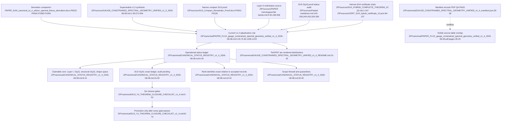

# F01 — Theory, authority, and scope firewall

## Outcome

The top-level file beginning `Canonical_` is not the current status authority. The controlling stack is inside `sources/PAPER_FLUX_gauge_constrained_spectral_geometry_unified_v1_4_2026-08-08.zip`:

1. the v1.4 Markdown master as editable synthesis;
2. the v1.4 status registry as operational claim ledger;
3. the v1.4 SU(3) checklist as the promotion gate;
4. narrow sources only within their declared domains.

The top-level DOCX and v1.3 files remain useful derivational history but are superseded where they conflict. TeX, PDF, and the dependency graph are distributions or summaries, not independent status authorities.

Every claim needs two distinct fields:

- **mathematical status:** proven / exact ledger / conditional / open / rejected;
- **reproducibility status:** cold reproduced / bundled certificate / record-backed / payload missing.

This separation resolves much of the apparent conflict among SU(3), SU(4), and SU(5/6) statements.

## Complete F01 coverage

All 16 ZIP members and the top-level DOCX were reviewed in full or, for images, visually:

- `sources/PAPER_SUN_canonical_su_n_wilson_spectral_theory_derivation.docx`: paragraphs P0001–P1095 and tables T01–T10.
- ZIP canonical v1.4 Markdown `1-1223`, TeX `1-2264`, PDF pages `1-29`, registry `1-62`, checklist `1-70`, README `1-25`, manifest `1-58`, and the whole dependency graph image.
- ZIP sources: v1.3 master `1-1134`; v1.3 registry `1-44`; `PAPER homological flat bands.md:1-340`; `Pasted markdown.md:1-337`; compact SU(3) DOCX P0001–P0126; SU4 theorem `1-167`; certificate JSON `1-137`; topology ledger JSON `1-1358`.

Every member hash listed in the v1.4 manifest (`manifest.json:41-56`) matches the extracted file.

## Authority flow

## Defensible claim ledger

| Claim | Status | Authority |
|---|---|---|
| compact SU(3) even class gap through `beta^-1/2`, remainder `O(beta^-1)` | proven, regime-scoped | registry line 8; compact proof P0001–P0126 |
| `O(y2)` incidence/Hodge factorization | proven and hand-checkable | registry lines 9–12; master `173-276` |
| `O(y3)` tromino/bare-link selection mechanism | proven structural mechanism | registry line 13; audit `102-139` |
| `O(y3)` coefficient `-109151/249696` | exact arithmetic; clean replay recommended | registry line 14; paper `189-195,330-337` |
| generic fourth-order four-shape obstruction space | proven algebraic/orbit classification | registry line 15; master `296-340` |
| SU(3) 189-record kernel and rational pencil | exact computational ledger; audit pending | registry lines 16–18; master `441-531` |
| implemented SU(3) `c4(k)` global extrema | numerically decisive; interval proof incomplete | registry line 18; checklist `36-52` |
| universal axial/rank identities | exact relative to accepted ledgers; upstream gaps disclosed | registry lines 19–24; master `377-475` |
| SU(4) exceptional correction | narrow certificate record PASS | SU4 theorem `26-167`; JSON `46-116` |
| source `y` → canonical `u=beta_H/6` | open / conditional | registry line 25; checklist `30-34` |
| raw plaquette equals physical glueball | unsupported | registry line 38; master `477-479` |
| five-term continuum extrapolation | consistent, not controlled | registry line 39; master `533-538` |
| continuum Yang–Mills mass gap | not addressed | registry line 40; master `697-699` |
| Schur/Haar “Theorem B”, 4D SU2 theta/TRG, q-Racah novelty | quarantined | registry lines 35–37; master `734-740` |

## Six SU(3) fourth-order gates

1. **`PVP=aP`:** construct the exact full model-space matrix, prove a common rational diagonal and zero off-diagonals, and hash the ledger (`SU3_Y4_THEOREM_CLOSURE_CHECKLIST_v1_4.md:5-15`).
2. **Degenerate fold:** validate the des-Cloizeaux operator for `dim(P)>1`, including off-diagonal hopping, against direct block diagonalization (`:17-21`).
3. **Full independent regression:** expand Stage 3H from 1,478 to all 3,895 topologies, including 2,417 folded cases, and reproduce the 189-record kernel (`:23-28`).
4. **Magnetic normalization:** derive the insertion prefactor from the Hamiltonian and machine-check the source-`y` to canonical-`u` mapping (`:30-34`).
5. **Outward-rounded intervals:** remove point wrapping for `theta`, `delta`, `plo/phi`, and pi/tiling endpoints and retain a proof log (`:36-40`).
6. **Uniform Gamma touching:** control inner `|k|~y` and outer regions jointly, or uniformly diagonalize the multiband effective Hamiltonian (`:42-52`).

Mandatory archival work accompanies the gates: ship `DATA_Y4_full_real_space_h4_kernel.json.gz` plus SHA-256, put stages 3F/3H in the one-command run, retain exact intermediate ledgers, and use `c4(Gamma)≈-2.857916` rather than the rigid `-2.5134` in the mass series (`:54-60`).

## Contradictions and stale claims

1. The top-level DOCX has its own precedence language but predates v1.4 and is absent from its manifest. Treat it as a derivation companion, not a competing registry (`DOCX:P0001-P0004,P1083-P1094`; `README:1-13`).
2. The DOCX's exact restricted-flux bridge (`P0581-P0592`) cannot currently serve as the audited simulation-`y` bridge; v1.4 keeps that conversion open (`master:75-80`; registry line 25).
3. v1.3 overpromotes the SU(3) fourth-order chain and no-rescaling mapping (`v1.3:61,359-374,592-604`). v1.4 supersedes those statuses.
4. The Layer-II paper proves rank identities relative to accepted certificates but phrases the whole mobility chain as proved (`PAPER:9-35,242-253`); the independent audit reopens shared fold/normalization/regression/interval/touching dependencies (`Pasted markdown.md:249-263`).
5. The audit itself has an optimistic headline (`Pasted markdown.md:11-15`) contradicted by its detailed caveats (`:249-263`); the caveats control under the narrowest-supported rule.
6. The current v1.4 master still calls the SU(3) fourth-order stack “Proven — exact computer-assisted” and refers to a hashed kernel (`master:582-583`), while the same master/registry/checklist say the payload must be shipped and six gates remain (`master:441-531`; registry `16-30,44-54`). The registry/checklist control; line 583 is stale.
7. The constants index calls `u=beta_H/6` a “Proven bridge” (`master:650-655`), but only the canonical definition is fixed; conversion of the Aug. 8 source variable remains open (`master:75-80,509-519`).
8. The DOCX says SU(5/6) are unresolved (`P0847-P0850,P1060-P1061`), while v1.4 accepts rank closure relative to external certificates (`master:1206-1222`). Correct status: mathematically accepted relative to the external ledger, not cold-reproducible from this bundle.
9. The SU4 theorem/JSON/96-record topology ledger agree, but the certificate references an absent persistent-results archive (`CERT_SU4_hybrid_certificate_v2.json:118-134`). It is a narrow record-backed PASS, not a full rerun package.
10. SU4 and v1.4 reuse `A/B` for different coefficient bases (`SU4 theorem:68-100`; master `1178-1196`), inviting coefficient-slot errors.
11. Several named authorities/scripts, the raw SU3 kernel, stable-rank payloads, SU5/6 certificates, and SU4 persistent archive are absent (`master:1206-1218`).
12. The manifest's PDF visual-QA PASS is false: pages 28–29 have severe table overlap (`manifest:35-39`; PDF pages 28–29).

## Feature-level path forward

Freeze one authority map built from the v1.4 master, registry, checklist, and enumerated narrow exceptions. Store claim scope, mathematical status, reproducibility status, dependencies, and supersession separately. Correct stale v1.4 prose and the ambiguous normalization label; mark v1.3/DOCX conflicts as superseded. Close Gates 1 and 4 early, then Gate 2, then Gate 3 plus the archived kernel, and Gates 5/6 after the kernel is fixed. Only a clean all-stage run may trigger promotion. Regenerate the PDF and correct its QA record last.

Confidence is high in the authority map and contradictions. Confidence in record-backed fourth-order truth is necessarily lower because several raw payloads and referenced bundles are absent. No theorem computation was rerun.
