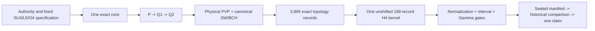

# Cross-feature duplication report

## Verdict

The audit identified one root cause: this is not primarily a “too many notebooks” problem. The project lacks stable authority, data, execution, and evidence boundaries, so each new result copies the previous program, mutates globals, prints another gate table, and becomes a new apparent authority.

The correct consolidation is one staged implementation, not a choice among solvers:

1. one controlling authority record;
2. one pure core and typed artifact chain;
3. one explicit physical-P/Q1/Q2 representation;
4. one exact Haar contractor and one canonical Hermitian SW/BCH calculation;
5. one 3,895-record topology computation assembling one unshifted 189-record kernel;
6. one fail-fast run manifest and one final claim decision.

Tests may use accepted fixed fixtures, but no second implementation produces a competing fourth-order result.

## Duplicate and version inventory

- The two v5 notebooks are byte-identical, including outputs.
- The two v06c notebooks have identical parsed source/output; their only difference is notebook metadata.
- The two v10a2 notebooks have identical code; only `(1)` contains the recorded 17/17 execution.
- Both v10a21r notebooks are identical, both Python exports are identical, and each notebook code cell equals the Python export.
- The cumulative NestedQ notebook contains source-exact copies of standalone v7, v8, v9, v9.1, and v10a.
- v9.1 differs materially from v9 only by the coefficient-extraction step `0.0005 -> 0.002` and labels (`ENGINE_HAAR_hodge_mass_string_linked_cubic_v9.py:3569-3576`; `ENGINE_HAAR_hodge_mass_string_linked_cubic_v9_1.py:3569-3577`).
- v10a20b is v10a20 plus the missing `heapq` import and a label correction.
- v10a21 is v10a20b plus an exact-Haar cache and the rooted adjudicator.
- The v10a22→v10a24c family is a hotfix lineage, not a set of independent oracles.
- Every major Python solver export lacks a `__main__` guard. Importing it launches top-level production work.
- `_build_global_model` is defined three times in each major copied solver; examples are `ENGINE_HAAR_hodge_mass_string_linked_cubic_v9.py:1933,2425,2964`, `ENGINE_O4_hodge_v10a_physicalq_certificate.py:1895,2387,2926`, and `hodge_v10a24c_RootedFullT1_DualColdOracle_O4_A100(1).py:1952,2444,2983`.

Duplicate files are aliases or history, not independent evidence.

## Root-cause matrix

| Root cause | Evidence | Risk | Consolidation boundary |
|---|---|---|---|
| Competing authority text | v1.4 calls SU(3) fourth order “Proven” at ZIP master `582-583`, while its registry/checklist keep six gates open (`registry:16-30`; `checklist:5-60`). The master also ambiguously calls the normalization a proved bridge at `650-655` while `75-80,509-519` keep source-`y` conversion open. | A newer filename or optimistic paragraph can silently override the actual ledger. | One machine-readable claim registry with separate mathematical/reproducibility status, dependencies, disputes, and supersession. Generate prose from it. |
| Copy-forward solver monolith | Local geometry/Haar/H0 from F02 is recopied through F05/F06/F07/F09; the latest F09 source is 7,370 lines, with the inherited engine at `v10a24c.py:1-6430`. | Fixes drift, dead code shadows live code, and correlated branches look independent. | One pure library for geometry, trace states, representations/H0, translations, and primary operators; one production runner only. |
| Competing meanings of Q | F04 uses local diagonal-Q (`NB_HAAR_hodge_glueball_feshbach_krylov_production_v2.ipynb:333-481`); F05 uses implicit `K=C G C^T` (`v5:3248-3442`); F06 reconstructs physical Q with `B B^T=K` (`physicalQ.py:3660-3768`). | Semantically different tuples/dictionaries can be mixed. The v10a3 firewall actually queries irrep-indexed groups with center-residue keys (`Firewall.py:3009-3010,4626-4718`). | Canonical physical-Q artifact with typed key `(joint-irrep signature, exact H0 energy, center flux)`, factors `B`, and checked derived kernel `K=B B^T`. |
| No stage artifacts | F05 rebuilds P/Q models in memory; F06 does not save Q1/Q2 factors; F07 does not save `W2X/R2X`, 117,161 topology records, `QBOUND`, or lift witnesses; F08/F09 expose only globals/stdout. | Copied literals and live objects become the API; no consumer can verify producer identity. | Content-addressed stage artifacts with schemas, exact encodings, source/config/environment hashes, and input/output IDs. |
| Same-kernel recovery | F07 recovery requires the failed kernel; F08/F09 resumes trust live globals/caches and incomplete name-only preflights. | Stale code, lattice, tolerances, or caches can contaminate a “certificate.” | Fresh process per stage; resume only from atomic, hash-validated disk checkpoints. Exclude live-kernel resumes from evidence. |
| Target-echo regressions | F02 infers a direct term from an imported coefficient (`v06c:805-813`); F03 assigns `PVP` and later prototypes inject targets (`Prism Complete:645-725,1161-1693`); v7 calibrates free parameters to supplied coefficients; F07 injects `FOLD_EX`; F08 gates against F07 targets. | Passing may mean consistency with an expected number, not a derivation. | The one canonical runner computes and seals its raw kernel before loading any historical target. Fixed lower-order fixtures may fail the run but may never supply a missing term. |
| F07/F08/F09 presented as three validations | F08 reruns F07's histories/rationalization/Haar lift and defines `RAW=zeta(DELTA_MIN)` before inverting it (`v10a21` cell source `6041-6690,7097-7129`). F09's two legs share a 6,430-line engine and later substitute the oracle scalar into the fold (`v10a24c.py:7306-7337`). | Correlated branches and bookkeeping identities look like multiple confirmations while producing no authoritative result. | Retire all three result branches. The one physical-Q/SW topology engine computes the canonical 3,895 records once and assembles the only 189-record kernel. |
| Rooted support logic duplicated | F08 constructs rooted subsets/incidence at v10a21 cell source `7067-7129`; F09 reimplements rooted cache/closure/incidence at `v10a24c.py:7045-7172,7239-7296`, after earlier root-cache defects. | The same combinatorial rule drifts and creates alternative scalar results. | Remove rooted finite-cluster adjudication from production. Retain only geometry operations explicitly required by the one canonical topology enumerator. |
| “Exact” values cross floating boundaries | F07 rationalizes `float*sqrt(2)` with `limit_denominator` (`v10a20b` cell source `6208-6242`) and lifts floating Haar values to integer numerators (`6440-6662`). F09's cluster result is a fitted numeric coefficient (`v10a24c.py:6934-6946`). | Later `Fraction` algebra obscures the provenance of inferred inputs. | Every value records arithmetic status: symbolic exact, reconstructed, denominator-lifted, interval-certified, or fitted numeric, with residual/precision witnesses. |
| Convention metadata is implicit | F03 uses assigned `PVP=-P`; F09 computes `PVP=+I`; source `y` versus canonical `u` is open; T1 ordering/sign/basis conventions live in globals. | Sign, basis, and scale disagreements are hard to distinguish from defects. | Operator artifacts must carry basis, sign convention, coupling variable, normalization, T1 ordering, lattice/root convention, irrep, flux, and exact energy. |
| Gate/report logic duplicated and fail-open | Mutable `gates=[]`/`gate()` is copied throughout; v24c still prints v10a23 labels (`v10a24c.py:7294-7303,7357-7370`); F10 writes JSON after 11/13 with two NaNs (`su3_a100_master:787-837`). | A certificate can be detached from source/run identity or emitted after required failures. | One structured, fail-closed manifest writer. Publication is atomic and impossible when a required gate fails/skips. |
| Corpus identities conflated | F07 has 117,161 Haar-pair topologies; F08 has rooted supports; F09 has rooted cluster classes and 189 records; canonical Gate 3 requires a different 3,895-topology corpus (`checklist:23-28`). | Similar words/counts can be misreported as closure of Gate 3. | Give each corpus a stable ID, schema, enumerator version, expected cardinality, and parent relation. Gates require exact corpus IDs. |
| Monte Carlo “independence” is incomplete | F10 dynamically imports absent external code (`su3_a100_master:730-760`), shares analysis logic, produces NaN effective masses, and stores no campaign results. | It adds another unfinished branch while contributing nothing to fixed-order closure. | Remove Monte Carlo from the SU(3) O4 architecture. Revisit it only as a future project after the canonical fixed-order claim is resolved. |

## Confirmed correctness defects in the version chain

These are not merely style issues:

1. v10a20 uses `heapq` without importing it; the default lift path fails. v10a20b is the only F07 standalone candidate.
2. v10a22 constructs `H0+uW` using a vector instead of `diag(H0)+uW`, causing NumPy broadcasting (`Hodge_v10a22...ipynb:5863-5887`).
3. v10a23 has an unrooted cache collision and an incomplete same-polarization fold-support composition; v10a24 fixes both.
4. v10a24b fixes cross-polarization D but introduces a generic-statistics return that references D-only variables; a full run would fail. v10a24c repairs the packaging.
5. The v10a3 firewall's Q1 producer/consumer key mismatch can omit sextet/adjoint distinctions (`ENGINE_O4_hodge_v10a3_physicalq2_order4_firewall_a100.py:3009-3010,4626-4634,4712-4718`). No v10a3 result should be accepted until repaired and rerun.
6. F10 records two effective-mass failures as NaN but still writes its JSON artifact.

## Duplication retained only as tests

No duplicated fourth-order production path remains intentional.

- Dense/local calculations may survive only as small immutable fixtures for the one factorized Haar contractor.
- Prism results may survive only as scoped lower-order regression fixtures.
- Exact toy matrices may test the one SW/BCH implementation.
- Historical coefficients may be loaded only after the one raw kernel is sealed.

Finite-cluster, Gelfand, fitted, dual-cold, alternate-Haar production, Stage-3H replay, and Monte Carlo branches do not produce promotable outputs. The canonical 3,895 topology computation is Stage 3H; it is not compared with another fourth-order solver.

## Consolidated shape

## Priority implications

1. Freeze one authority/specification and reject every current v10a20-v10a26 notebook as a runner.
2. Extract one core from the executed v10a2 physical-Q frontier and repair the v10a3 typed-key defect.
3. Reproduce the trusted lower-order cells from one fresh runner.
4. Build exact P/Q1/Q2, physical `PVP`, and the one SW/BCH fold.
5. Make the canonical topology engine evaluate all 3,895 records and assemble the one unshifted 189-record kernel.
6. Close normalization, interval, and Gamma gates sequentially on that kernel hash.
7. Seal the manifest, load historical targets once, and update the claim registry once.

Confidence is high in the duplicate relationships, authority contradictions, target echoes, static defects, missing output artifacts, and absent Stage 3H implementation. No A100 production workflow or absent Monte Carlo dependency was executed, so numerical agreement and runtime feasibility remain unknown.
