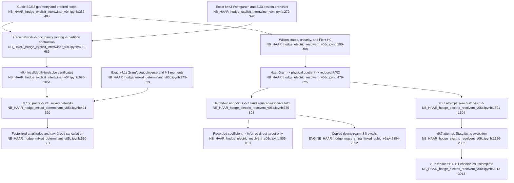

# F02 — Local Haar/Fierz contraction and electric-resolvent certificates

## Outcome

The reusable evidence is three cell-scoped certificates, not one notebook-level certificate:

- v0.4: exact local contractor, stored **30/30 PASS**.
- v0.5c: mixed SU(3) determinant closure, stored **29/29 PASS**.
- the first v0.6c cell: electric-resolvent core, stored **20/20 PASS**.

The three appended v0.7 attempts fail, raise an exception, or stop incomplete. They do not calculate the direct third-order term. The `(1)` v06c file has identical parsed source/output and differs only in notebook metadata, so it is not independent evidence.

## Files and evidence ranges

| File | Ranges | Assessment |
|---|---:|---|
| `sources/NB_HAAR_hodge_explicit_intertwiner_v04.ipynb` | outputs 13–180; source 183–1108 | coherent, scoped certificate |
| `sources/NB_HAAR_hodge_mixed_determinant_v05c.ipynb` | outputs 13–165; source 169–730 | coherent, scoped certificate |
| `sources/NB_HAAR_hodge_electric_resolvent_v06c.ipynb` | v0.6 outputs 13–150/source 154–874; appended attempts 881–3013 | core passes; whole notebook does not |
| `sources/NB_HAAR_hodge_electric_resolvent_v06c_alt.ipynb` | same logical source and outputs | metadata-only duplicate |

## Exact call flow

### v0.4 explicit contractor

1. Permutation helpers feed `weingarten_table(k)` and construct exact symbolic Weingarten tables for `k=1,2,3` (`NB_HAAR_hodge_explicit_intertwiner_v04.ipynb:272-342`).
2. `build_cubic_complex()` constructs links, faces, `B2`, `B3`, and shared-edge adjacency; it gates `B2*B3=0` (`:352-411`).
3. `face_steps()`, `conjugate_steps()`, and `chain_to_loop_steps()` build ordered Wilson loops (`:413-480`).
4. `build_trace_network()` encodes per-link `U/Ubar` indices; `classify_local_occupancy()` routes each link to balanced Weingarten, pure epsilon, or explicit zero/quarantine (`:532-606`).
5. `contract_trace_network()` performs partition contraction and merges equivalent partition states (`:490-530`, `:608-686`).
6. The consumers are plaquette/deformation tests, 75 depth-two endpoint networks, 48 cube surfaces, and the depth-three mixed frontier (`:696-1054`).

### v0.5c mixed determinant closure

1. Direct enumeration builds the `(4,1)` invariant Gram matrix and exact pseudoinverse (`NB_HAAR_hodge_mixed_determinant_v05c.ipynb:243-285`).
2. `partitions()` → `f_lambda()` → `su3_key()` → `decomp()` → `M3(a,b)` computes exact SU(3) character moments (`:288-339`).
3. Cubic geometry plus `generate_structured_words(3)` reproduces 53,160 linked paths (`:349-426`).
4. Face/link counts and `has_mixed_41_on_any_link()` isolate 245 mixed endpoint networks (`:447-520`).
5. `factorized_amplitude()` multiplies the exact moments and endpoint signs accumulate the raw C-odd cancellation (`:530-601`).

### v0.6c electric resolvent

1. Cubic geometry and finite Wilson-network states are built at `NB_HAAR_hodge_electric_resolvent_v06c.ipynb:234-429`.
2. `H0_action()` applies self-Casimir and Fierz reconnections (`:439-469`).
3. `combine_bra_ket()` → `haar_inner()` constructs a balanced Haar metric; `closure()` → `closure_matrices()` closes the basis, constructs `A/G`, and removes Gram-null identities (`:479-590`).
4. `reduced_resolvent_on_state()` projects out `E0=8/3` and computes `R` or `R2` (`:592-625`).
5. `generate_words(2)` → endpoint rows → cached resolvents → `endpoint_sum()` produces the signed hopping coefficients (`:675-775`).
6. Fold arithmetic combines assigned `PVP=-P` with the computed `R2`; the final direct target is inferred from an imported recorded cubic coefficient rather than calculated (`:785-813`).

## Evidence ledger

### Stable sub-certificates

- v0.4, stored 30/30 (`NB_HAAR_hodge_explicit_intertwiner_v04.ipynb:112-145`): exact Weingarten `k<=3`, SU(3) epsilon primitive, `B2*B3=0`, norm/deformation checks, all 75 depth-two networks, all 48 cube surfaces, and the 245-network mixed frontier.
- v0.5c, stored 29/29 (`NB_HAAR_hodge_mixed_determinant_v05c.ipynb:96-128`): rank-three `(4,1)` Gram matrix, exact pseudoinverse, `M3(4,1)=M3(1,4)=3`, the `5+240` mixed split, and raw C-odd off-diagonal cancellation.
- v0.6c core, stored 20/20 (`NB_HAAR_hodge_electric_resolvent_v06c.ipynb:86-109`): physical electric spectra, `PVRVP=(5/612)S`, `PVR2VP=-(1975/124848)S`, and the corresponding folded coefficient.

### Weaker checks

- Some v0.5c gates compare closed-form expressions to themselves instead of rerunning v0.4 (`NB_HAAR_hodge_mixed_determinant_v05c.ipynb:611-615`, `:638-641`).
- v0.5c's adjacent-plaquette factorization is argued rather than independently contracted (`:176-199`, `:530-539`).
- v0.6c gate 20 imports `RECORDED_FULL_U3_Q`; it does not calculate `PVRVRVP` (`NB_HAAR_hodge_electric_resolvent_v06c.ipynb:805-813`).
- The v0.6c header says the `R2` coefficient is positive, while code and stored output consistently give a negative value (`:77-81`, `:184-189`, `:785-803`).

### Appended v0.7 failures

1. The first attempt finds no depth-three histories and ends **3/5 PASS** (`NB_HAAR_hodge_electric_resolvent_v06c.ipynb:1420-1594`).
2. The endpoint-map revision raises `AttributeError: 'State' object has no attribute 'items'` and retains an empty `pass` placeholder (`:2126-2332`).
3. The tensor-multiply revision finds 4,111 candidates but stores no coefficient or final result (`:2812-3013`).

The v0.7 `haar_inner()` also rejects all unequal local `U/Ubar` counts (`:2707-2736`), so it excludes the nonzero SU(3) determinant channels that v0.5c was created to handle.

## Inputs, outputs, and invariants

Inputs: `N=3`, `L=3`, `C_F=4/3`, `E0=8/3`; cubic incidence and ordered loops; exact partition/character algebra; plus an external recorded full cubic coefficient in v0.6c gate 20.

Outputs:

- exact local Haar primitives through balanced `k<=3`, pure epsilon, and mixed `(4,1)/(1,4)` moments;
- `t3=5/612`;
- squared-resolvent coefficient `-1975/124848`;
- an inferred, not directly certified, direct target `+1975/62424`.

Invariants:

- `B2*B3=0`;
- Gram-null identities are removed before inversion;
- `H0` is metric-Hermitian on the physical quotient;
- the `E0` eigenspace is removed from the reduced resolvent;
- off-diagonal coefficients follow signed shared-edge incidence;
- SU(3) determinant imbalance is handled by center-aware algebra, not declared zero.

## Flowchart

## Dependencies and consumers

The downstream Krylov/global-Q/mass-string files copy this machinery rather than import it. Representative reuse is at:

- `sources/NB_HAAR_hodge_glueball_feshbach_krylov_production_v2.ipynb:484-563`;
- `sources/NB_HAAR_hodge_mass_string_globalq_krylov_v5_a100.ipynb:1203-1282`;
- `sources/ENGINE_HAAR_hodge_glueball_globalq_vacuum_character_v8.py:919-998`;
- `sources/ENGINE_HAAR_hodge_mass_string_linked_cubic_v9.py:2354-2392`.

## Feature-level path forward

1. Freeze v0.4, v0.5c, and the first v0.6c cell as three separately hashed certificates.
2. Extract one shared cubic-geometry/state/Haar/`H0`/Gram/resolvent implementation.
3. Use a single SU(3)-correct Haar dispatcher for balanced Weingarten, pure epsilon, and mixed determinant channels.
4. Retire the appended v0.7 cells from evidence.
5. Rebuild the direct `PVRVRVP` certificate without an imported target.
6. Require a cold-run manifest, source hash, dependency lock, and cell-local result artifact.

Confidence is high for the stored call paths and failure causes, medium for the unrerun adjacent-plaquette factorization, and low for any direct third-order claim.
