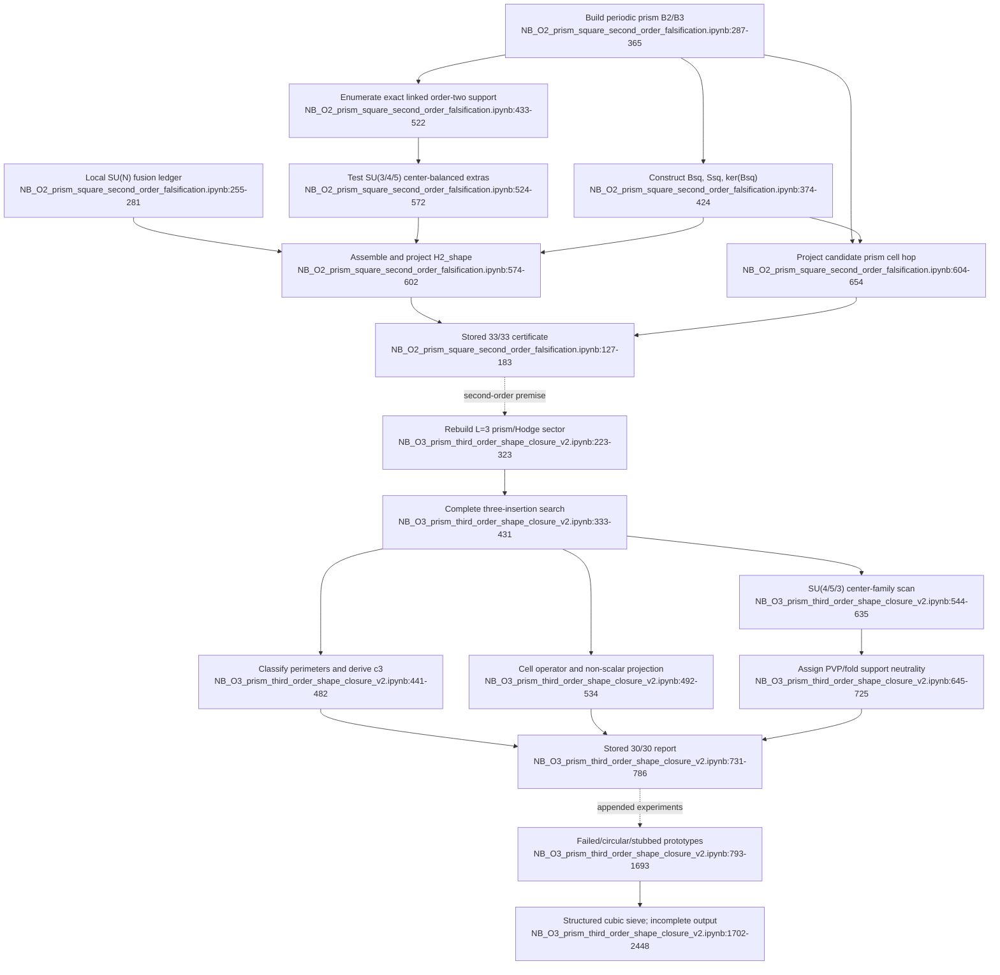

# F03 — Triangular-prism selection-rule falsification and shape closure

## Outcome

The strongest reusable result is narrower than the titles imply:

- The second-order notebook is a clean stored **33/33** structural certificate for vertical-square support and Hodge flatness.
- The first cell of the third-order notebook is a stored **30/30** certificate for the stable/integral triangular-prism completion mechanism.
- The low-rank folded/determinant tail is not independently calculated. `PVP=-P` is assigned and then gated, so it does not close the canonical `PVP=aP` audit.
- Later GPU/prototype cells are failed, circular, stubbed, or incomplete and must be quarantined from evidence.

Recommended status: accept the incidence/enumeration results as structural evidence; keep determinant-family cancellation, folded closure, and “complete third-order shape closure” provisional.

## Second-order exact flow

Key ranges in `sources/NB_O2_prism_square_second_order_falsification.ipynb`:

- scope: `188-226`;
- local fusion ledger: `255-281`;
- product cell complex: `287-365`;
- Hodge sector for `L=3,4,5`: `374-424`;
- exact order-two support: `438-522`;
- SU(3/4/5) center scan: `525-572`;
- projected `H2_shape=t_N*S_sq`: `574-602`;
- candidate third-order cell hop: `611-654`;
- stored 33/33 result: `127-183`.

Call sequence:

```text
symbolic local weights
  -> triangular_prism_torus
       -> triangulated_torus_2d
       -> cycle_B1
  -> Bsq, Ssq, K=ker(Bsq)
  -> enumerate_exact_linked_order2
       -> oriented_square_map_exact
       -> shared_edges_dense
  -> center_balance_extra_channels(SU3, SU4, SU5)
  -> project t_N*Ssq to K
  -> project square_cell_hop_from_B3 to K
  -> gate summary
```

## Third-order authoritative cell

Key ranges in `sources/NB_O3_prism_third_order_shape_closure_v2.ipynb`:

- scope: `168-202`;
- prism complex/Hodge gates: `223-323`;
- complete three-insertion search: `342-431`;
- temporal weights/coefficient: `446-482`;
- cell operator and quotient projection: `492-534`;
- low-rank center classification: `544-635`;
- assigned SU(3) first-order/fold argument: `645-725`;
- stored 30/30 report: `18-162`, `731-786`.

Call sequence:

```text
prism_torus -> B2, B3, Bsq, Ssq, K
  -> exact_three_solutions(p)
       -> completion_cell
       -> perimeter-history classes
  -> temporal_weight -> c3(N)
  -> square_cell_hop -> product-form comparison -> K projection
  -> center_scan(4), center_scan(5), center_scan(3)
  -> assigned structural fold predicates
  -> gate summary
```

## Stored evidence versus appended prototypes

| Cell | Stored result | Evidence assessment |
|---|---|---|
| second-order notebook | 33/33 at `NB_O2_prism_square_second_order_falsification.ipynb:127-183` | cleanest F03 certificate |
| third-order cell 1 | 30/30 at `NB_O3_prism_third_order_shape_closure_v2.ipynb:90-121` | strong stable/integral enumeration; low-rank fold tail asserted |
| cell 2 | no output, `:793-897` | unused sketch; admits missing incidence gather |
| cell 3 | regression false at every order, `:909-1152` | failed random-corpus prototype |
| cell 4 | apparent match, `:1161-1345` | injected zero vector/target-return path, not independent |
| cell 5 | apparent pass, `:1354-1538` | DSU parity stub and stored coefficient constant |
| cell 6 | apparent `1/3`, `:1547-1693` | injected all-zero prism boundary and target echo |
| cell 7 | partial passes, `:1702-2448` | more structured, but output stops before depth 3/4 completion and final summary |

Every cell has `execution_count: null`, so stored-output chronology has no authenticated run provenance.

## Mathematical products and invariants

The notebooks produce

```text
t_N = 2N(N^2-4) / [(N^2-1)(2N^2-1)(4N^2-9)]
ell_N = -2N(3N^2-5) / [(N^2-1)(2N^2-1)(4N^2-9)]
H2_shape = t_N*S_sq = -4t_N*I + t_N*B_sq^T*B_sq
c3_prism = 64 / [N(N^2-1)^2]
```

Checked invariants include:

- `B2*B3=0` (`NB_O3_prism_third_order_shape_closure_v2.ipynb:301-303`);
- `S_sq+4I=B_sq^T*B_sq` (`NB_O2_prism_square_second_order_falsification.ipynb:381-383`);
- `S_sq` acts as `-4I` on `ker(B_sq)` (`:385-419`);
- kernel dimensions `19,33,51` for `L=3,4,5` (`:35-69` stored output);
- exact link-balance enumeration at order two (`:445-475`);
- center-balanced filters for SU(3/4/5) (`:524-572`);
- complete third-order cell-boundary relation (`NB_O3_prism_third_order_shape_closure_v2.ipynb:342-365`);
- non-scalar projected cell operator (`:509-534`; stored spread `6`).

Counts:

- order two at `L=3`: 972 ordered shared-edge endpoint pairs, each multiplicity 2; zero nonlocal, missing-local, or triangle-mediated histories (`NB_O2_prism_square_second_order_falsification.ipynb:74-93`);
- order three at `L=3`: 81 initial squares, 24 solutions each, 1,944 histories; perimeter classes `(5,5)`, `(6,5)`, `(5,6)` each occur 648 times (`NB_O3_prism_third_order_shape_closure_v2.ipynb:29-52`).

## What 33/33 proves—and does not

It proves, within the encoded `L=3` product complex plus geometry checks at `L=4,5`, that second-order off-diagonal support is exactly shared-edge square adjacency; the center-balanced SU(3/4/5) scan adds no nonlocal or triangle-mediated endpoint; and, conditional on the common local coefficient `t_N`, the support-changing shape kernel is scalar modulo the boundary ideal. It also exhibits a viable non-scalar third-order cell-hop direction.

It does not prove the diagonal/rest energy, an all-volume theorem, arbitrary triangulations, complete physical-Hilbert-space Haar closure, source normalization, continuum physics, or the full third-order folded/rest term. `t_N` is imported from F02. The displayed Hodge identity is partly definitional because `Ssq` is built as `Bsq.T@Bsq-4I`; the nontrivial content is support completeness plus the common local weight.

## Flowchart



## Feature-level path forward

Retain the exact incidence/enumeration result only as a fixed lower-order fixture, move every prototype cell out of production, and import `t_N` from its hashed F02 fixture rather than copying it. The canonical O4 runner must compute its own full physical `PVP` matrix and pass fixed multidimensional folded-operator fixtures before using “complete closure”; this feature does not become another production path.

Confidence is high for the call flow and stored structural counts, medium for all-volume promotion, and low for the asserted SU(3) folded closure.
