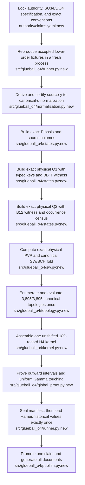

# One canonical path

## Decision

There will be exactly one SU(3) fourth-order production computation:

> **authority and normalization → physical P/Q1/Q2 states → canonical Hermitian SW/BCH → complete 3,895-topology corpus → one exact 189-record H4 kernel → global proof → final historical comparison**

No second oracle, alternate production algorithm, reconciliation branch, hybrid scalar shift, or competing kernel is part of the architecture.

This replaces the earlier multi-lane proposal. “Independent finite-cluster,” Gelfand, polynomial-fit, dual-cold-oracle, and Monte Carlo paths are removed from the fourth-order critical path. Existing implementations may supply fixed regression fixtures or isolated code ideas, but they cannot produce an alternative promotable result.

## Why this path

The path begins from the last executed physical-Q frontier, v10a2 17/17, rather than from any unexecuted v10a20-v10a26 notebook. It preserves the project's canonical physical-Q representation and makes the missing 3,895-case Stage-3H corpus the production calculation itself, not a replay of some other calculation.

The chosen algorithm is fixed:

- group/lattice/order: SU(3), `L=5`, through `O(u^4)`;
- state representation: explicit physical P/Q1/Q2;
- block identity: `(canonical joint irrep, exact H0 energy, canonical center flux)`;
- local Haar: one exact factorized contractor restricted to the canonical fourth-order workload; `W22`/`Q2->Q2` is never built, `p+q<=6` is enforced, and `(2,5)/(5,2)` is a fatal upstream-order violation rather than a pattern to implement;
- perturbation theory: canonical Hermitian Schrieffer-Wolff/BCH only;
- arithmetic: exact integers/rationals through kernel assembly; outward-rounded intervals for the global proof;
- topology corpus: exactly the canonical 3,895 Stage-3H records, computed once;
- final result: one unshifted 189-record real-space H4 kernel;
- external numbers: Hamer/historical values load only after that kernel and its manifest are sealed.

There is no runtime flag for Gelfand versus SW, fit versus recurrence, primary versus oracle, or old versus modern branch.

## Sources selected and rejected

### Foundation

- Keep the stored v5, v8, v9.1, v10a, and executed v10a2 results as regression fixtures at their stated scope.
- Use v10a2's explicit physical-Q construction as the implementation baseline.
- Repair the v10a3 producer/consumer block-key mismatch before any Q2 work (`sources/ENGINE_O4_hodge_v10a3_physicalq2_order4_firewall_a100.py:3009-3010,4626-4718`).

### Candidate code to extract narrowly

- v10a24c's physical `PVP` construction and multidimensional fold-regression ideas (`sources/hodge_v10a24c_RootedFullT1_DualColdOracle_O4_A100(1).py:6499-6575`);
- v10a24c's corrected rooted geometry/fold-support fixes, only where the canonical 3,895-corpus implementation requires them (`sources/hodge_v10a24c_RootedFullT1_DualColdOracle_O4_A100(1).py:7045-7172`);
- v10a20b denominator intent (`sources/Hodge_v10a20b_DenominatorLift_Exact_DA_m4_A100(2).ipynb:1`, cell 2 source 6382-6662), rewritten so exact values are exact from their origin rather than reconstructed from floats;
- no code from v10a26's `(5,2)/(2,5)` invariant basis. That branch exists only because v25's finite-cluster builder materialized the fifth-order `W22` block that its own O4 specification forbids.

### Rejected from production

- all v10a20-v10a26 notebooks as runners or run evidence;
- v10a25 Gelfand linked-cluster result;
- v10a26 finite-cluster/SW rooted result and its pickle checkpoint;
- the Section-15 one-/two-face GO benchmark as a production gate;
- rooted finite-cluster incidence as an alternative scalar computation;
- target-derived local scalar shifts;
- F07 literal `FOLD_EX` handoff;
- F08 bookkeeping inversion as an oracle;
- F09 dual-cold branch selection;
- Monte Carlo as a fixed-order theorem dependency.

## Single target architecture



Every arrow is mandatory and sequential. Any failure terminates the run. There is no bypass, alternate runner, partial promotion, or merge of competing outputs.

## Minimal repository shape

This is a destination map, not permission to modify the read-only `sources/` archive.

```text
authority/
  claims.yaml                 one controlling claim and milestone state
  specification.yaml          fixed SU3/L5/O4 conventions and 3,895 corpus ID
src/glueball_o4/
  runner.py                   the only production entry point
  geometry.py                 cubic geometry, roots, translations
  haar.py                     the one exact local Haar contractor
  states.py                   P, Q1, Q2 and typed keys
  normalization.py            source-y to canonical-u derivation
  sw.py                       the one canonical Hermitian SW/BCH implementation
  topology.py                 the one 3,895-record enumerator/evaluator
  kernel.py                   the one 189-record assembler
  global_proof.py             interval and Gamma proof
  publish.py                  post-success claim/docs generation
tests/
  fixtures/                   accepted low-order and local algebra fixtures only
evidence/
  runs/<content-id>/          append-only artifacts from the single runner
docs/generated/               generated only after final success
```

Do not add a factory, plugin registry, algorithm switch, or second runner.

## One execution contract

The only promotable invocation is a fresh run of the single entry point, conceptually:

```text
python -m glueball_o4.runner run --fresh
```

The runner has one fixed canonical configuration. Operational checkpoints may restart an interrupted stage only when source, specification, environment, input, and stage hashes match exactly. A resumed run is diagnostic; final promotion requires a fresh end-to-end run.

Each stage writes one immutable, content-addressed artifact with:

- source and specification hashes;
- dependency/environment lock and effective fixed configuration;
- exact parent artifact hash;
- arithmetic status;
- structured required-gate results;
- output payload hash;
- timing/resource data;
- terminal status.

The gate primitive raises immediately on fail, skip, NaN, missing output, cardinality mismatch, or hash mismatch. It never merely prints and continues.

## Canonical artifacts, in order

1. authority/specification snapshot;
2. accepted lower-order fixture replay;
3. normalization certificate;
4. exact P artifact;
5. exact Q1 artifact and `B B^T=K` witness;
6. exact Q2 artifact, `B12` witness, observed local-occurrence census, and a machine-checked certificate that no `W22`/`Q2->Q2` contraction was scheduled;
7. exact physical `PVP` matrix and multidimensional SW/BCH certificate;
8. denominator/Haar/support arithmetic ledger;
9. canonical 3,895-record topology table with one exact amplitude per record;
10. one unshifted 189-record H4 kernel;
11. outward interval and uniform Gamma certificates;
12. sealed pre-unblind run manifest;
13. Hamer/historical comparison;
14. promoted claim record and generated documents.

No finite-cluster coefficient, Gelfand result, fitted coefficient, shifted hybrid kernel, or Monte Carlo estimate appears in this chain.

## Gate-by-gate critical path

| Milestone | Required gate | Exact exit artifact | What may be claimed |
|---|---|---|---|
| M0 authority lock | one controlling v1.4-derived status; SU3/L5/O4 specification hash fixed | authority/spec snapshot | only that fourth order remains audit-pending |
| M1 baseline | all accepted lower-order fixtures reproduce from a fresh process | baseline manifest | only the already scoped lower-order results |
| M2 normalization | Hamiltonian derivation proves the source-`y` to canonical-`u` map | normalization certificate | coefficients may now be labeled in the canonical variable |
| M3 physical states | exact P, Q1, Q2; typed keys; `B B^T`; `B12`; no E0 pole; observed occurrence census closed; every local word has `p+q<=6`; `W22`, `(2,5)`, and `(5,2)` absent by construction | P/Q1/Q2 artifacts plus order-schedule certificate | only state-space and quotient completeness through the declared O4 depth |
| M4 fold | exact physical `PVP=aP`; exact multidimensional noncommuting SW/BCH regression | PVP/fold certificate | only Gates 1-2 are closed |
| M5 topology | exactly 3,895 unique expected records, including the 2,417 formerly missing folded cases; every amplitude exact | topology table and coverage manifest | only that canonical Stage 3H coverage is complete |
| M6 kernel | topology table deterministically assembles exactly 189 nonzero records with no target-loaded shift | raw H4 kernel and SHA | the exact fixed-order computational ledger exists; global theorem still pending |
| M7 global proof | outward interval proof and uniform Gamma-touching proof both pass on that kernel hash | interval/Gamma certificates | all six fixed-order gates are closed |
| M8 unblind/publish | pre-unblind manifest sealed; historical comparison runs; registry and documents generated from the same manifest | final manifest and generated docs | the precise registry-approved SU(3) fourth-order claim, and nothing broader |

Claims never advance on partial completion. A failure at M5 leaves the project at M4; it does not create a “mixed result” branch.

## Implementation phases

### Phase 0 — delete ambiguity

- Mark all source-only v10a20-v10a26 notebooks non-evidential.
- Remove alternative fourth-order runners from the destination design.
- Freeze the exact conventions and corpus identity before editing computational logic.

### Phase 1 — extract the one core

- Extract only the code required for the selected algorithm.
- Keep imports pure and production behind `glueball_o4.runner`.
- Replace mutable globals and copied notebook state with typed immutable artifacts.
- Repair the Q block-key contract.

### Phase 2 — prove the foundation

- Replay accepted lower orders.
- Close normalization before fourth-order coefficient comparison.
- Build P/Q1/Q2 and measure the actual Haar occurrence corpus under an order-aware block schedule.
- Implement the one exact contractor required by that O4 corpus. Any `(2,5)/(5,2)` observation must print full layer/state/link provenance and stop; it must never cause the contractor to be expanded.

### Phase 3 — compute fourth order once

- Prove physical `PVP` and canonical SW/BCH.
- Enumerate the canonical 3,895 topology records.
- Compute every amplitude exactly and assemble the unshifted 189-record kernel.
- Do not compute a competing finite-cluster scalar and do not shift the kernel to a target.

### Phase 4 — finish the proof and publish

- Run interval and Gamma analysis on the exact kernel hash.
- Seal the complete pre-unblind manifest.
- Load Hamer/historical values once as the final comparison step.
- Promote one registry claim and regenerate documents only if every preceding stage passed.

## Success criteria

The architecture is complete only when one fresh command produces one uninterrupted chain from authority snapshot to generated documents, with:

- one source tree;
- one fixed configuration;
- one physical-Q state representation;
- one Haar contractor;
- one order-aware block schedule with no `W22` at O4;
- one SW/BCH implementation;
- one 3,895-record topology corpus;
- one unshifted 189-record H4 kernel;
- one run manifest;
- one final claim decision.

Anything else is a test fixture, archived experiment, or failure record—not another path.

## Immediate next action

Do not run another A100 notebook. First create the single-runner plan, remove the finite-cluster/Gelfand/Factor52/dual-oracle branches from it, and implement only through M3 on ordinary deterministic fixtures. The first GPU authorization comes after M3 proves the exact state, order-schedule, and occurrence contracts.
