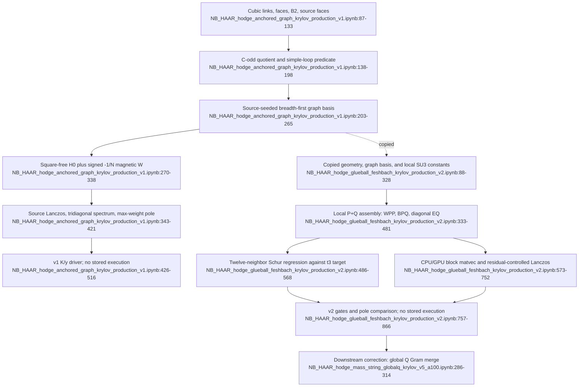

# F04 — Anchored graph/Krylov glueball prototypes

## Outcome

This feature contains a useful two-step prototype lineage:

- v1 builds the connected, square-free, C-odd Wilson-loop graph and a source-started Lanczos pole solver.
- v2 copies that backbone, adds local one-shared-link and determinant/sextet Q channels, and introduces cold-regression and Ritz-convergence gates.

Neither notebook stores an execution. Both have `execution_count: null` and `outputs: []`, so the basis sizes, pole tables, and gate summaries present in their source are intended runtime behavior, not evidence captured in this project mirror. The later global-Q solver explicitly says that channels produced by different raw trace products can be nonorthogonal and must be Gram-merged. Consequently, v2's locally indexed, diagonal-Q construction is a bridge prototype, not the current physical-Q or fourth-order result.

## Files and evidence ranges

| File | Ranges | Assessment |
|---|---:|---|
| `sources/NB_HAAR_hodge_anchored_graph_krylov_production_v1.ipynb` | empty execution record 4–8; scope 9–61; graph engine 87–338; Lanczos 343–421; driver 426–516 | coherent unexecuted square-free prototype |
| `sources/NB_HAAR_hodge_glueball_feshbach_krylov_production_v2.ipynb` | empty execution record 4–8; scope 9–78; graph engine 158–328; local P+Q model 333–481; cold regression 486–568; Lanczos 573–752; driver 757–866 | coherent unexecuted channel-enrichment prototype; Q quotient is local, not global |

## Exact call flow

### v1: connected square-free graph backbone

1. Module initialization fixes `N=3`, periodic `L=3`, graph depth `MAX_K=3`, five `y` values, one `xy` polarization, and Lanczos limits (`NB_HAAR_hodge_anchored_graph_krylov_production_v1.ipynb:71-82`).
2. `build_cubic_complex()` calls `shift()` to enumerate vertices, oriented links, plaquettes, and the link–face incidence matrix `B2`; top-level code then builds link-to-face adjacency and the zero-momentum source-face list (`:87-133`).
3. `canonical_codd()` quotients `q` and `-q` with the C-odd sign; `is_simple_single_loop()` enforces one connected oriented cycle; `candidate_faces()` restricts deformations to incident plaquettes (`:138-198`).
4. `build_graph_basis(max_depth)` seeds all translated `xy` plaquettes, then breadth-first applies `q ± B2[:,f]`, retaining only square-free simple loops and normalizing the source vector (`:203-265`).
5. `build_squarefree_hamiltonian(max_depth)` calls the basis builder, assigns exact perimeter electric energies, adds the SU(3) elementary-plaquette diagonal `PWP=+P`, and assembles signed `-1/N` connected deformations into a symmetric sparse `W` (`:270-338`).
6. `spectral_measure()` forms the matrix-vector action `H(y)x=d0*x+y*W*x`, calls `source_lanczos()`, diagonalizes the tridiagonal matrix, and selects the maximum-source-weight pole (`:343-421`).
7. The top-level driver repeats the build and spectral solve for `K=0..3`, asserts the source-code expectations `27, 297, 2,889, 24,516`, prints a K-convergence table, and evaluates a finite-`y` first-order slope (`:426-516`).

### v2: copied graph backbone plus local P+Q channels

1. Module initialization fixes `MAX_K=2`, the same lattice/source inputs, local SU(3) Casimirs and decomposition weights, convergence tolerances, and an optional CuPy backend (`NB_HAAR_hodge_glueball_feshbach_krylov_production_v2.ipynb:88-153`).
2. `build_cubic_complex()` and the top-level incidence/source construction reproduce the v1 geometry (`:158-202`); `canonical_codd()`, `canonical_pair_codd()`, `is_simple_single_loop()`, `candidate_faces()`, and `plaquette_match()` supply graph and Q-channel keys (`:207-277`).
3. `build_graph_basis(max_depth)` repeats the v1 source-seeded breadth-first traversal and source normalization (`:282-328`).
4. `build_enriched_model(max_depth)` calls the basis builder, assigns `E_P`, and uses nested `get_q()` to deduplicate locally keyed Q records while enforcing a single energy for each key (`:333-367`).
5. For elementary plaquettes it adds `PWP=+P` and a sextet Q coupling of `-1`; for one-shared-link deformations it adds retained square-free P–P hops, like-orientation `bar3/6` Q channels, and opposite-orientation singlet/adjoint Q channels (`:369-445`).
6. It assembles the sparse `W_PP` and `B_PQ` blocks, verifies P-space symmetry, and returns diagonal `E_Q` plus Q-type metadata (`:447-481`). There is no Q Gram matrix or Q–Q mixing in this model.
7. `validate_second_order_t3(model)` Schur-reduces the actual assembled blocks at `E0=8/3`, enumerates twelve shared-edge plaquette neighbors, and compares each signed coefficient with the hard-coded target `5/612` (`:486-568`).
8. `prepare_runtime()` copies the blocks and source to CPU or GPU (`:573-604`). `source_lanczos(runtime,y,enriched)` applies either the P-only or block P+Q Hamiltonian, performs two-pass full reorthogonalization, and stops only after residual, energy, and residue stability tests (`:609-752`).
9. The top-level driver evaluates local algebra gates, builds `K=0..2`, calls the cold `t3` regression at `K=2`, compares square-free and enriched poles, checks the central `y` derivative at `K=0`, and would reject failed gates or warn on unconverged deepest-K poles (`:757-866`).

## Inputs, outputs, and coded invariants

### Inputs

- Shared: `SU(3)`, periodic `3^3` lattice, `xy` component of the zero-momentum C-odd plaquette source, `C_F=4/3`, and `y=(0.02,0.05,0.10,0.20,0.30)` (`NB_HAAR_hodge_anchored_graph_krylov_production_v1.ipynb:71-82`; `NB_HAAR_hodge_glueball_feshbach_krylov_production_v2.ipynb:88-106`).
- v1: maximum graph depth three and a square-free fundamental-loop Hilbert-space restriction (`NB_HAAR_hodge_anchored_graph_krylov_production_v1.ipynb:18-40`).
- v2: maximum graph depth two; hard-coded one-link `F x F` and `F x Fbar` weights/gaps plus the elementary determinant/sextet channel (`NB_HAAR_hodge_glueball_feshbach_krylov_production_v2.ipynb:23-47`, `:108-122`).

### Intended outputs

- v1 would print graph-basis and Krylov dimensions, source-pole energy/residue, and depth convergence (`NB_HAAR_hodge_anchored_graph_krylov_production_v1.ipynb:46-61`, `:442-505`).
- v2 would print P/Q dimensions and channel counts; P-only versus enriched pole energies; residue and Ritz residual; seven gates when the default `K=2` path reaches the cold regression; and a final convergence warning/status (`NB_HAAR_hodge_glueball_feshbach_krylov_production_v2.ipynb:768-866`).
- No intended output is stored in either notebook (`NB_HAAR_hodge_anchored_graph_krylov_production_v1.ipynb:4-8`; `NB_HAAR_hodge_glueball_feshbach_krylov_production_v2.ipynb:4-8`).

### Coded invariants

- Loop coordinates remain in `{-1,0,+1}` and form one connected oriented cycle (`NB_HAAR_hodge_anchored_graph_krylov_production_v1.ipynb:151-192`, `:233-248`).
- Charge-conjugate loops share one key with the correct C-odd sign (`:138-149`).
- The source has Euclidean norm one in the asserted orthonormal square-free basis (`:254-263`).
- Sparse P-space magnetic blocks are symmetric to `1e-12` (`:321-328`; `NB_HAAR_hodge_glueball_feshbach_krylov_production_v2.ipynb:447-458`).
- v2 rejects inconsistent energies for a repeated local Q key (`NB_HAAR_hodge_glueball_feshbach_krylov_production_v2.ipynb:351-363`).
- v2's cold model must reproduce all twelve signed `t3=5/612` neighbors to `5e-13`, and its elementary enriched pole must have central slope `+1` within `2e-6` (`:539-566`, `:832-854`).
- v2's reported Lanczos convergence requires a Ritz residual plus stable energy and residue over two checks (`:678-715`).

These are assertions in unexecuted source, not recorded passes.

## Evidence and provenance limits

1. **No saved runs.** The comments giving v1 basis sizes and v2's approximate two-hundred-thousand Q states are forecasts embedded in source, not notebook outputs (`NB_HAAR_hodge_anchored_graph_krylov_production_v1.ipynb:53-61`; `NB_HAAR_hodge_glueball_feshbach_krylov_production_v2.ipynb:76-78`).
2. **Hard-coded upstream algebra.** v2 embeds Casimirs, channel weights, gaps, and `T3_TARGET` numerically (`NB_HAAR_hodge_glueball_feshbach_krylov_production_v2.ipynb:104-122`). The cold regression checks assembly against that imported target; it is not an independent derivation.
3. **Local Q is not the physical/global quotient.** Q channels are keyed by local trace-pair history and assigned diagonal energies (`:346-445`, `:460-478`). The later v5 solver identifies nonorthogonality between channels from different raw trace products and replaces this with `K_lambda=C G_lambda C^T` before Feshbach elimination (`NB_HAAR_hodge_mass_string_globalq_krylov_v5_a100.ipynb:286-314`).
4. **Truncation remains substantial.** v2 explicitly excludes arbitrary multi-link/multi-occupancy channels and the string sector (`NB_HAAR_hodge_glueball_feshbach_krylov_production_v2.ipynb:68-78`). v1 excludes even the local Feshbach channels (`NB_HAAR_hodge_anchored_graph_krylov_production_v1.ipynb:33-40`).
5. **Pole identity is heuristic.** Both solvers select the Ritz value with maximum source weight independently at each `y`; neither performs overlap-based branch continuation across coupling or depth (`NB_HAAR_hodge_anchored_graph_krylov_production_v1.ipynb:403-417`; `NB_HAAR_hodge_glueball_feshbach_krylov_production_v2.ipynb:680-706`).
6. **No reproducibility artifact.** Neither notebook serializes a basis, sparse operator, pole table, environment lock, or source/output hash. A fresh run is therefore required before any numerical statement can be cited.

## Flowchart

## Dependencies and consumers

- **Upstream mathematical dependency:** v2 says its local channels come from already-certified SU(3) Feshbach algebra but imports no certificate or shared implementation; it copies the resulting constants (`NB_HAAR_hodge_glueball_feshbach_krylov_production_v2.ipynb:15-17`, `:104-122`).
- **Internal dependency:** v2 is a source copy of v1's geometry, C-odd graph algebra, basis traversal, and Lanczos design rather than an importable extension (`NB_HAAR_hodge_anchored_graph_krylov_production_v1.ipynb:87-421`; `NB_HAAR_hodge_glueball_feshbach_krylov_production_v2.ipynb:158-328`, `:609-752`).
- **Downstream consumer/correction:** the global-Q mass/string lineage keeps the anchored graph idea but globally Gram-merges source-bright Q channels before its Feshbach solve (`NB_HAAR_hodge_mass_string_globalq_krylov_v5_a100.ipynb:286-326`).
- **Declared next observable:** v2 names a winding-string calculation in the same Hamiltonian as the next requirement for continuum comparison (`NB_HAAR_hodge_glueball_feshbach_krylov_production_v2.ipynb:862-866`).

## Feature-level unification path

1. Extract one reusable cubic-complex, C-odd canonicalization, simple-loop, and breadth-first graph-basis library; retain v1's basis counts as cold regression fixtures only after a fresh recorded run.
2. Separate Hilbert-space construction from the eigensolver: make P basis, physical/global Q quotient, operator blocks, and source vector explicit versioned artifacts.
3. Retire v2's history-local diagonal-Q model as a production path. Feed the anchored P graph into the globally Gram-merged or explicitly orthonormal physical-Q representation used downstream.
4. Give the pole solver overlap-based branch continuation across `y` and K, while retaining Ritz residual and residue checks.
5. Emit a cold-run manifest containing code hash, environment, configuration, basis/operator hashes, gate ledger, and pole table; only that artifact can promote numerical evidence.

Confidence is high (0.97) for the static call flows, coded gates, empty-output status, and v1→v2 lineage. Confidence is medium for the mathematical completeness of the local channel mapping because it was not rederived or executed here. The principal unresolved gap is numerical: neither prototype has a stored run in the project corpus.
