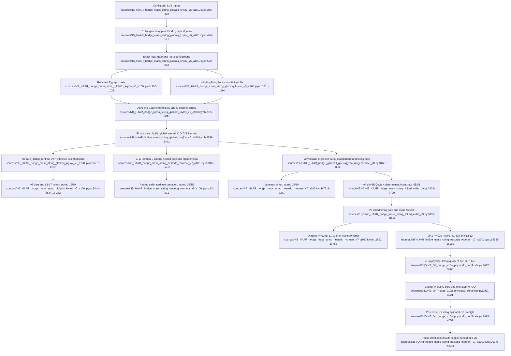

# F05 — Global-Q Gram-merged mass/string solver lineage

## Outcome

The defensible cubic-order path is **v5 global-Q baseline → v8 vacuum-character mass correction → v9.1 linked-string sign-corrected closure → appended v10a explicit-Q certificate**. The v7 scalar first-Q-moment interpretation is retired, and the original v9 export is a recorded numerical coefficient-extraction failure rather than the passing production result. The cumulative notebook is an evidence container with both failed and passing cells; it must not be treated as one uniformly passing run.

No source file writes a durable model artifact. Each script/notebook rebuilds large in-memory bases, Gram kernels, and pole tables, prints a gate ledger, and exits. The feature therefore has strong stored numerical evidence but weak provenance and reuse boundaries.

## Sources consulted and identity map

Every scoped source was read in full.

| Exact path and full range read | Role | Identity result |
|---|---|---|
| `sources/NB_HAAR_hodge_mass_string_globalq_krylov_v5_a100.ipynb:1-3636` | v5 global-Q baseline, code plus stored output | Whole-file SHA-256 `5977DEB9769287270937062D6BFA553B183BC270A0FECAD93DFF41811AD6593C` |
| `sources/Hodge_Mass_String_GlobalQ_Krylov_v5_A100 (1).ipynb:1-3636` | Copy of v5 | **Exact byte duplicate** of the preceding notebook, including output; same SHA-256 |
| `sources/NB_HAAR_hodge_mass_string_nestedq_moment_v7_a100.ipynb:1-3471` | Standalone v7 source-only notebook | Its code-cell source is exact to cumulative notebook cell 0; SHA-256 `89F6E2B915CAD04F4B3BD4554DB20FF36F75EFB14919E08E740ABF481C359140` |
| `sources/NB_HAAR_hodge_mass_string_nestedq_moment_v7_a100.ipynb:1-20562` | Cumulative executed v7→v8→v9→v9.1→v10a notebook | Cell 0 is v7; cells 1–4 are exact source copies of the standalone v8, v9, v9.1, and v10a exports respectively |
| `sources/ENGINE_HAAR_hodge_glueball_globalq_vacuum_character_v8.py:1-3526` | v8 mass correction | Exact to cumulative cell 1; source SHA-256 `F89FCEB0328C37B2EB4D1E823FCE16848D5E54D069B68D6F59A97C892B925F07` |
| `sources/ENGINE_HAAR_hodge_mass_string_linked_cubic_v9.py:1-4004` | Original v9 linked-string export | Exact to cumulative cell 2; source SHA-256 `671036DF4E21CCB229C12B26DE5F7E942428CCA23358B2D28E6589CC107F31A9` |
| `sources/ENGINE_HAAR_hodge_mass_string_linked_cubic_v9_1.py:1-4005` | v9.1 numerical-extraction hotfix | Exact to cumulative cell 3; source SHA-256 `BDCE7AAAAFE7931EB3D862F9F87A32F3C7E463D1CCA3BC7144FEE6BED16C8112` |
| `sources/ENGINE_O4_hodge_v10a_physicalq_certificate.py:1-4178` | Appended v10a explicit physical-Q certificate; downstream F06 boundary | Exact to cumulative cell 4; source SHA-256 `C1E9E7687A57FAC0C2AE7445EDB2FBEB9ABC80A0BB831B43777F8BDA31EE8C81` |

The v5 code-cell source hash is `21A3A792F5CFE408B3841F4DC5F499B86B34301A1CCB53456EE6A1F37400C2E1`. The standalone v7 notebook has `execution_count: null` and `outputs: []` at `sources/NB_HAAR_hodge_mass_string_nestedq_moment_v7_a100.ipynb:4-8`; its evidence comes only from the exact executed copy in the cumulative notebook.

### Exact and near duplicates

- The two v5 notebooks are exact whole-file duplicates, not variants.
- Cumulative notebook source ranges `sources/NB_HAAR_hodge_mass_string_nestedq_moment_v7_a100.ipynb:223-3671`, `:3674-7208`, `:7374-11387`, `:11768-15781`, and `:16160-20346` are respectively exact source copies of v7, v8, v9, v9.1, and v10a.
- v9.1 is a **near duplicate** of v9. Its only substantive default change is `V9_C3_H=0.0005` → `0.002`, with a comment that the larger signal supports the symmetric degree-5 fit (`sources/ENGINE_HAAR_hodge_mass_string_linked_cubic_v9.py:3569-3576`; `sources/ENGINE_HAAR_hodge_mass_string_linked_cubic_v9_1.py:3569-3577`). Remaining differences are v9.1 labels/messages (`sources/ENGINE_HAAR_hodge_mass_string_linked_cubic_v9_1.py:3876-3878,3921-3924,3987-4002`). The physical construction and exact rational target are unchanged.
- v8 and v9 are cumulative copies of the preceding monolith, not modular consumers. v9 also stores audit closures/records in the returned model dictionary (`sources/ENGINE_HAAR_hodge_mass_string_linked_cubic_v9.py:3157-3161`), coupling its new string audit to builder internals.

## Exact current-state flow

### v5 — implicit global-Q Gram/Feshbach baseline

1. Configuration fixes SU(3), periodic geometry, Krylov/Feshbach tolerances, and production ranges (`sources/NB_HAAR_hodge_mass_string_globalq_krylov_v5_a100.ipynb:363-399`).
2. `build_cubic_complex` constructs links, plaquettes, stars, and incidence (`:434-485`); the C-odd graph algebra and exact local Haar/Fierz machinery follow (`:487-982`).
3. `build_graph_basis` builds the retained P graph (`:986-1033`). `WindingStringSector` supplies the straight-string and local-deformation P sector (`:1511-1790`), while `sigma_fit_bundle` fits finite-length tensions (`:1983-1994`).
4. Linkwise joint-Casimir actions and `_joint_template` resolve Q channels by Peter–Weyl irreps (`:3027-3247`).
5. The **final**, runtime-effective `_build_global_model` enumerates one-step joint actions, groups them by joint irrep signature and bare energy, contracts exact/floating Haar cross-Grams, and forms positive-semidefinite `K_lambda=C G_lambda C^T` kernels (`:3248-3442`). It deliberately keys Q denominators to bare `H0` (`kkey=(lam,0)`), excluding history-dependent vacuum labels from Q.
6. `build_global_glueball_model` and `build_global_string_model` wrap that builder (`:2476-2535`). `prepare_global_runtime` transfers sparse structures; `_global_effective_eval` evaluates `H_PP + u W_PP + u^2 Σ_lambda K_lambda/(E-lambda)`; `global_feshbach_pole` solves the nonlinear pole and residue (`:2537-2637`). `validate_global_t3` checks the third moment (`:2639-2680`).
7. The top-level driver builds the glueball and L=3…7 string models, extracts perturbative/finite-u results, fits tension, and asserts the gate ledger (`:3444-3614`). There is no `if __name__ == "__main__"`, so importing the file-equivalent code executes production.

There are three definitions of `_build_global_model` at `sources/NB_HAAR_hodge_mass_string_globalq_krylov_v5_a100.ipynb:2217`, `:2709`, and `:3248`. Python name resolution makes only the last definition active when the driver runs. The wrappers were defined earlier, but look up the final global name at call time. This shadowing is a material maintenance hazard.

### v7 — calibrated nested first-Q moment, now retired

The v7 addition (`sources/NB_HAAR_hodge_mass_string_nestedq_moment_v7_a100.ipynb:3169-3453`) wraps the same global-Q kernels with `_q1_effective_eval`, replacing each bare denominator with `E-lambda-u*omega_q` (`:3215-3238`), then solves it in `q1_nested_pole` (`:3240-3286`). `_fit_c3`, `mass_c3`, and `calibrate_mass_omega` tune one scalar omega to the exact mass cubic coefficient (`:3288-3317`); the corresponding string functions independently tune a second omega (`:3320-3347`).

This is a calibration loop, not an independent physical prediction: `M3_EX=-109151/249696` is supplied at `:3208`, while the now-corrected historical string target is supplied as `S3_EX=+61/408` at `:3212`. The fitted values in the stored run—mass omega ≈1.181957 and string omega ≈0.497739—therefore absorb missing cubic physics. v8 explicitly retires this interpretation (`sources/ENGINE_HAAR_hodge_glueball_globalq_vacuum_character_v8.py:3524-3530`).

### v8 — mass repair from the local vacuum character

v8 diagnoses the missing mass cubic contribution as the exact SU(3) local-vacuum determinant, not a scalar `W_QQ` moment (`sources/ENGINE_HAAR_hodge_glueball_globalq_vacuum_character_v8.py:3163-3196`). `vacuum_character_ops` builds the finite character-space operators (`:3234-3272`), and `vacuum_cluster_energy` supplies the linked vacuum energy (`:3281-3288`), with exact `e_vac,2=-3/4` and `e_vac,3=-9/32`. `_v8_global_effective_eval` keeps the v5 bare-Q kernels/denominators but changes the P diagonal vacuum counterterm (`:3290-3310`); `v8_global_feshbach_pole` and coefficient extraction consume it (`:3320-3386`). The driver verifies the repaired mass through cubic order (`:3388-3526`) and intentionally does not issue a new mass/string continuum ratio.

### v9 → v9.1 — direct marked-string cubic closure and sign correction

v9 derives, rather than inserts, the raw straight-string cubic moment. `_v9_first_resolvent_vector` constructs `phi=R0 Q W|straight>` from retained nondegenerate P intermediates plus exact joint-Casimir global-Q vectors (`sources/ENGINE_HAAR_hodge_mass_string_linked_cubic_v9.py:3689-3726`). `_v9_w_expectation` contracts `⟨phi|W|phi⟩` (`:3728-3766`), using the SU(3)-specific `(4,1)/(1,4)` determinant projector in `_v9_haar_endpoint` (`:3585-3660`). `derive_marked_string_raw_c3` returns the extensive raw value per link (`:3768-3788`).

The direct result is `E3_raw/L=-65/51`. Four incident plaquettes per bulk link combine it with the independently derived vacuum coefficient to give

`s3 = -65/51 - 4*(-9/32) = -61/408`.

This is the explicit correction of the earlier `+61/408` sign (`sources/ENGINE_HAAR_hodge_mass_string_linked_cubic_v9.py:3534-3567,3578-3580`). `_v9_string_effective_eval` adds the extensive `L*raw_c3*u^3` identity to the v8 vacuum/global-Q Hamiltonian (`:3792-3813`), `v9_string_feshbach_pole` solves it (`:3822-3858`), and `_v9_string_coeffs` performs the cubic firewall fit (`:3861-3871`). v9.1 changes only the finite-difference scale used by that firewall; it is the passing export, not a new physics version.

### appended v10a — explicit physical-Q quotient and F06 handoff

v10a is a self-contained distilled certificate and explicitly stops before a full `m4/C3` claim (`sources/ENGINE_O4_hodge_v10a_physicalq_certificate.py:1-24`). `_v10_physical_raw_vec` reconstructs raw one-step Q vectors (`:3637-3658`). `build_physical_q_quotient` eigendecomposes each block Gram matrix, removes null directions, produces an orthonormal physical-Q basis, constructs `B_M/B_W`, and verifies `B B^T=K` (`:3660-3769`). `v10_explicit_pq_pole` solves the explicit P⊕Q Hamiltonian and checks it against the Schur/Feshbach pole (`:3811-3836`). `build_one_step_WQQ` constructs the source-projected one-step Q interaction (`:3854-3921`).

`v10_string_c3_decomposition` splits the raw marked-string moment into PP, cross, and QQ pieces without manual cubic injection (`:3975-4015`), while `v10_q2_preflight` only censuses the first new Q1→Q2 layer (`:4018-4057`). The driver/certificate (`:4060-4178`) hands the genuinely higher-order Q2/folded work to F06; it does not promote a fourth-order result.

## Stored evidence: pass, fail, and error states

| Stored run | Exact output range | State and material result |
|---|---|---|
| v5, present identically in both v5 notebooks | `sources/NB_HAAR_hodge_mass_string_globalq_krylov_v5_a100.ipynb:13-282` and exact duplicate `sources/Hodge_Mass_String_GlobalQ_Krylov_v5_A100 (1).ipynb:13-282` | **19/19 passed** (`:272`). Includes exact-vs-fast Haar, glue K2/K3 Gram PSD, 12 third-moment neighbors, `m2=11/306`, `s2=-22/153`, L=3…7 string Gram checks, convergence, positive tension, and fit-spread gates. |
| v7 standalone | `sources/NB_HAAR_hodge_mass_string_nestedq_moment_v7_a100.ipynb:4-8` | **Not executed; no stored output.** |
| v7 cumulative cell 0 | `sources/NB_HAAR_hodge_mass_string_nestedq_moment_v7_a100.ipynb:13-221` | **15/15 passed** (`:198`) for its calibrated gates, including omega≈1.181957 (mass) and ≈0.497739 (string). Passing numerics do not rescue the retired interpretation. |
| v8 cumulative cell 1 | `sources/NB_HAAR_hodge_mass_string_nestedq_moment_v7_a100.ipynb:7211-7371` | **16/16 passed** (`:7358`). Character depth 4→5 shift `1.152e-11`; exact `e2=-3/4`, `e3=-9/32`; repaired `m3=-0.437135627286`; K1/K2 mass poles converge. |
| original v9 cumulative cell 2 | `sources/NB_HAAR_hodge_mass_string_nestedq_moment_v7_a100.ipynb:11390-11765` | Exact rational construction passes, but the numerical cubic firewall reports `s3=-0.149519257361` and fails tolerance (`:11591`); final ledger is **11/12**, followed by `AssertionError` (`:11735-11761`). |
| v9.1 cumulative cell 3 | `sources/NB_HAAR_hodge_mass_string_nestedq_moment_v7_a100.ipynb:15784-16157` | With `h=0.002`, fitted `s3=-0.149509808855` passes (`:15985`); **12/12 v9.1**, cumulative **28/28** (`:16129-16150`). This is the authoritative cubic string run. |
| appended v10a cumulative cell 4 | `sources/NB_HAAR_hodge_mass_string_nestedq_moment_v7_a100.ipynb:20349-20542` | Raw Q vectors 1323 → physical rank 1107 + nullity 216; `BB^T-K` error `3.553e-15`; explicit and Schur poles agree; source-projected one-step K0 `W_QQ` max `1.114e-15`; string PP/L=0, cross/L=-1/3, QQ/L=-16/17, raw/L=-65/51, linked `s3=-61/408`; Q2 new-key census 8160; **24/24 passed** (`:20379-20539`). No `m4` is claimed. |

## Inputs, outputs, invariants, and side effects

### Inputs

- SU(3) (`N=3`), periodic L=3 cubic glue lattice, a C-odd zero-momentum T1 source, exact representation weights/Casimirs, and local exact Haar/Fierz/determinant identities (`sources/NB_HAAR_hodge_mass_string_globalq_krylov_v5_a100.ipynb:286-399,434-982`).
- Winding strings of L=3…7 and configurable deformation/audit depths (`sources/NB_HAAR_hodge_mass_string_globalq_krylov_v5_a100.ipynb:1511-1790`; `sources/ENGINE_HAAR_hodge_mass_string_linked_cubic_v9.py:3570-3576`).
- Environment-variable overrides for production sizes, tolerances, and fit steps. These are read directly at module top level.

### Outputs and side effects

- In memory: P bases, sparse `W_PP`, grouped Gram kernels `K_lambda`, source vectors, pole/residue records, tension fits, finite-u `x`/ratio tables, and (v10a) explicit physical-Q quotient matrices.
- Externally visible side effects: console/progress output and accelerator-memory allocation/release. There are no HTTP/DB/process calls and no durable `.npz`/JSON/model manifest writes in this feature.
- Notebook outputs are the only persisted run evidence. The standalone `.py` exports contain no attached run results, even where their source is exact to an executed notebook cell.

### Invariants/firewalls

- Source normalization; P-Hamiltonian and kernel Hermiticity; exact-vs-tensor Haar agreement; Gram PSD/Cauchy bounds; third-moment adjacency; known `m2` and `s2`; Lanczos/Ritz/Feshbach convergence and denominator separation (`sources/NB_HAAR_hodge_mass_string_globalq_krylov_v5_a100.ipynb:3248-3614`).
- v8: exact character `e2/e3`, depth convergence, and repaired `m3` (`sources/ENGINE_HAAR_hodge_glueball_globalq_vacuum_character_v8.py:3388-3526`).
- v9.1: raw moment locality/extensivity, exact rational `s3=-61/408`, numerical cubic extraction, and finite-length consistency (`sources/ENGINE_HAAR_hodge_mass_string_linked_cubic_v9_1.py:3876-4005`). The printed ratio is finite-u/finite-length evidence, **not** a continuum extrapolation.
- v10a: quotient rank/nullity, `BB^T=K`, explicit-PQ/Schur agreement, source-projected one-step `W_QQ`, T1 identities, string PP/cross/QQ split, and Q2 census (`sources/ENGINE_O4_hodge_v10a_physicalq_certificate.py:4060-4178`). Its near-zero one-step K0 `W_QQ` result is not a proof that all Q-space interactions vanish.

## Current lineage and call flow

## Dependencies and consumers

- Internal prerequisites: F01 exact local Haar/Fierz algebra and F03 C-odd graph/geometry construction feed the P and Q action builders. The v8/v9 determinant terms also depend on the SU(3)-specific exact local-character identities.
- Sibling consumer: F04 uses related anchored-Krylov evidence but is not called by these monoliths.
- Downstream consumer: appended v10a is the boundary into F06 higher-order physical-Q/Q2/folded expansion. Its `v10_q2_preflight` output is a census, not a solved fourth-order coefficient.
- No external package/service consumer is encoded. NumPy/SciPy and optional accelerator backends are implementation dependencies; source duplication substitutes for a package-level internal API.

## Feature-level unified path forward

1. **Freeze the evidence ledger.** Canonicalize v5 as baseline, v8 as the mass correction, v9.1 as the cubic string result, and v10a as the explicit-Q certificate. Mark v7 and original v9 noncanonical while retaining their stored output ranges and hashes as diagnostic history.
2. **Extract one construction pipeline.** Keep exactly one implementation each for geometry/C-odd P states, exact Haar and joint Casimir resolution, physical Q quotient, vacuum character, marked-string cubic contraction, and pole solving. Delete copied generations and all shadowed `_build_global_model` definitions.
3. **Make the v10a physical quotient canonical.** Persist orthonormal Q blocks and couplings `B`; derive `K=B B^T` as an internal identity witness. Production uses the explicit physical P⊕Q representation only; the old implicit/Schur solver is not another result path.
4. **Use a staged artifact DAG:** configuration → P basis → projected raw actions → Gram blocks/physical quotient → `W_PP`, `B`, `E_Q`, and derived `K` → vacuum/string linked counterterms → pole solver → gate/evidence report. Replace v9 closure-valued model metadata with typed, serializable records.
5. **Use one runner and scoped fixtures.** Importing the library must not launch work. The single canonical runner may replay the stored mass/string results as lower-order fixtures, then continues through physical Q2/fold/O4; no mass, string, or certificate runner publishes a competing result.
6. **Persist reproducibility artifacts.** Emit JSON plus NPZ manifests containing code/config/environment hashes, basis/operator hashes, exact-vs-numeric tolerances, run identifiers, gate ledger, and pole/fit outputs. This converts notebook cell output from the only evidence into a view of a durable run.

The target is one explicit physical-Q construction and one production solver. `K=B B^T` is a required identity check, not a second solver view.

## Confidence and known gaps

**Confidence: high** on source identity, call flow, stored pass/fail/error states, v7 retirement, and the v9 sign correction. All scoped files were read in full, exact source-cell matches were hash-checked, and each numerical claim above is tied to its stored output range.

Known gaps:

- This audit did not rerun the A100-scale workflows; it verifies stored outputs and exact source provenance, not present-hardware reproducibility.
- The notebooks do not persist package versions, accelerator details, seeds, or serialized intermediate operators sufficient for byte-for-byte replay.
- Multiple generations coexist in one cumulative notebook, including a failed v9 cell followed by a passing v9.1 cell. Claims must stay cell-scoped.
- v10a certifies one-step physical Q and performs only a Q2 census. Full Q1→Q2 dynamics, folded fourth-order terms, `m4`, and continuum extrapolation remain outside F05.
