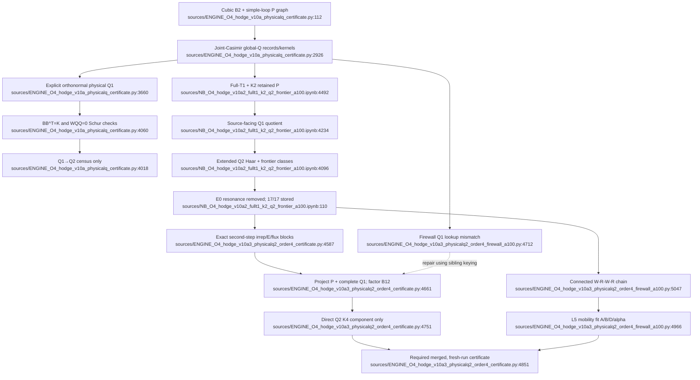

# F06 — Explicit physical-Q and Q2 certificate/frontier

## Bottom line

This feature has one reproducible evidence point and two unverified fourth-order branches:

- **Accepted frontier evidence:** the executed v10a.2 notebook records **17/17 passing gates** for the full-
  `T1` retained space, the `K=2` simple-loop `P` graph, the source-facing physical `Q1` quotient, extended
  Q2 Haar coverage, a nonempty second magnetic layer, and removal of the apparent `E0=8/3` resonance.
  It explicitly does **not** construct the physical Q2 resolvent or report `m4_rest` / `C3_full^shp`
  ([executed notebook lines 31-148](../../sources/Hodge_v10a2_FullT1_K2_Q2_Frontier_A100%20%281%29.ipynb#L31)).
- **Unverified branch A:** `ENGINE_O4_hodge_v10a3_physicalq2_order4_certificate.py` factors an anchored physical-Q2
  range and forms only the direct `P-W-Q1-W-Q2-W-Q1-W-P` component. It keeps the protected mobility
  values as references and states that folds, P returns, linked-vacuum subtraction, and momentum extraction
  remain ([lines 4438-4458](../../sources/ENGINE_O4_hodge_v10a3_physicalq2_order4_certificate.py#L4438),
  [4828-4857](../../sources/ENGINE_O4_hodge_v10a3_physicalq2_order4_certificate.py#L4828)). There is no stored run output.
- **Unverified branch B:** `ENGINE_O4_hodge_v10a3_physicalq2_order4_firewall_a100.py` instead runs a connected
  four-insertion recursion and attempts to fit/gate protected `A/B/D/alpha` mobility coordinates while leaving
  the scalar and full `C` blinded ([lines 4448-4478](../../sources/ENGINE_O4_hodge_v10a3_physicalq2_order4_firewall_a100.py#L4448),
  [5104-5134](../../sources/ENGINE_O4_hodge_v10a3_physicalq2_order4_firewall_a100.py#L5104)). It also has no stored run
  output, and its claimed complete-Q1 projection has a high-confidence lookup-key mismatch described below.

The unified path is therefore: **freeze v10a.2 as the last accepted certificate; repair and merge the two
v10a.3 branches into one staged engine; run it cleanly; serialize its Q1/Q2 factors and evidence; only then
promote any fourth-order mobility claim.**

## Files reviewed and evolution

All five assigned artifacts were read in full. The large common prefixes were verified byte-for-byte at the
logical-source-line level rather than treated as independent implementations.

| Artifact | Role and relationship | Stored evidence |
|---|---|---|
| `sources/ENGINE_O4_hodge_v10a_physicalq_certificate.py` | v10a base library plus executable driver. It exposes explicit orthonormal Q1, constructs one-step `W_QQ`, checks v8 Schur equivalence, and stops at a Q2 census ([lines 1-23](../../sources/ENGINE_O4_hodge_v10a_physicalq_certificate.py#L1), [3616-4056](../../sources/ENGINE_O4_hodge_v10a_physicalq_certificate.py#L3616), [4060-4178](../../sources/ENGINE_O4_hodge_v10a_physicalq_certificate.py#L4060)). | None; source only. |
| `sources/NB_O4_hodge_v10a2_fullt1_k2_q2_frontier_a100.ipynb` | Unexecuted v10a.2 notebook. Its only code cell is source-identical to the executed copy (SHA-256 `AA55F331…580578F2`). It replaces the v10a driver with full-T1/K2 frontier code ([lines 22-4551](../../sources/NB_O4_hodge_v10a2_fullt1_k2_q2_frontier_a100.ipynb#L22)). | No execution count; zero outputs. |
| `sources/NB_O4_hodge_v10a2_fullt1_k2_q2_frontier_a100.ipynb` | Same code as the unexecuted notebook; execution count 1. | One complete stream output, 17/17 gates ([lines 31-148](../../sources/Hodge_v10a2_FullT1_K2_Q2_Frontier_A100%20%281%29.ipynb#L31)). |
| `sources/ENGINE_O4_hodge_v10a3_physicalq2_order4_certificate.py` | Reuses the v10a library and v10a.2 helper layer through line 4435, omits the v10a.2 driver, then adds the Q2-factor/direct-component branch ([lines 4438-4857](../../sources/ENGINE_O4_hodge_v10a3_physicalq2_order4_certificate.py#L4438)). | None; source only. |
| `sources/ENGINE_O4_hodge_v10a3_physicalq2_order4_firewall_a100.py` | Adds an A100/L=5 preamble, shares the same inherited library through line 4447, then adds a distinct direct-recursion/mobility-fit branch ([lines 1-9](../../sources/ENGINE_O4_hodge_v10a3_physicalq2_order4_firewall_a100.py#L1), [4448-5134](../../sources/ENGINE_O4_hodge_v10a3_physicalq2_order4_firewall_a100.py#L4448)). | None; source only. |

The Python files all parse, but none has a `__main__` guard. Importing any of them executes its expensive
production driver. The inherited base also defines `_build_global_model` three times; only the last definition
is live when the driver runs ([lines 1895-2150](../../sources/ENGINE_O4_hodge_v10a_physicalq_certificate.py#L1895),
[2387-2608](../../sources/ENGINE_O4_hodge_v10a_physicalq_certificate.py#L2387),
[2926-3124](../../sources/ENGINE_O4_hodge_v10a_physicalq_certificate.py#L2926)).

## Exact flows

### v10a: expose Q1, prove equivalence, stop before Q2

1. `build_graph_basis` grows square-free simple-loop `P` states from the configured source faces
   ([lines 664-710](../../sources/ENGINE_O4_hodge_v10a_physicalq_certificate.py#L664)).
2. The final `_build_global_model` resolves each magnetic action into joint link-Casimir channels, subtracts
   retained-P components, Gram-merges collision blocks, and emits Schur kernels plus the raw records needed
   to reconstruct physical Q ([lines 2926-3124](../../sources/ENGINE_O4_hodge_v10a_physicalq_certificate.py#L2926)).
3. `build_physical_q_quotient` eigendecomposes each raw-Q Gram block, discards its null range, constructs
   orthonormal Q coordinates and `B_W`, and independently reconstructs every `K_lambda = B B^T`
   ([lines 3660-3768](../../sources/ENGINE_O4_hodge_v10a_physicalq_certificate.py#L3660)).
4. `v10_explicit_pq_pole` compares the explicit `P+Q1` Hamiltonian with the v8 Schur pole when `W_QQ=0`
   ([lines 3811-3831](../../sources/ENGINE_O4_hodge_v10a_physicalq_certificate.py#L3811)); `build_one_step_WQQ` then
   contracts every physical Q1 vector and plaquette orientation and gates Hermiticity/vanishing on the K=0
   glueball range ([lines 3854-3920](../../sources/ENGINE_O4_hodge_v10a_physicalq_certificate.py#L3854)).
5. The same driver rechecks low-order mass, T1 orientation equivalence, and the independent string cubic
   decomposition before `v10_q2_preflight` performs only a flux/network census of `Q1 -> W`
   ([lines 4018-4056](../../sources/ENGINE_O4_hodge_v10a_physicalq_certificate.py#L4018),
   [4060-4178](../../sources/ENGINE_O4_hodge_v10a_physicalq_certificate.py#L4060)).

Hard stop: the file says Q2 plus linked/folded subtraction is required and prints fourth-order values only as
future firewalls ([lines 19-23](../../sources/ENGINE_O4_hodge_v10a_physicalq_certificate.py#L19),
[4155-4178](../../sources/ENGINE_O4_hodge_v10a_physicalq_certificate.py#L4155)).

### v10a.2: fix the Hilbert-space split and certify the frontier

1. `_v10a2_install_q2_haar` adds balanced k=3 Weingarten, `(4,1)/(1,4)`, and rank-five pure-six SU(3)
   singlet projectors, refusing unsupported occurrence patterns
   ([unexecuted notebook lines 4096-4186](../../sources/NB_O4_hodge_v10a2_fullt1_k2_q2_frontier_a100.ipynb#L4096)).
2. The driver promotes **all plaquette faces** to seeds before building `K=2` P, then constructs the three
   full-T1 source columns ([lines 4492-4503](../../sources/NB_O4_hodge_v10a2_fullt1_k2_q2_frontier_a100.ipynb#L4492)).
3. `_v10a2_source_facing_q` retains every raw record in every global collision block touched by the source,
   factors its physical range, and gates `(B B^T-K_lambda)S=0`. This is source-facing, not a serialization of
   the complete global Q1 Hilbert space ([lines 4234-4300](../../sources/NB_O4_hodge_v10a2_fullt1_k2_q2_frontier_a100.ipynb#L4234)).
4. `_v10a2_q2_frontier_census` applies the second magnetic insertion to anchored bright Q1 vectors, classifies
   outcomes as retained-P, Q1-key, or new-Q2, and audits all pairwise Haar occurrence patterns. It does not
   yet Gram-project a Q2 complement ([lines 4311-4350](../../sources/NB_O4_hodge_v10a2_fullt1_k2_q2_frontier_a100.ipynb#L4311)).
5. `_v10a2_e0_resonance_audit` rebuilds the full-T1 K=0 model, resolves second-step `E0=8/3` blocks, and
   subtracts the complete plaquette band in physical norm ([lines 4407-4462](../../sources/NB_O4_hodge_v10a2_fullt1_k2_q2_frontier_a100.ipynb#L4407)).

Stored result: `P=4,077`, source-facing `3,969 -> 1,539 + 2,430 null`, 64,272 second actions with
52,608 classified new-Q2, 13 apparent E0 groups all found in retained P, maximum residual norm squared
`4.662e-18`, and **17/17 gates passed**
([executed notebook lines 67-112](../../sources/Hodge_v10a2_FullT1_K2_Q2_Frontier_A100%20%281%29.ipynb#L67),
[139-148](../../sources/Hodge_v10a2_FullT1_K2_Q2_Frontier_A100%20%281%29.ipynb#L139)).

Hard stop: the stored run explicitly says the physical Q2 resolvent is not constructed and the protected
fourth-order numbers are reference-only ([executed notebook lines 39-40](../../sources/Hodge_v10a2_FullT1_K2_Q2_Frontier_A100%20%281%29.ipynb#L39),
[115-116](../../sources/Hodge_v10a2_FullT1_K2_Q2_Frontier_A100%20%281%29.ipynb#L115)).

### v10a.3 certificate branch: factor anchored Q2, report one component

1. `_v10a3_build_second_step_actions` starts from the anchored bright source-facing Q1 range, applies W, and
   groups exact vectors by dynamic joint-irrep signature, H0 energy, and C- center-flux key
   ([lines 4587-4646](../../sources/ENGINE_O4_hodge_v10a3_physicalq2_order4_certificate.py#L4587)).
2. `_v10a3_factor_q2` converts the full global-Q collision keys into the same dynamic irrep key, separately
   filters center flux, Gram-projects each block against retained P plus every relevant raw global-Q1 generator,
   factors the positive remainder into `B12`, and checks `B12 B12^T`
   ([lines 4649-4748](../../sources/ENGINE_O4_hodge_v10a3_physicalq2_order4_certificate.py#L4649)).
3. `_v10a3_direct_q2_order4` applies exact bare `R1/R2` denominators and forms the anchored direct Q2 matrix
   only ([lines 4751-4766](../../sources/ENGINE_O4_hodge_v10a3_physicalq2_order4_certificate.py#L4751)).

The driver can be put into a partial block smoke mode; in that mode its nonempty/removal gates are explicitly
allowed to pass without a complete Q2 result ([lines 4460-4467](../../sources/ENGINE_O4_hodge_v10a3_physicalq2_order4_certificate.py#L4460),
[4674-4678](../../sources/ENGINE_O4_hodge_v10a3_physicalq2_order4_certificate.py#L4674),
[4821-4833](../../sources/ENGINE_O4_hodge_v10a3_physicalq2_order4_certificate.py#L4821)). A canonical certificate must
record and reject `partial=true` for promotion.

### v10a.3 firewall branch: direct connected chain and mobility fit

1. `_v10a3_apply_W` applies connected magnetic faces and immediately resolves exact H0 irreps; the reduced
   resolvent explicitly removes the full `E0=8/3` plaquette band
   ([lines 4579-4596](../../sources/ENGINE_O4_hodge_v10a3_physicalq2_order4_firewall_a100.py#L4579),
   [4652-4679](../../sources/ENGINE_O4_hodge_v10a3_physicalq2_order4_firewall_a100.py#L4652)).
2. Three anchored sources are propagated through W1/R1 and W2/R2. Translation plus Hermitian bilinear
   contraction gives K2 and K4 without materializing W3/W4 or W22
   ([lines 4937-4963](../../sources/ENGINE_O4_hodge_v10a3_physicalq2_order4_firewall_a100.py#L4937),
   [5041-5085](../../sources/ENGINE_O4_hodge_v10a3_physicalq2_order4_firewall_a100.py#L5041)).
3. A separate source-adapted Q2 audit projects three second-step columns against retained P and a purportedly
   complete relevant Q1 range ([lines 4796-4843](../../sources/ENGINE_O4_hodge_v10a3_physicalq2_order4_firewall_a100.py#L4796)).
4. `_v10a3_extract_shape` fits four shape coordinates on four allowed L=5 momenta and uses two additional
   momenta as residual checks ([lines 4966-4991](../../sources/ENGINE_O4_hodge_v10a3_physicalq2_order4_firewall_a100.py#L4966)).

## Blocking static defect in the A100 firewall branch

The inherited global-Q producer indexes collision groups by **joint-Casimir representation signature and
energy**: `collisions.add((gsig, lam), ...)`, where `gsig = _rep_sig_codd(sig)`
([lines 3009-3010](../../sources/ENGINE_O4_hodge_v10a3_physicalq2_order4_firewall_a100.py#L3009)).

The firewall consumer instead calls that dictionary with **center-residue signature and energy**. Its
`_v10a3_residue_key_vec` derives the key from `_v9_flux_key_state` ([lines 4626-4634](../../sources/ENGINE_O4_hodge_v10a3_physicalq2_order4_firewall_a100.py#L4626)),
then `_v10a3_q1_group_basis` performs `.get((residue_key, Esg), [])`
([lines 4712-4718](../../sources/ENGINE_O4_hodge_v10a3_physicalq2_order4_firewall_a100.py#L4712)). These key spaces are
not generally equal: a like-oriented shared link can carry a sextet representation while its center residue is
fundamental-conjugate, and an adjoint channel has zero center residue while retaining an `8` irrep label.

Consequently the firewall cannot substantiate its phrase “complete global physical Q1 span” until the lookup is
rekeyed. The sibling certificate branch already shows the correct pattern: translate collision keys to dynamic
irrep signatures and then filter center flux separately
([lines 4649-4671](../../sources/ENGINE_O4_hodge_v10a3_physicalq2_order4_certificate.py#L4649)). Confidence: **high** on
the key-space mismatch; the exact numerical consequence remains unmeasured because no firewall output exists.

## Feature flowchart

Every node is labeled with an exact source location.

## Inputs, outputs, invariants, and consumers

| Category | Contract |
|---|---|
| Inputs | SU(3) (`N=3`); periodic cubic `B2`; exact Haar/Fierz and joint-link H0 projectors; full three-polarization T1 source; retained simple-loop P depth; Gram/vector tolerances; A100 branch fixes `GLUE_L=5` before loading the inherited library ([firewall lines 1-9](../../sources/ENGINE_O4_hodge_v10a3_physicalq2_order4_firewall_a100.py#L1)). |
| Q1 output | Physical Gram range, nullity, energies, trace-network vectors, and `B_W`; invariant `B B^T = K_lambda`, orthonormal vectors, and explicit/Schur pole equivalence ([v10a lines 3660-3768](../../sources/ENGINE_O4_hodge_v10a_physicalq_certificate.py#L3660)). |
| v10a.2 output | Full-T1/K2 frontier census, supported endpoint patterns, and E0 subtraction audit. The output is console/notebook evidence only; no machine-readable certificate is serialized. |
| Q2 output proposed | Block keys `(joint irrep, exact E, center flux)`, retained projector rank, Q2 Gram spectrum/nullity, `B12`, `E_Q2`, and reconstruction error ([certificate lines 4661-4748](../../sources/ENGINE_O4_hodge_v10a3_physicalq2_order4_certificate.py#L4661)). |
| Core invariants | Gram PSD; rank stable under tolerance sweep; retained-P and complete-Q1 subtraction; no physical E0 denominator; `B12 B12^T` reconstruction; Hermitian K4/Bloch symbol; fresh, non-partial run. |
| Consumers | The later denominator-lift, rooted-cluster, and dual-oracle O4 stages should consume a serialized Q1/Q2 certificate, not re-copy this monolith. The theorem/status registry should consume only signed run evidence, never values printed as reference targets. |

## Unified path for F06

1. **Freeze evidence:** designate the executed v10a.2 `(1)` notebook as the last accepted F06 result. Mark the
   identical unexecuted notebook as a source mirror and all three `.py` drivers as unexecuted proposals.
2. **Extract one library:** keep a single live implementation of lattice geometry, Haar/H0 projectors, final
   joint-Casimir `_build_global_model`, physical-Q factorization, and block Gram projection. Put every driver
   behind an explicit entry point; eliminate the two shadowed `_build_global_model` versions.
3. **Use one canonical block key:** `(canonical dynamic joint-irrep signature, exact H0 energy, canonical center
   flux)`. Repair the Q1 lookup inside the one physical-Q implementation; do not preserve the firewall runner.
4. **Choose the certificate construction:** use its complete retained-P/global-Q1 projection and `B12`
   reconstruction as the sole Q2 implementation. Migrate only indispensable connected-chain formulas into the
   canonical topology stage; do not merge or retain the firewall branch. Partial mode is never promotable.
5. **Persist evidence:** write a versioned manifest plus arrays for P/Q1/Q2 dimensions, block keys, Gram spectra,
   tolerance ranks, `B_W`, `B12`, energies, K2/K4, input hashes, configuration, and every gate. A console stream is
   insufficient for downstream adjudication.
6. **Run from a clean process:** first reproduce v10a.2's 17/17 values, then build the canonical L=5 P/Q1/Q2
   artifacts and continue into the single 3,895-record topology stage. Fixed identities may fail the run, but
   no second Q2/K4 implementation produces an alternative answer.
7. **Keep the theorem firewall:** even a successful mobility run may promote only the explicitly fold-neutral
   `A/B/D/alpha` coordinates after the proof dependency is linked. `m4_rest` and full `C3_full^shp` remain blocked
   until P-return/fold, linked marked-cluster, and interacting-vacuum terms are assembled by the canonical
   topology computation.

## Confidence and remaining gaps

- **High confidence:** file evolution/duplication; the exact stored v10a.2 17/17 result; all deliberate hard stops;
  absence of stored v10a/v10a.3 runs; the A100 firewall key-space mismatch.
- **Medium-high confidence:** the sibling v10a.3 certificate's block keying is structurally suitable for the
  merged implementation. It still requires a fresh full run and machine-readable outputs.
- **Open:** numerical Q2 rank, tolerance stability, K4 matrix, and protected mobility values for either v10a.3
  branch. The source contains gates but no execution evidence, so none of those claims is accepted here.
