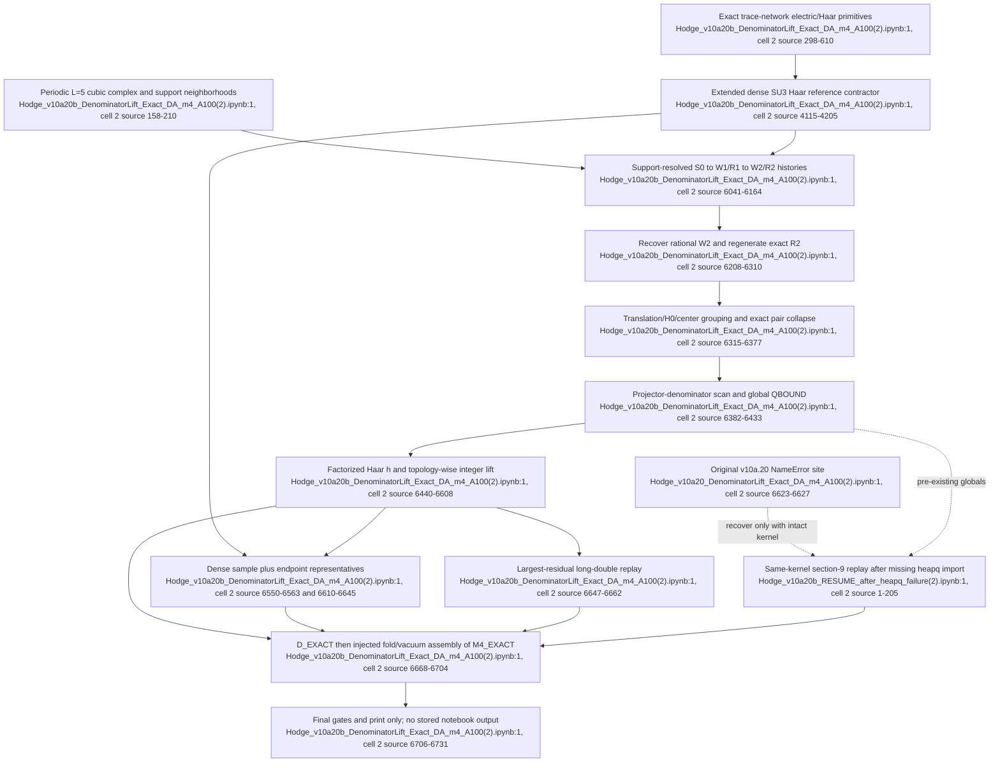

# F07 — Exact denominator-lift fourth-order arithmetic

## Outcome

The intended path is mathematically legible: build support-resolved two-step histories, recover their normalized coefficients as rationals, collapse translation-equivalent state pairs, prove a global denominator divisor, lift each factorized SU(3) Haar value to an integer numerator, and combine the result with fold and linked-vacuum terms to form `m4_rest`.

The project mirror does **not** contain a completed F07 run. All three notebooks are minified to one physical JSON line, their code cells have `execution_count: null`, and every `outputs` array is empty. Therefore the exact topology counts, gate totals, `D_EXACT`, and `M4_EXACT` printed by the source are intended runtime results, not evidence stored here.

The runnable candidate is v10a.20b. v10a.20 is broken by one missing import, and the recovery notebook is deliberately a same-kernel continuation rather than a standalone program.

### Locator convention

Every notebook is physically `:1`. Citations below therefore use the form `file:1 (cell 2, source lines x–y)`, where the second range is the logical line number inside the code cell's `source` array. This is necessary because ordinary physical line citations cannot distinguish any internal notebook code.

## Files, complete-read result, and provenance

| File | Physical / logical shape | Stored execution | Assessment |
|---|---|---|---|
| `sources/Hodge_v10a20_DenominatorLift_Exact_DA_m4_A100(2).ipynb` | physical `:1`; two cells; code cell has 6,736 source entries | none | Original denominator-lift notebook. It calls `heapq.heappush`/`heapreplace` at cell-2 lines 6625–6627 but never imports `heapq`; the default `LONGDOUBLE_TOP=256` path therefore raises `NameError` on the first heap insertion. |
| `sources/Hodge_v10a20b_DenominatorLift_Exact_DA_m4_A100(2).ipynb` | physical `:1`; two cells; code cell has 6,737 source entries | none | Preferred candidate. Relative to v10a.20, its executable code changes only by adding `import heapq` at cell-2 line 77; the other source-only change is the visible section label at line 6168. |
| `sources/Hodge_v10a20b_RESUME_after_heapq_failure(2).ipynb` | physical `:1`; two cells; code cell has 276 source entries | none | Recovery cell. It restarts section `[9]` after importing `heapq`, but requires the exact in-memory objects constructed by sections `[3]`–`[8]` of the failed run. |

The v10a.20b Markdown cell explicitly calls itself a bugfix release and says the arithmetic is otherwise unchanged (`Hodge_v10a20b_DenominatorLift_Exact_DA_m4_A100(2).ipynb:1`, cell 1, logical lines 1–11). A direct source-array comparison confirms that claim. The recovery Markdown says to use it only in the runtime that failed at `heapq.heappush` (`Hodge_v10a20b_RESUME_after_heapq_failure(2).ipynb:1`, cell 1, logical lines 1–3).

## Exact call flow

The following uses v10a.20b line numbers; v10a.20 is identical after accounting for the single inserted import and renamed heading.

1. **Build the periodic cubic complex.** `build_cubic_complex()` enumerates the `L=5` vertices, links, plaquettes, and link–face incidence matrix `B2`; top-level code derives link/face neighborhoods (`Hodge_v10a20b_DenominatorLift_Exact_DA_m4_A100(2).ipynb:1`, cell 2, source lines 92–124 and 158–210).
2. **Install the trace-network/Haar algebra.** `LXState`, `lx_trace_state`, `lx_tensor_product`, `lx_H0_action`, `lx_wg_fixed`, `lx_combine_bra_ket`, and `lx_haar_inner` define the exact local trace-network state, electric action, and rational low-occurrence SU(3) contractions (`:1`, cell 2, source lines 298–610). `_v10a2_install_q2_haar()` extends the dense reference contractor to balanced `k=3`, determinant `(4,1)`, and pure-six patterns, returning `qhaar`, the supported-pattern set, certificates, and the uncached canonical contractor `_qcache` (`:1`, cell 2, source lines 4115–4205; installed at 5898–5901).
3. **Generate connected marked histories.** `_v10a4_fs_model()` supplies oriented plaquette steps (`:1`, cell 2, source lines 5114–5123). `_v17_apply_W_labeled()` finds incident plaquettes, calls `_v10a3_project_action_dyn()` to tensor the new trace and resolve each touched link into electric irreps, and retains the exact plaquette-support union (`:1`, cell 2, source lines 4595–4615 and 6055–6071). `_v17_R_labeled()` calls `_v10a3_reduced_resolvent()`, which subtracts the full `E0=8/3` plaquette band and divides every nonresonant signature by its gap (`:1`, cell 2, source lines 4691–4718 and 6074–6080).
4. **Build the half-history corpus.** For the default axial polarization `2`, top-level code forms `S0 -> W1L -> R1L -> W2L -> R2L` and also `R12L`; it gates every reduced-resolvent `E0` residual before continuing (`:1`, cell 2, source lines 6141–6164). The scalar exactification refuses a run without polarization `2` (`:1`, cell 2, source lines 6299–6304).
5. **Exactify coefficients conditionally.** `_x_exactify_coeff()` multiplies each floating coefficient by `sqrt(2)`, applies `Fraction.limit_denominator()` at ceilings `10^5` and `10^7`, requires both reconstructions to agree within `5e-13`, and restricts denominator primes to `S4_PRIMES` (`:1`, cell 2, source lines 6195–6218). `_x_exactify_labeled()` applies this to all `W2` and cold-check `R2` entries; `_x_derive_R2()` independently regenerates exact `R2=W2/(8/3-H0)`, and `_x_compare_labeled()` requires literal equality (`:1`, cell 2, source lines 6221–6310).
6. **Collapse the exact pair ledger.** `_x_phys_index()` groups right histories by canonical joint-H0 signature and energy. The translation scan canonicalizes matching whole block pairs with `_x_canon_block_pair()`, skips the separately analytic one-face/one-face term, and gates the intended census of 5,400 H0 matches, 3,597 whole-block orbits, and a 9,814,138 raw-pair upper bound (`:1`, cell 2, source lines 6315–6346). State pairs are then grouped by center-flux key and joint-canonicalized, producing the intended 1,829,147 occurrences and 117,161 nonzero topologies (`:1`, cell 2, source lines 6348–6377).
7. **Construct the common denominator proof.** `_x_local_patterns_fast()` and `_x_haar_den_bound()` multiply local projector denominators `(1,1):3`, `(2,2):24`, `(3,3):120`, determinant `:6`, and pure-six `:72`. The corpus scan forms the prime-exponent LCM `QBOUND` of every `2 * weight.denominator * q_H` plus the analytic `D11=-13/896` term (`:1`, cell 2, source lines 6382–6433).
8. **Lift every Haar topology.** `_v10a13_haar_factor()` evaluates the production contraction with low-rank Weingarten/epsilon/pure-six factors (`:1`, cell 2, source lines 5353–5429). Section `[9]` sorts all pairs by `_v10a13_pair_score()`, proves `q_H <= 120^4`, evaluates `h`, requires `|q_H h-round(q_H h)|<10^-5`, and adds the exact integer contribution directly into `TOTAL_NUM/QBOUND` (`:1`, cell 2, source lines 6440–6608).
9. **Cross-check the lift.** A deterministic stratified sample plus one representative of each endpoint signature is recomputed with dense `_qcache`; the 256 largest lift residuals are replayed through `_x_haar_longdouble()`; both paths must give the same integer numerator (`:1`, cell 2, source lines 6550–6563 and 6610–6662).
10. **Assemble the intended coefficient.** `D_EXACT=TOTAL_NUM/QBOUND` is gated against denominator localization and the prior blind floating value. The source then injects `FOLD_EX=5315003/140454` and `VLINK_EX=-1474623/1675520`, forms `M4_EXACT=D_EXACT+FOLD_EX-VLINK_EX`, checks the prior floating value, and would print the rational mass series only if all new gates pass (`:1`, cell 2, source lines 6668–6731). The linked-vacuum value is independently reconstructed earlier in the same notebook (`:1`, cell 2, source lines 5971–6038); `FOLD_EX` is not recomputed in this notebook's active top-level path.

## Inputs, outputs, and invariants

### Inputs

- Fixed SU(3), periodic `L=5`, full cubic link/plaquette incidence data, and the T1 polarization ordering `((1,2),(0,2),(0,1))` (`Hodge_v10a20b_DenominatorLift_Exact_DA_m4_A100(2).ipynb:1`, cell 2, source lines 92–124 and 4521–4534).
- The support-resolved, floating `W2Ls[2]` and `R2Ls[2]` produced earlier in the same monolithic cell (`:1`, cell 2, source lines 6141–6164).
- Exact local electric energies and SU(3) projector denominators; factorized and dense Haar contractors built inside the notebook (`:1`, cell 2, source lines 4115–4205, 5353–5429, and 6382–6396).
- Configurable tolerances/sample sizes: coefficient ceilings and residual, lift tolerance, dense sample, top long-double residual count, and debug truncation (`:1`, cell 2, source lines 6195–6201 and 6469–6472).

### Intended outputs

- Exact recovered coefficient ledgers `W2X`, `R2X`; canonical pair weights `pairw`; common denominator `QBOUND`; integer numerator `TOTAL_NUM`; rational `D_EXACT`; and rational `M4_EXACT` (`Hodge_v10a20b_DenominatorLift_Exact_DA_m4_A100(2).ipynb:1`, cell 2, source lines 6305–6308, 6348–6371, 6425–6433, and 6565–6704).
- A final gate table and mass-series printout (`:1`, cell 2, source lines 6706–6731).
- No ledger, rational result, environment record, or output hash is serialized to disk.

### Coded invariants

- Exact `R2` must equal exactified `W2/(E0-H0)` on every nonresonant signature (`:1`, cell 2, source lines 6261–6310).
- Corpus counts must match the embedded v10a.16/v10a.19 regression census and denominator primes must remain inside the declared localization set (`:1`, cell 2, source lines 6343–6377 and 6433).
- Every supported topology must satisfy `q_H <= 207,360,000`, every term denominator must divide `QBOUND`, and every floating lift must be within `10^-5` of an integer (`:1`, cell 2, source lines 6480–6482 and 6579–6608).
- Dense and factorized contractors must lift sampled topologies to identical integers; long-double replay must agree on the largest residuals (`:1`, cell 2, source lines 6610–6662).
- Debug truncation is forbidden from emitting a final `D_A` (`:1`, cell 2, source lines 6664–6666).

These are source assertions, not recorded passes.

## Recovery and same-kernel risk

The original failure is deterministic: v10a.20 uses `heapq` without importing it (`Hodge_v10a20_DenominatorLift_Exact_DA_m4_A100(2).ipynb:1`, cell 2, source lines 6623–6627). v10a.20b fixes that at startup (`Hodge_v10a20b_DenominatorLift_Exact_DA_m4_A100(2).ipynb:1`, cell 2, source line 77).

The recovery cell correctly resets `TOTAL_NUM`, counters, sampling sets, and the heap before replaying all of section `[9]`; it does not continue a half-accumulated integer sum (`Hodge_v10a20b_RESUME_after_heapq_failure(2).ipynb:1`, cell 2, source lines 82–118). However, it assumes dozens of globals already exist—`pairw`, `QBOUND`, `_qcache`, `_v10a13_haar_factor`, `oe`, `gates`, and configuration values—and performs no up-front version/hash check (`:1`, cell 2, source lines 1–24 and 82–108). A fresh or contaminated kernel can therefore fail late or silently use stale caches/configuration. It is a recovery convenience, not reproducible evidence.

## Evidence boundary and gaps

1. **No saved execution.** None of the three notebooks proves that any F07 gate ran in this mirror.
2. **Conditional exactness.** The final `D_EXACT` is exact relative to a recovered rational history ledger and the projector-denominator theorem. The history coefficients themselves originate as floats and are inferred with `limit_denominator()` (`Hodge_v10a20b_DenominatorLift_Exact_DA_m4_A100(2).ipynb:1`, cell 2, source lines 6208–6242). Two ceilings, a residual bound, prime localization, and the resolvent identity are strong diagnostics, but not a stored symbolic derivation of every coefficient.
3. **Partial independent replay.** Every topology is integer-lifted, but only the stratified dense sample/signature representatives and the largest 256 residuals receive alternate numerical evaluation (`:1`, cell 2, source lines 6550–6563 and 6610–6662). The effective precision of `np.longdouble` is platform-dependent and is not logged.
4. **Injected fold.** `VLINK_EX` has an internal derivation, while `FOLD_EX` appears only as a literal at final assembly (`:1`, cell 2, source lines 5971–6038 and 6680–6682). F07 therefore does not provide self-contained provenance for every addend of `m4_rest`.
5. **Stale narrative.** Lines 6181–6185 and the banner at 6192 still describe modular finite fields/CRT, although the executable branch is denominator lift. This is documentation drift, not the call path.
6. **No immutable artifact.** The 117,161-topology ledger, exact numerator, denominator, sample indices, environment, and gate report are not saved or checksummed. Later same-kernel consumers cannot establish that they received this exact corpus from these exact sources.

## Dependencies and consumers

- **Upstream:** F02 supplies the Haar/electric primitives; F03 supplies topology/shape constraints; F05/F06 supply the global-Q, physical-Q, full-T1, and Q2 lineage copied into this monolith. Within this notebook the active F07 dependency is narrower: cubic geometry, extended Haar tensors, dynamic link-irrep projection, reduced resolvent, and support-resolved W/R histories.
- **Downstream:** F08 treats the F07 exact scalar as the target for a literal rooted-incidence adjudication. F09 attempts independent finite-cluster and full-T1/operator-fold checks. Because F07 has no stored execution artifact, those consumers currently rely on copied literals or same-kernel state rather than a verifiable handoff.

## Flowchart

## Feature-level unified path

1. Make v10a.20b the sole historical reference and retire the broken v10a.20 plus the same-kernel resume from the proof path.
2. Extract the F07 stages into one fresh-process pipeline with explicit typed inputs: `history-ledger -> rationalized-ledger -> pair-ledger -> denominator-proof -> Haar-lift-ledger -> coefficient-certificate`.
3. Serialize and checksum each boundary, especially the exact support histories, 117,161-topology pair ledger, `QBOUND`, per-topology `(q_H,n_H,residual)`, dense/long-double replay set, exact addends, and final gate report.
4. Replace the floating coefficient-recovery boundary with symbolic/rational coefficient generation where practical; otherwise label the result explicitly as conditional exactification and record every reconstruction witness.
5. Recompute the fold addend in the same certificate or consume it through a checksummed upstream certificate rather than a literal.
6. Run once from a clean environment, record actual precision/backend metadata, and require F08/F09 to consume the resulting immutable certificate by hash. Only that clean run can promote F07 from executable candidate to evidence.

## Confidence

- **High** on file coverage, version diff, missing-import diagnosis, execution status, and data/control flow: all three notebook JSON documents, every cell source, metadata, and output array were inspected.
- **High** that no F07 result is evidenced in the project mirror.
- **Medium** on the claimed mathematical sufficiency of the denominator/localization bounds because the notebooks store neither a completed run nor the upstream proof/corpus as a machine-verifiable artifact. The unified path preserves that claim as a hypothesis to certify, not a conclusion to promote.
