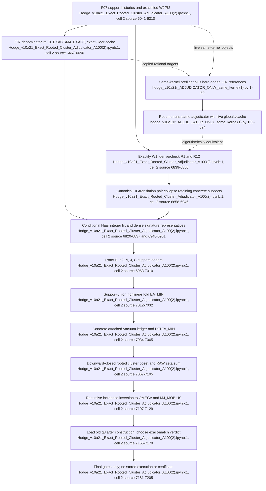

# F08 — Exact rooted linked-cluster adjudication

## Outcome

F08 implements a clear bookkeeping adjudication: reconstruct exact support-resolved ledgers for `D`, `C`, `e2`, `N`, and `J`; form the nonlinear fold on literal support unions; attach exact vacuum weights to concrete marked supports; and apply a recursive rooted-cluster incidence transform before comparing the result with the newer F07 `m4_rest` and the older record-backed `q3`.

The project mirror contains **no completed F08 execution**. The full notebook and both resume notebooks have `execution_count: null` and empty `outputs`; the Python exports are source-only. Thus the source encodes a prospective verdict, but does not evidence which verdict was reached.

The five files contain only two unique implementations:

- one monolithic v10a.21 notebook, which reruns the complete v10a.20 denominator-lift pipeline before adjudication; and
- one 524-line same-kernel resume, duplicated byte-for-byte as two notebooks and two Python exports.

### Locator convention

All three notebooks are minified to one physical JSON line. Notebook citations therefore use `file:1 (cell 2, source lines x–y)`, where the latter is the logical line within the code cell's `source` array. The Python exports have ordinary physical line numbers.

## Files, complete-read result, duplicates, and execution status

| File | Shape / identity | Stored output | Assessment |
|---|---|---|---|
| `sources/Hodge_v10a21_Exact_Rooted_Cluster_Adjudicator_A100(2).ipynb` | physical `:1`; two cells; code cell has 7,205 source entries | none | Full pipeline. It is v10a.20b plus an exact-Haar cache and the appended rooted adjudicator. |
| `sources/Hodge_v10a21r_ADJUDICATOR_ONLY_same_kernel(1).ipynb` | physical `:1`; two cells; code cell has 524 source entries | none | Resume after F07 section `[8]`; skips the global section-`[9]` Haar sweep and hard-codes the F07 rational references. |
| `sources/Hodge_v10a21r_ADJUDICATOR_ONLY_same_kernel(3).ipynb` | SHA-256 identical to the `(1)` notebook | none | Exact duplicate, not a separate run. |
| `sources/hodge_v10a21r_ADJUDICATOR_ONLY_same_kernel(1).py` | 524 physical lines; exactly equal to the `(1)` notebook's code-cell text | n/a | Python export of the same resume cell, not standalone despite the `.py` extension. |
| `sources/hodge_v10a21r_ADJUDICATOR_ONLY_same_kernel(3).py` | SHA-256 identical to the `(1)` Python export | n/a | Exact duplicate. |

The duplicate notebook SHA-256 is `F5E176B9841D6DEAE6B3011846A54ABB10FCE1B87658B7A8EDA8C65FB97BA057`; the duplicate Python SHA-256 is `4E5B48749C96FDE3EB7C6C98F58456ABE5EDDA1F5A6EE6CD92BD1FF0907DD78D`. Duplicate numbering therefore does not supply independent provenance or replication.

The full notebook differs from v10a.20b in only four relevant ways before the new adjudicator: a section label change, `HAAR_EXACT={}` before the F07 lift, caching each exact lifted Haar value, and appending the v10a.21 code. The stored notebook still contains no resulting gate table or rational printout.

## Exact call flow

### Full v10a.21 path

1. **Rebuild F07 prerequisites and histories.** The inherited code constructs the `L=5` cubic complex, extended SU(3) Haar contractor, full marked source, and support-resolved `W1/R1/W2/R2/R12` half-histories (`Hodge_v10a21_Exact_Rooted_Cluster_Adjudicator_A100(2).ipynb:1`, cell 2, source lines 158–210, 4115–4205, and 6041–6164).
2. **Run the denominator-lift certificate.** Inherited `_x_exactify_labeled`, `_x_derive_R2`, pair collapse, `QBOUND`, and topology-wise Haar lift produce `W2X`, `R2X`, `D_EXACT`, and `M4_EXACT` (`:1`, cell 2, source lines 6204–6433 and 6467–6690). v10a.21 additionally initializes `HAAR_EXACT` and stores each lifted topology as a `Fraction` for reuse (`:1`, cell 2, source lines 6571 and 6580–6590).
3. **Initialize the marked root and exact-ledger helpers.** `ROOT=anchor_faces[2]`; `_v21_prune_ledger`, `_v21_add_ledger`, `_v21_union_convolution`, `_v21_sum`, and `_v21_size_table` operate on `frozenset` supports with exact `Fraction` values (`:1`, cell 2, source lines 6786–6818).
4. **Provide exact Haar values on demand.** `_v21_haar_exact(a,b)` first reuses `HAAR_EXACT`; otherwise it obtains the known denominator bound, evaluates the factorized contractor in floating point, rounds `q_H*h` to an integer when the residual is below `LIFT_TOL`, and caches `Fraction(n_H,q_H)` (`:1`, cell 2, source lines 6820–6837).
5. **Exactify one-step/fold histories.** `_v21_exactify_and_derive_R()` rationalizes `W1` and regenerates `R1` from the exact electric gap; `R1` is compared with an independently exactified cold copy. A second resolvent gives `R12`, again compared literally with the cold copy (`:1`, cell 2, source lines 6839–6856).
6. **Resolve Gamma bilinears by concrete support.** `_v21_cluster_bilinear()` groups right histories by canonical H0 block, translates every left history, preserves multiplicity separately for each concrete union support, canonicalizes state pairs, groups by center-flux key, and collapses each topology to an exact support-weight map (`:1`, cell 2, source lines 6858–6946).
7. **Lift and distribute each topology.** One representative per endpoint signature can be compared with dense `_qcache`; every topology then obtains an exact lifted Haar value and contributes `1/2 * coefficient * Haar` to its concrete support. Nonzero supports must contain `ROOT` and be connected (`:1`, cell 2, source lines 6948–6989).
8. **Build the five exact moment ledgers.** The code calls the bilinear for `D(W2,R2)`, `e2(W1,R1)`, `N(R1,R1)`, `J(R1,R12)`, and `C(R1,R2)`. It gates their totals against `D_EXACT`, `-5945/612`, `511051/124848`, `-48945521/25468992`, and zero respectively (`:1`, cell 2, source lines 6991–7010).
9. **Fold before cluster subtraction.** `_v21_union_convolution(E2_MIN,N_MIN)` constructs the support ledger for the nonlinear product. `EA_MIN = D_MIN - 2*C_MIN - E2N_MIN + J_MIN`, and its total must equal the corresponding exact scalar expression (`:1`, cell 2, source lines 7012–7032).
10. **Attach the vacuum ledger.** Each one-face embedding receives `V1=-39/1280`; each adjacent pair receives `VPAIR=-327/83776`. Their concrete marked-support ledger must sum to `-1474623/1675520`. `DELTA_MIN=EA_MIN-V_MIN` must already sum to `M4_EXACT` (`:1`, cell 2, source lines 7034–7065).
11. **Construct and invert the rooted cluster poset.** `_v21_rooted_connected_subsets_of()` enumerates every root-containing connected subset of a support. `CLUSTERS` is formed as the downward closure of all `DELTA_MIN` supports; `RAW[C]` is then defined as the sum of all minimal weights whose support lies inside `C`. Ascending-size recursion subtracts every proper rooted connected subset to produce `OMEGA[C]` (`:1`, cell 2, source lines 7067–7124).
12. **Check the incidence identity and adjudicate.** The code requires `OMEGA[C]==DELTA_MIN[C]`, sums nonzero `OMEGA` to `M4_MOBIUS`, samples disconnected-spectator invariance, and only then loads historical `Q3_OLD`. It requires the recursive total to match exactly one of `{M4_EXACT,Q3_OLD}` and assigns the textual verdict (`:1`, cell 2, source lines 7126–7179). A final source-only gate summary follows (`:1`, cell 2, source lines 7181–7205).

### Same-kernel resume path

1. The resume checks a list of upstream globals and aborts if listed prerequisites are absent (`hodge_v10a21r_ADJUDICATOR_ONLY_same_kernel(1).py:1–39`; identical notebook location `Hodge_v10a21r_ADJUDICATOR_ONLY_same_kernel(1).ipynb:1`, cell 2, source lines 1–39).
2. It hard-codes the claimed completed F07 results:
   - `D_EXACT = -361008126292641364183 / 7250590288602460800`;
   - `M4_EXACT = -160506019419340168451 / 14501180577204921600` (`hodge_v10a21r_ADJUDICATOR_ONLY_same_kernel(1).py:41–43`).
3. It reuses any existing `HAAR_EXACT` cache, or begins an empty on-demand cache, then runs the same adjudicator body as the full notebook (`:45–524`).

The resume's F08 body is textually the same algorithm as full-notebook cell-2 lines 6743–7205, apart from the preamble and shifted locators.

## Inputs, outputs, and invariants

### Inputs

- Concrete plaquette supports, translations, adjacency, the axial root, and exact electric signatures from the inherited cubic/H0 engine.
- Support-resolved `W1Ls`, `R1Ls`, `R12Ls`, plus exactified `W2X` and `R2X` from F07.
- Exact lifted Haar cache or access to the factorized contractor and denominator bound.
- Exact F07 scalar references `D_EXACT` and `M4_EXACT`; the resume injects these as literals.
- Exact local vacuum weights and their previously enumerated one-face/adjacent-pair embeddings.

### Intended outputs

- Exact per-support moment ledgers `D_MIN`, `E2_MIN`, `N_MIN`, `J_MIN`, `C_MIN`.
- Exact folded axial ledger `EA_MIN`, vacuum ledger `V_MIN`, minimal marked-history ledger `DELTA_MIN`, downward-closed `CLUSTERS`, finite-cluster incidence values `RAW`, irreducible weights `OMEGA`, and `M4_MOBIUS`.
- A verdict selecting the F07 `m4_rest`, historical `q3`, or an inconclusive third value.
- No file serializes any of these ledgers, their hashes, the gate report, or the verdict.

### Coded invariants

- Exact regenerated `R1` and `R12` must equal their independently rationalized cold copies (`Hodge_v10a21_Exact_Rooted_Cluster_Adjudicator_A100(2).ipynb:1`, cell 2, source lines 6843–6856).
- Every nonzero bilinear support must be rooted and connected; optional dense signature representatives must agree within `5e-12` (`:1`, cell 2, source lines 6948–6982).
- Moment totals must equal the embedded exact references, and `C` must cancel exactly at Gamma (`:1`, cell 2, source lines 6991–7010).
- The nonlinear support fold must equal its scalar algebra; attached vacuum supports must sum to their exact global value; the minimal marked ledger must equal `M4_EXACT` (`:1`, cell 2, source lines 7012–7065).
- The cluster family must be downward closed; recursive incidence must recover every minimal-support weight exactly; the linked sum must equal `M4_EXACT` (`:1`, cell 2, source lines 7088–7129).
- The final exact value must match exactly one of the new F07 scalar or old `q3` (`:1`, cell 2, source lines 7155–7177).

These are assertions in unexecuted source, not recorded passes.

## Exact-versus-floating boundary

| Stage | Arithmetic | Consequence |
|---|---|---|
| Geometry, support unions, multiplicities, cluster subsets | integers / exact sets | structurally exact |
| Raw `W1/W2/R1/R2/R12` histories | floating coefficients | inherited numerical boundary |
| History exactification | `float*sqrt(2)` followed by two-ceiling `Fraction.limit_denominator()` | exact ledgers are conditional on successful rational recovery |
| Haar value construction | floating factorized contraction, known denominator, nearest-integer lift | exact `Fraction` is conditional on the denominator theorem and numerical error bound |
| Moment ledgers, fold, vacuum ledger, zeta/incidence transforms, final comparisons | `Fraction` | exact relative to recovered histories and lifted Haar values |

The dense check is optional: setting `V10A21_DENSE_REPS=0` skips all dense evaluations while `maxdense=0` still satisfies the gate (`Hodge_v10a21_Exact_Rooted_Cluster_Adjudicator_A100(2).ipynb:1`, cell 2, source lines 6790–6792 and 6948–6961). It also checks only one representative per endpoint signature, not every topology.

## Evidence and provenance limits

1. **No saved run.** Source comments claim a completed `46/46` v10a.20 certificate in the resume (`hodge_v10a21r_ADJUDICATOR_ONLY_same_kernel(1).py:9–16`), but none of the F07/F08 notebooks stores that output.
2. **Shared-corpus adjudication, not an independent oracle.** The full v10a.21 reruns the same history generator, rationalization, factorized Haar contractor, and denominator lift used to obtain `M4_EXACT`. Agreement can reject one bookkeeping hypothesis inside that corpus, but cannot validate omitted microscopic histories; the notebook states this boundary itself (`Hodge_v10a21_Exact_Rooted_Cluster_Adjudicator_A100(2).ipynb:1`, cell 2, source lines 6776–6783).
3. **The incidence identity is constructed to invert.** `RAW` is defined as the zeta sum of `DELTA_MIN`, then the recursive transform is its literal Möbius inverse (`:1`, cell 2, source lines 7097–7124). Recovering `DELTA_MIN` is a useful historical implementation check, not a physical energy calculation. The destination architecture retires this adjudication instead of adding another oracle; the canonical 3,895-record computation must produce the result directly.
4. **Target coupling.** The moment totals are gated against embedded exact values, and both `M4_FROM_MIN` and `M4_MOBIUS` are required to equal the F07 target before historical `q3` is compared (`:1`, cell 2, source lines 6991–7010, 7063–7065, and 7126–7129). The comparison with `q3` is blind in code order, but the new target is not withheld from the preceding gates.
5. **Sampled spectator check.** Disconnected-spectator invariance covers at most 200 base clusters and one selected far face (`:1`, cell 2, source lines 7137–7153).
6. **No immutable handoff.** Neither the full run nor the resume writes exact ledgers or a provenance manifest. Downstream consumers therefore receive copied literals or live kernel objects, not a checksummed certificate.

## Same-kernel and duplicate risk

- The resume is not standalone. Its preflight omits actual globals later used, including `_XQ`, `gate`, and `V10A7_PROGRESS`; a partially compatible kernel can pass the listed check and fail later (`hodge_v10a21r_ADJUDICATOR_ONLY_same_kernel(1).py:23–39`, `:114–175`, and `:222`).
- Any pre-existing `HAAR_EXACT` entry is trusted without recomputing its denominator/residual witness (`:45–50` and `:139–156`). A stale cache from a different source version can contaminate the result.
- Interrupting section `[9]` leaves many mutable globals and caches in memory. The resume verifies names, not source hashes, values, lattice size, configuration, or corpus identity.
- The `(1)`/`(3)` notebook and Python duplicates multiply apparent evidence without adding an independent run. A single canonical resume source should replace all four copies.

## Dependencies and consumers

- **Upstream:** F07 supplies exactified two-step histories and the candidate `D_EXACT/M4_EXACT`; F02 supplies Haar/electric primitives; F06 supplies the physical-Q/full-T1 and reduced-resolvent lineage copied into the monolith.
- **Downstream:** F09 must independently evaluate raw finite-cluster/full-T1 quantities and determine whether this shared-corpus bookkeeping result survives a genuinely separate oracle. F01's authority registry should remain audit-pending until such a run is stored and reconciled with historical `q3`.

## Flowchart

## Feature-level unified path

1. Collapse the four identical resume artifacts into one historical source record and exclude F08 from production.
2. Do not turn rooted incidence into another oracle or certificate runner.
3. If any rooted subset/canonicalization routine is needed by the canonical 3,895-record topology engine, migrate that routine with fixed tests into the one core; migrate no `RAW`, `OMEGA`, scalar target, verdict, or same-kernel state.
4. The one topology table and one SW/BCH fold determine the one H4 kernel. No F07/F08/F09 comparison chooses between results.
5. Keep the historical `m4_rest` and `q3` numbers unavailable until the canonical kernel manifest is sealed; afterward they are comparison data only.

## Confidence and gaps

- **High** on file coverage, duplicate identity, notebook/output status, exact call flow, target values, and same-kernel risks: every cell and both unique source implementations were read in full, and notebook code was compared directly with the Python exports.
- **High** that F08 provides no stored verdict in this project mirror.
- **Medium** on the mathematical completeness of the underlying history corpus and Haar denominator theorem; F08 explicitly inherits rather than independently proves them.
- The central unresolved gap is experimental, not interpretive: the single canonical 3,895-record computation has not been implemented or run.
