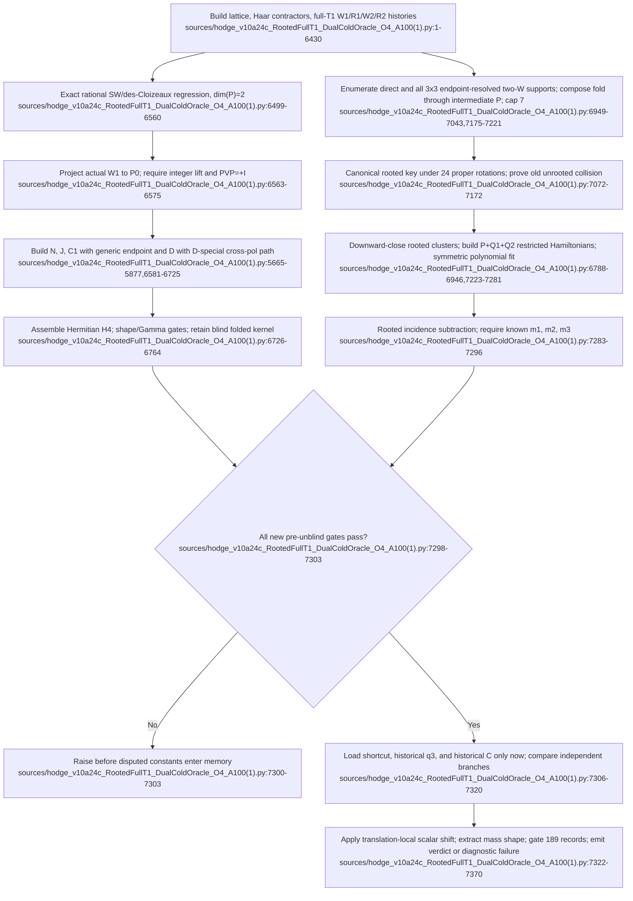

# F09 — Independent finite-cluster, full-T1 fold, and rooted dual-cold oracle

## Bottom line

The F09 family is a copy-forward sequence, not nine independent implementations. It converges on **v10a.24c**: an exact multidimensional fold regression plus a physical `PVP` check, a full three-polarization fourth-order operator fold, and a separately rebuilt rooted finite-cluster linked-gap oracle. The safest runner is the **v10a.24c production-no-watchdog notebook**; the line-addressable Python file is byte-for-byte the code cell of the watchdog-enabled v10a.24c notebook, not of the production-no-watchdog variant.

Static source coverage is stronger than evidentiary coverage. All eight notebooks have two cells, `execution_count: null`, and zero stored outputs; the Python file is source only. Thus F09 contains runnable implementations of canonical Gates 1 and 2, but **no preserved pass/fail result closes either gate**. Canonical Gate 3 is not implemented: no F09 file contains the Stage 3H `1,478 -> 3,895` topology extension.

## Locator convention and evidence inventory

Most notebooks are one physical JSON line. For them, locators below are `cell 1 markdown Lx-y` or `cell 2 code Lx-y`, counted after decoding the notebook `source` arrays. v10a.22 is pretty-printed, so both physical JSON lines and logical code lines are available. The final Python mirror uses ordinary physical line numbers.

| Artifact | Role and exact evolution evidence | Stored execution evidence |
|---|---|---|
| `sources/Hodge_v10a22_INDEPENDENT_FiniteCluster_Oracle_A100(1).ipynb` | First independent finite-cluster draft (`cell 1 markdown L1-3`; `cell 2 L5691-6166`). It is invalid as an oracle: `_v22_one_particle_heff` and `_v22_vac_energy` form `H0 + uW` from a vector instead of `diag(H0) + uW` (`cell 2 L5844-5867`; physical JSON **5863-5887**), causing NumPy row/column broadcasting rather than a diagonal unperturbed Hamiltonian. The pre-unblind lower-order gates and unblind are `cell 2 L6121-6166` (physical JSON **6140-6185**). SHA-256 prefix `CC4B8E6D5B69`. | 2 cells; code `execution_count=null`; 0 outputs. No pass, failure, exception, coefficient, or verdict is preserved. |
| `sources/Hodge_v10a23_FullT1_OperatorFold_K4_A100(1).ipynb` | Standalone full-T1 fold predecessor. It recomputes `PVP` (`cell 2 L6614-6634`), numerically checks a genuinely two-dimensional model space (`L6636-6679`), builds/folds translation-resolved kernels (`L6682-6802`), then unblinds only the nonscalar C row (`L6805-6855`). It explicitly does not call its Gamma scalar physical `m4` (`cell 1 markdown L1-21`; code `L6813-6814`). SHA prefix `CA40B4B9E9AB`. | 2 cells; null execution; 0 outputs. |
| `sources/Hodge_v10a23_DualColdOracle_FullT1_O4_A100(1).ipynb` | Combines the fold and finite-cluster legs and fixes v10a.22 with `np.diag(model['H0']) + uW` (`cell 1 markdown L1-39`; code `L6868-6882`). It upgrades the fold regression to exact rational SW algebra (`L6461-6522`) and unblinds only after lower-order gates (`L7026-7113`). It is superseded: its unrooted cache and root-anchored same-polarization fold union capped at six appear at `L6905-7006`, including the unsafe union at `L6979-6984`. SHA prefix `805ABD73D953`. | 2 cells; null execution; 0 outputs. |
| `sources/Hodge_v10a24_RootedFullT1_DualColdOracle_O4_A100(1).ipynb` | Explicitly says “Do not run v10a.23” and fixes two static defects (`cell 1 markdown L1-26`): a distinguished rooted cache using 24 proper rotations and endpoint-resolved composition through the actual intermediate position and all three T1 polarizations, allowing marked supports through size 7. Implementations are `cell 2 L6905-7104`; production census begins `L7130`. SHA prefix `53A737F6303A`. | 2 cells; null execution; 0 outputs. |
| `sources/Hodge_v10a24b_RootedFullT1_DualColdOracle_O4_A100(1).ipynb` | Surgical D-endpoint fix (`cell 1 markdown L1-27`; code `L5665-5877`): analytic `D11=-13/896` applies only to equal polarizations; cross-polarization 1x1 matches use the ordinary Haar path. This version introduced a deterministic packaging failure: generic `_v23_endpoint_general` returns D-only variables `skipped11`, `cross11_fallback`, and `cross11_dv` at `cell 2 L6577-6660`; the first completed N call would raise while constructing stats. SHA prefix `1A40685C0A8A`. | 2 cells; null execution; 0 outputs; therefore the predicted NameError is static evidence, not a stored traceback. |
| `sources/Hodge_v10a24b_RESUME_after_D_interrupt_same_kernel(1).ipynb` | Emergency continuation only (`cell 1 markdown L1-5`; code `L1-1688`). It requires live globals/caches and explicitly rejects restarted kernels (`L18-31`), replaces the D-special endpoint (`L39-251`), and resumes after K2/N/J/C1 rather than reproducing them. It can bypass v24b’s generic-return crash only because those generic calls must already exist from the interrupted v10a.24 kernel. SHA prefix `CCA48EE8D33D`. | 2 cells; null execution; 0 outputs. Not a standalone or reproducible certificate. |
| `sources/Hodge_v10a24c_RootedFullT1_DualColdOracle_O4_A100(1).ipynb` | Corrects v24b’s packaging only (`cell 1 markdown L1-14`): D-only diagnostics remain in `_v10a17_endpoint_vector` (`cell 2 L5665-5877`), while generic N/J/C1 stats use only locally defined fields (`L6581-6667`). Physics, support, and unblind logic are unchanged. Code cell SHA prefix `935A3A5BA680`. | 2 cells; null execution; 0 outputs. |
| `sources/Hodge_v10a24c_PRODUCTION_NO_WATCHDOG_A100(2).ipynb` | Same v24c physics with the asynchronous faulthandler timer removed (`cell 1 markdown L1-9`; code `L53-59`). Relative to the rooted v24c notebook, only runtime-watchdog/title material changes; later logical lines shift by -25 (for example generic endpoint `L6556`, unblind `L7281`). SHA prefix `45863A0B7974`. This is the preferred clean production runner. | 2 cells; null execution; 0 outputs. |
| `sources/hodge_v10a24c_RootedFullT1_DualColdOracle_O4_A100(1).py` | Exact code duplicate of the watchdog-enabled rooted v24c notebook (same full SHA-256; **7,370 physical lines**). It is the authoritative line-addressable review copy below, but lines **53-84** arm/redirect the optional watchdog and may write `/tmp/hodge_v10a16_faulthandler.log`. | Source only; no result payload. |

## Exact v10a.24c call flow

### What the final implementation actually does

1. **Fold regression.** `_v23_sw_exact` performs an order-four BCH/SW block diagonalization (`6499-6514`); `_v23_fold_formula_exact` constructs `K2`, `N`, `J`, `C1`, `D`, `K3`, and the claimed `H4` (`6517-6528`). `_v23_degenerate_fold_regression` uses four seeded exact-rational 5x5 Hamiltonians with `dim(P)=2`, verifies orders 2-4 exactly, and separately requires noncommuting `K2,N` (`6531-6560`).

2. **Physical `PVP`.** The actual three W1 sources are projected into the full plaquette `P0` basis, rounded only after a `<2e-10` lift check, and required to equal the three translated anchor columns of `+I`; only then is `A_PVP=1` assigned (`6563-6575`).

3. **Full-T1 moments and fold.** Generic translation-resolved pair contraction builds N/J/C1 (`6581-6696`); D uses `_v10a17_endpoint_vector`, whose same-polarization analytic one-face substitution and cross-polarization fallback are firewalled (`5665-5877`). The driver builds `K2,N,J,C1,D` (`6711-6725`) and evaluates
   `H4 = D - a(C1+C1^T) - 1/2(K2N+NK2) + a^2J` (`6726-6729`). Shape, Hermiticity, protected-coefficient, and Gamma formula checks remain blind (`6732-6764`); the Gamma scalar is explicitly a regression, not physical `m4` (`6745-6758`).

4. **Supports.** `_v24c_candidate_supports` retains both each connected concrete support and the translated left P endpoint (`6949-6993`). `_v24c_compose_second_order_supports` composes every `(bra_pol, intermediate_pol, ket_pol)` path at the concrete intermediate plaquette and admits the true seven-face marked maximum (`7007-7043`). Production constructs direct D/C supports, all nine two-W polarization pairs, folded supports, and explicit rooted clusters through size three (`7175-7237`), then verifies downward closure (`7239-7255`). W1/W2 are used here as a **support census**, not as reused raw cluster coefficients.

5. **Rooted cache.** Exactly 24 determinant-`+1` cubic transforms are built (`7072-7086`). `_v24c_shape_key` stores the transformed root separately from the other faces, forcing root-to-root equivalence (`7105-7128`). The old 48-transform unmarked key survives only as a diagnostic (`7131-7146`); `_v24c_root_cache_regression` must find at least one size-four collision under that old key (`7149-7180`).

6. **Independent cluster fit.** `_v23c_build_basis` constructs P seeds plus W(P)=Q1 and W(Q1)=Q2, rejects non-P zero-denominator resonances, and checks W Hermiticity/P orthonormality (`6848-6909`). Both one-particle and vacuum matrices correctly use `diag(H0)+uW` (`6912-6926`). The one-particle branch selects the P-overlap manifold and uses des-Cloizeaux orthogonalization; the rooted row sum minus one vacuum energy defines the gap (`6912-6932`). `_v23c_fit_cluster` fits degree 6 on 13 symmetric points over `[-0.055,0.055]`, compares a narrower fit’s fourth coefficient, and requires the `u=0` gap `8/3` (`6934-6946`). Each rooted proper-rotation class is fit once, with sampled duplicate-class recomputation and a fit-stability gate (`7266-7281`). Rooted incidence inversion then must recover `m1=1`, `m2=11/306`, and `m3=-109151/249696` (`7283-7296`).

7. **Unblind and terminal outputs.** Disputed constants do not appear until every new gate passes (`7298-7303`). The independent `m4=totals[4]`, quarantined shortcut, historical q3, and historical C are compared (`7306-7320`). A translation-local scalar shift replaces only the blind folded Gamma rest, after which the final mass shape and exactly 189 nonzero anchored records are gated (`7322-7337`). The terminal products are in-memory globals/stdout: `M4_ORACLE`, `C_COLD`, `K4_mass_cols`, `mass_shape`, `record_count`, `VERDICT`, and the `gates` list (`7339-7370`). Nothing serializes them.

## Inputs, outputs, invariants, and hard stops

**Inputs/dependencies.** The F09 tail depends on the same monolithic file’s upstream lattice and SU(3) machinery: `faces`, `verts`, `anchor_faces`, `qhaar`; `W1s/R1s`, labeled `R1Ls/R12Ls/R2Ls/W2Ls`; projection, translation, support-connectivity, H0/signature, Haar, and Hodge-shape helpers built before line 6431. Runtime dependencies include NumPy, SciPy, SymPy, and a `GLUE_L=5`, three-polarization configuration. No other project module imports or calls F09 as a library; execution occurs at import/notebook-run time.

**Core invariants.** Exact fold equality through fourth order; genuinely noncommuting `K2,N`; physical `PVP=+I`; Hermitian W/operator kernels; full 36 second-order hoppings; protected Hodge shape; root retained; connected supports; fold support size at most seven; rooted-cache collision regression; downward-closed cluster poset; no non-P resonance; des-Cloizeaux overlap/orthogonality bounds; `u=0` gap `8/3`; fit-window stability; correct `m1-m3`; no disputed value before pre-unblind success; final Gamma rest equal to the independent oracle; exactly 189 anchored records.

**Hard stops/errors.** v10a.22 silently constructs the wrong broadcast Hamiltonian. v10a.23 is statically superseded by two geometry defects. v10a.24 D aborts on legal cross-polarization one-face matches. Full v10a.24b would crash after its first generic N calculation while packaging undefined D-only statistics. The resume notebook raises if its live-kernel prerequisites are absent. v10a.24c raises on individual invariant failures, on any pre-unblind gate failure (`7300-7303`), and on post-unblind structural failure (`7369-7370`). Since no output is stored, there is no evidence that any terminal branch has ever been reached.

## Canonical Gates 1-3

| Canonical gate | F09 implementation | Closure status |
|---|---|---|
| **Gate 1 — verify physical `PVP=aP`** | Implemented against actual W1/P0 data at Python `6563-6575`; it requires the exact translated `+I` structure before assigning `a=1`. | **Open.** Source is adequate, but all notebooks have zero outputs and there is no signed/serialized gate result. |
| **Gate 2 — regress the folded des-Cloizeaux formula on a genuinely multidimensional degenerate model space** | Implemented exactly at `6499-6560`: four rational 5x5 models, `dim(P)=2`, equality through order four, and a noncommuting `K2,N` check. | **Open.** Again, implementation is present but no preserved execution proves it passed in the production artifact/environment. |
| **Gate 3 — complete Stage 3H from 1,478 to 3,895 topologies** | **Absent.** A full-text check of all nine F09 files finds no `Stage 3H`, `1478`, or `3895`. F09 instead builds support-derived rooted clusters (`7221-7264`) and gates a final **189-record kernel** (`7322-7337`), which is a different corpus and invariant. | **Open and out of F09 scope.** The destination makes the 3,895-record Stage-3H computation the sole production topology stage. |

Therefore F09 closes **none** of canonical Gates 1-3 as evidence. It supplies candidate executable certificates for Gates 1-2 only.

## Feature-level unified path forward

1. **Retire every F09 runner:** quarantine v10a.22 through v10a.24c and the same-kernel resume as source history, including the no-watchdog notebook. None is the destination production path.
2. **Extract only fixed concepts:** migrate the physical `PVP` construction and exact multidimensional fold fixtures into the one canonical physical-Q/SW implementation. Do not migrate the rooted finite-cluster result, local scalar shift, or branch verdict.
3. **Make Stage 3H the computation:** the canonical runner itself enumerates and evaluates exactly 3,895 topology records and assembles its one unshifted 189-record kernel. There is no distinct replay/certificate runner.
4. **Promotion rule:** Gates 1-2, topology coverage, kernel assembly, normalization, interval, and Gamma gates all execute sequentially in the same content-addressed run. Any failure stops that one run.

## Confidence and gaps

- **High confidence** in file coverage, copy/evolution relationships, exact final call flow, the v10a.22 broadcast defect, v10a.23 geometry defects, v10a.24b generic-stats crash, v10a.24c/Python identity, and the absence of stored outputs; these are direct static facts from every requested file.
- **High confidence** that F09 does not implement canonical Gate 3; the searched topology identifiers are absent and the implemented corpus has different construction and terminal invariants.
- **Unresolved by available evidence:** actual support/class counts, numerical coefficients, pass/fail rows, 189-record attainment, scalar/shape verdict, runtime, memory use, and whether a fresh A100 production run completes. No F09 artifact contains an execution trace or result payload.
- **Version-label drift:** v24c still names many gates and summaries `v10a.23` (`7294-7303`, `7357-7370`), so downstream evidence must key by source hash rather than printed version strings.
