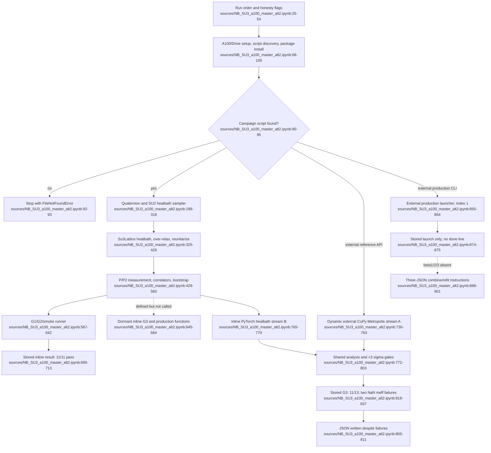

# F10 — SU(3) lattice Monte Carlo cross-validation campaign

## Outcome

The notebook contains a useful independent PyTorch heatbath implementation and a partially successful single-volume cross-check, but **not a completed production or continuum campaign**. Its inline G1/G2/smoke block records 11/11 passing checks. The two-implementation G3 comparison records only 11/13: both effective-mass gates fail because `|Delta|/sigma` is `NaN`. The first production launch has no stored completion line, the other two ensembles were not launched, and the combine/refit is instructions only.

The required CuPy campaign scripts and every claimed JSON/NPZ result are absent from the project mirror. Consequently, the external implementation, its measurement conventions, the emitted cross-check JSON, and the continuum inputs cannot be independently inspected here.

## Source and stored-output inventory

The sole F10 source was read in full: `sources/NB_SU3_a100_master_alt2.ipynb:1-906` (SHA-256 `BC99B9064E201754C0DB115A8AC0F76141FC3A3F919CDF47A7A5A166109BE161`). It has six cells: two Markdown and four code cells. Every code cell has `execution_count: null` despite carrying stdout, so the outputs are stored evidence without an intact Jupyter execution-order record.

| Cell | Source range | Stored output range | Verified state |
|---|---|---|---|
| 0 — run book | `sources/NB_SU3_a100_master_alt2.ipynb:25-54` | none | Declares the intended environment, G1/G2, G3, three production ensembles, combine step, no-checkpoint warning, and unresolved P2 normalization. |
| 1 — environment/discovery | `sources/NB_SU3_a100_master_alt2.ipynb:68-100` | `:107-113` | Stdout reports A100-SXM4-40GB, mounted Drive, and **only** `/content/ENGINE_MC_su3_t1pm_spatial_nextrun.py` selected for both production and reference roles. |
| 2 — inline PyTorch implementation | `sources/NB_SU3_a100_master_alt2.ipynb:130-688` | `:695-713` | 11 `[PASS]`, 0 `[FAIL]`, 0 `NaN`; only `gate_block_G1_G2()` is invoked. |
| 3 — two-stream G3 cross-check | `sources/NB_SU3_a100_master_alt2.ipynb:730-811` | `:818-838` | 11 `[PASS]`, 2 `[FAIL]`, 2 `NaN`; nevertheless prints that `su3_g3_crosscheck_b599.json` was written. |
| 4 — production launcher | `sources/NB_SU3_a100_master_alt2.ipynb:855-864` | `:874-875` | Shows launch of ensemble 1 with the old `nextrun.py`, then only the no-checkpoint reminder. The expected `done -> .../beta1.json` line is absent. There is no stored exception object, but also no completion evidence. |
| 5 — combine instructions | `sources/NB_SU3_a100_master_alt2.ipynb:888-901` | none | Requires three absent JSONs and specifically invokes the absent `nextrun2.py`; no refit result is stored. |

All four stored outputs are plain stdout streams; there are no stored rich displays or exception/traceback objects.

## Exact current-state call flow

### Environment and dependency discovery

Cell 1 runs `nvidia-smi`, mounts Google Drive when possible, chooses `OUTDIR`, and uses `find()` to search `/content`, Drive, and the current directory (`sources/NB_SU3_a100_master_alt2.ipynb:68-95`). `SCRIPT_PROD` prefers `SU3_T1pm_spatial_MC_nextrun2.py`; `SCRIPT_REF` prefers `ENGINE_MC_su3_t1pm_spatial_nextrun.py`. If only one exists, both variables may point to it—as they do in the stored run (`:90-95,107-113`). Missing scripts raise `FileNotFoundError`. The cell then attempts a quiet `cupy-cuda12x` install with `check=False` and installs PyTorch only if its import fails, with `check=True` (`:96-100`).

### Inline PyTorch heatbath stream

The implementation fixes the torch seed, device, link/real dtypes, reunitarization cadence, and SU(2) subgroup pairs (`sources/NB_SU3_a100_master_alt2.ipynb:188-209`). Quaternion projection/embedding and Kennedy–Pendleton or small-alpha rejection sampling produce subgroup proposals (`:216-318`).

`Su3Lattice` initializes an even periodic `Nt×L³` cold lattice and checkerboard parity (`:325-335`). `staple` constructs the Wilson staple (`:342-360`); `heatbath_sweep` applies Cabibbo–Marinari SU(2)-subgroup heatbath updates (`:363-377`); `overrelax_sweep` supplies deterministic over-relaxation and the local-action audit (`:379-399`); `cycle` composes one heatbath with configurable over-relaxation (`:401-405`). Gram–Schmidt reunitarization and group-error measurement maintain/audit SU(3) (`:407-426`).

Plaquette moments, APE-smearing, and `t1_operators` measure the P and P2 T1 channels; `measure` concatenates requested APE levels (`sources/NB_SU3_a100_master_alt2.ipynb:429-489`). `random_gauge_transform` supports an independent gauge-invariance check (`:491-501`). `correlators`, `tau_int`, `effective_mass`, and `blocked_bootstrap` perform shared statistics (`:508-560`). `effective_mass` deliberately returns `NaN` when either adjacent correlator is non-positive (`:534-546`), which later drives the two G3 failures.

`run_ensemble` thermalizes, periodically reunitarizes, samples measurements/plaquettes, and returns arrays in memory (`sources/NB_SU3_a100_master_alt2.ipynb:567-585`). `gate_block_G1_G2` runs G1, G2, and the correlator smoke test (`:588-642`). Cell 2 ends by calling **only** this block (`:687-688`). Its docstring says G3 runs whenever a GPU is present and production arms via a `RUN_PRODUCTION` sentinel (`:138-146`), but the executable tail contains neither call nor sentinel check. The separately defined `gate_block_G3` and `production_stream` are dormant in the stored notebook (`:645-684`).

### Actual two-implementation G3 cell

Cell 3 dynamically imports the absent external script with `spec.loader.exec_module`, so its module-level behavior is also executed and cannot be audited from this corpus (`sources/NB_SU3_a100_master_alt2.ipynb:730-743`). It instantiates the external `EnsembleConfig`, `Backend`, and `SU3WilsonLattice`, then manually runs a seed-777 CuPy Metropolis stream at beta 5.99, `8³×16`, 400 thermal cycles, 400 configurations, separation 4, and APE levels 0/4 (`:744-763`). The inline PyTorch heatbath stream runs the same geometry/statistics via `run_ensemble` (`:765-770`).

`analyse` feeds both raw streams through the shared correlator, autocorrelation, blocking, bootstrap, and effective-mass code (`sources/NB_SU3_a100_master_alt2.ipynb:772-785`). `sig` and `g3gate` require `|Delta|/sqrt(err_A²+err_B²) < 3` (`:787-803`). P2 is explicitly excluded pending normalization confirmation (`:784-785`). The JSON dump executes regardless of `nfail`; no assertion or fail-closed return prevents a failing comparison from being written or described as a certificate (`:805-811`).

### Production and combine path

Cell 4 hard-codes `ENSEMBLE_INDEX=1` and spawns the discovered external production script with `--profile continuum --ensemble 1 --install-cupy --json <OUTDIR>/beta1.json` (`sources/NB_SU3_a100_master_alt2.ipynb:855-864`). The documented index mapping is beta 5.99 on `18³×18`, 6.0625 on `20³×20`, and 6.235 on `26³×26` (`:44-46`), but the absent external script owns the actual configurations. Cell 5 requires `beta1.json`, `beta2.json`, and `beta3.json` and calls `nextrun2.py --profile combine` to update the quoted fit-window comparison (`:888-901`). None of those inputs or the combined output is present.

## Gate ledger and failure semantics

### Inline G1/G2/smoke — all stored checks pass

| Gate | Stored result |
|---|---|
| G1a cold plaquette | 1.000000000, pass (`sources/NB_SU3_a100_master_alt2.ipynb:697-698`) |
| G1b group errors | unitarity `6.11e-07`, determinant `4.58e-07`, pass (`:699`) |
| G1c over-relaxation local action | max error `4.77e-06`, pass (`:700`) |
| G1d gauge invariance | plaquette delta `2.33e-07`; T1/P2 relative delta `7.29e-07`, both pass (`:701-702`) |
| G1e thermalized plaquette band | 0.6032, pass (`:703`) |
| G2a weak-beta mean | +0.00272 versus 0.00278, pass (`:705-706`) |
| G2b exact Haar real second moment | 0.05608 versus 1/18≈0.05556, pass (`:707`) |
| G2c imaginary mean | +0.00020, pass (`:708`) |
| G2d exact Haar imaginary second moment | 0.05489 versus 1/18≈0.05556, pass (`:709`) |
| Smoke correlator | finite `g=[3.5458e-03,-2.0133e-04,-7.1806e-05]` with positive `g(0)`, pass (`:711-713`) |

These are numerical invariant and distributional-anchor checks. They provide evidence for this finite implementation/run; naming them “exactness gates” does not turn them into a proof of the full Markov chain or continuum theory.

### G3 — partial cross-validation only

The stored streams yield plaquettes 0.59312±0.00008 (CuPy Metropolis) and 0.59279±0.00008 (PyTorch heatbath) (`sources/NB_SU3_a100_master_alt2.ipynb:818-820`). Plaquette passes at `2.99 sigma`, only 0.01 below the strict `<3` threshold. All ten P-channel correlator comparisons at APE 0/4 and `t=0…4` pass, with reported separations 0.19–1.74 sigma (`:823-828,830-834`). Both `meff_P_lvl0(1)` and `meff_P_lvl4(1)` fail with `NaN` (`:829,835`), yielding **11/13** (`:837`).

The NaNs arise because `effective_mass` returns NaN for a non-positive adjacent mean correlator, then `sig` propagates it and `nan < 3.0` is false (`sources/NB_SU3_a100_master_alt2.ipynb:534-546,787-792`). The gate correctly prints failure, but the workflow does not explain which stream/correlator is non-positive, choose a predeclared alternative estimator, or block certificate emission.

## Inputs, outputs, invariants, and side effects

### Inputs

- Wilson-action SU(3) links in complex64; float64 observable/statistical accumulation; periodic even lattices; torch seed `20260815`; external stream seed `777` (`sources/NB_SU3_a100_master_alt2.ipynb:155-175,188-203,744-750`).
- P observable `Im Tr W/3` and P2 `Im Tr(W²)/3`, three cyclic spatial planes, APE levels, global-mean-subtracted temporal correlators (`:155-171,467-489,508-517`). P2 comparison is not authorized until the external `nextrun2` convention is confirmed.
- Colab/A100/CUDA, Google Drive or a writable working directory, NumPy, PyTorch, CuPy, and one of two external campaign scripts (`:68-100`).

### Outputs and side effects

- Cell 3 writes `su3_g3_crosscheck_b599.json` to Drive/current `OUTDIR` (`sources/NB_SU3_a100_master_alt2.ipynb:805-811`). The stored stdout says it was written, but the file is absent from the mirror and its contents cannot be verified.
- Dormant `gate_block_G3` would write local `su3_port_g3_b599.json` (`:645-676`); dormant `production_stream` would write `su3_port_prod_b599_stream2.npz` (`:679-684`). Neither is called.
- Cell 4 spawns an external Python process intended to write `beta1.json` (`:855-864`). No completion/output artifact is present. `beta2.json`, `beta3.json`, and a combined-fit artifact are also absent.
- Other side effects are GPU allocation, package installation, Drive mounting, dynamic module execution, console output, and long-running subprocesses.

### Invariants and unresolved gates

- Maintained/tested: cold plaquette, SU(3) unitarity/determinant, over-relaxation action preservation, gauge invariance, physical plaquette band, weak-beta mean, exact Haar second moments, finite correlator pipeline, and `<3 sigma` cross-stream comparisons (`sources/NB_SU3_a100_master_alt2.ipynb:177-186,588-642,787-803`).
- Unresolved: two effective-mass G3 gates; P2 normalization/cross-check; checkpoint/restart integrity; all three production ensembles; the combine/refit; and preservation of the claimed external conventions.

## External and missing dependencies

Repository-wide filename and text search found no `ENGINE_MC_su3_t1pm_spatial_nextrun.py`, `SU3_T1pm_spatial_MC_nextrun2.py`, `su3_g3_crosscheck_b599.json`, `su3_port_g3_b599.json`, `su3_port_prod_b599_stream2.npz`, or `beta1/2/3.json`. Their only project references are inside this notebook.

The missing script is not a peripheral helper: Cell 3 requires its `EnsembleConfig`, `Backend`, `SU3WilsonLattice`, `cycle`, `plaquette`, and `measure_multiscale` APIs (`sources/NB_SU3_a100_master_alt2.ipynb:737-760`), while Cell 4 and Cell 5 require its CLI profiles (`:855-864,888-895`). The notebook also warns that old `nextrun` has no mid-run checkpoint and that P2 normalization in `nextrun2` was not visible (`:49-54`). Because the stored environment used old `nextrun.py` for both roles (`:107-113`), neither the preferred checkpointed production path nor the requested `nextrun2` combine path is evidenced.

## Evidence boundary versus the fixed-order theorem

F10 is an independent empirical cross-validation stream. G1/G2 test implementation invariants and known local/Haar expectations; G3 compares two finite-statistics algorithms at one beta and one finite volume. Even a fully passing G3 would support equilibrium-distribution and measurement-kernel consistency, not prove the fixed-order Hamiltonian coefficients, closure theorems, exact rank statements, or continuum limit owned by F01–F09.

The present record is weaker still: G3 is 11/13, P2 is deferred, production is incomplete, and no continuum refit exists. It must therefore be cited as **partial Monte Carlo validation**, never as replay-gate closure or a numerical proof of the fixed-order theorem. The prose calling `su3_g3_crosscheck_b599.json` a “certificate” (`sources/NB_SU3_a100_master_alt2.ipynb:897-901`) exceeds the stored gate state.

## Current flowchart

## Feature-level unified path forward

1. **Remove F10 from the O4 path.** It is not a dependency, gate, comparison stream, or publication input for the canonical fixed-order computation.
2. **Archive its current status accurately.** Preserve the 11/11 inline smoke evidence and the incomplete 11/13/NaN production attempt as historical empirical work only.
3. **Do not repair it during O4 consolidation.** Any future Monte Carlo effort is a new project authorized after the single fixed-order path reaches a terminal result.

## Confidence and gaps

**Confidence: high** on notebook call flow and stored stdout: the file was read in full and each output stream was counted and inspected. Confidence is high that the project mirror lacks every named external script/result artifact.

Known gaps:

- The absent CuPy scripts prevent verification of their update algorithm, measurement normalizations, CLI profiles, checkpoint behavior, and continuum fitting.
- The emitted Drive JSON is not in the corpus, so stdout is the only evidence that it was written.
- Null execution counts and the incomplete production stdout prevent reconstruction of a reliable execution timeline or terminal status.
- No GPU workflow was rerun; this audit verifies the stored record, not reproducibility on current hardware.
