# Current research map

Maintained guide, reconciled with the source and statement ledgers on **10 September
2026**. The workspace reconciliation and source-linked analytic formalization
were merged in [PR #113](https://github.com/ats314/WORKHOUSE/pull/113), merge
commit `742033a`. That records integration of the stated work; later changes
and CI results must be checked against their own revision.

Start here to select a mathematical obligation. Use the
[research goal](research_goal.md) for the governing continuum target and the
[formalization workflow](formalization_workflow.md) to turn a precise source
statement into a reviewed Lean proof and graph relationship. The
[derivation proof map](derivation_formalization.md) is generated from the live
[statement inventory](../ledger/derivation_statements.yaml); it supplies source
hashes, section locators, dependencies, whole-statement proofs, scoped ingredients
and remaining formalization. Counts belong there and in the generated
[frontier](../FRONTIER.md), not in another manually maintained total.

## Read the current claim at its own scope

Use the generated [derivation priority queue](../FRONTIER.md#7-current-derivation-priorities)
and [source-based priority review](research/graph-priorities-2026-09-10.md)
to select the next calculation. The queue reads native route metadata and
live source status. It separates curated order, exact targets, explicit
completion inputs and conditional consequences; missing Lean coverage is
not an unresolved analytic theorem. The broad gap-level dependency count
does not measure these source-level routes.

The [September 10 formalization correction](research/formalization-scope-2026-09-10.md)
distinguishes the up-Laplacian from its normalized carrier projector and adds
an actual rank-one RUR factorization. Its syntactic word counts and geometric
majorants remain scoped ingredients; they do not promote the full physical
Hodge checks or discharge the G17 Hamiltonian transcription.

The [fixed-square derivative reduction](derivations/w6-ground-jets-and-transport-budget.md)
establishes energy bounds through order three for the raw Hamiltonian,
ground energy and ground vector. Explicit bounds on the complete conditional
source-transport generator would then give `M_j(s) <= c_j s^-j`; those source
bounds remain to be proved. The
[conditional-score analysis](derivations/w6-conditional-score-tail-control.md)
separates positive-coupling endpoint control from uniform control as `g` tends
to zero. It proves the actual uniform source moment
`integral [4(1-w)/g^2]|f|^2 dnu_g <= 4(1+E/gamma)b_g[f]` for centered
finite-energy sources. The remaining sufficient inequality is conditional
score domination by the actual conditional potential (M10).
Changing source energies and the physical clock are retained in the
subdivision budget. Neither result asserts an interacting growing-grid floor.

The [conditional transport continuation](derivations/w6-conditional-transport-obstruction.md)
now expresses the actual score as a conditional continuity residual and derives
the constrained Agmon center using the original electric metric. Its specified
synchronized radial profiles follow that center exactly, cancelling the linear
normal phase drift. M10 remains open for this choice: the conditional amplitude,
quadratic phase fluctuations, rare-fiber complements and antipodal degeneracy
still need estimates. A finite-flow argument using actual conditional
concentration proves that some permitted Q8 cutoffs fail M10. This leaves the
specified synchronized successor open; no actual g^-4 score asymptotic is
assumed in that counterexample. The established source-moment implication
M11-M15 and the separate complete-energy and interacting-grid obligations retain
their scopes.
The synchronized S13 field is the selected realization of the existing
`DERIV:W6_CONDITIONAL_SCORE_TAIL_CONTROL:SCORE_DOMINATION_M10` priority;
its specialized open record is not a second priority or a necessary premise
of every possible proof of M10.

An analytic proof retains its registered mathematical status when Lean covers
only an ingredient. Conversely, a compiling abstract theorem applies to a
Wilson construction only after its model, domain and identification hypotheses
are supplied. Read the source, its `DERIV:` or `RESULT:` record, and the actual
formal declaration together. A historical report's missing input may have been
discharged by a later derivation; its date and scope still matter.

| Route | Established source and exact graph entry | Successor to distinguish |
| --- | --- | --- |
| Fixed-spacing physical transfer and complete odd band | [Infinite-volume Wilson construction](../paper/research_notes/G18_WILSON_INFINITE_VOLUME_PHYSICAL_BAND_20260905.md), `RESULT:WILSON_INFINITE_PHYSICAL_BAND`; [marked shell transport](derivations/wilson-marked-shell-transport.md), `DERIV:WILSON_MARKED_SHELL_TRANSPORT:S10_S15` and `:S21_S22` | G18 is discharged at its registered fixed-spacing scope. Matching and transporting that construction through the spatial continuum trajectory remain G19 obligations; an older statement that the entire band/source stage is absent is stale. |
| Actual true-vacuum block assembly | [True-vacuum block estimates](derivations/wilson-true-vacuum-block-estimates.md), `DERIV:WILSON_TRUE_VACUUM_BLOCK_ESTIMATES:BA20_BA26`; [independent check](derivations/wilson-true-blocks-independent-check.md) | BA20–BA25a establish the explicit strong-coupling window. The BA26 budget ceiling and continuation beyond that window remain distinct from missing Lean constructions. |
| SC17 spatial control | [Spatial closure](derivations/wilson-sc17-spatial-closure.md), `DERIV:WILSON_SC17_SPATIAL_CLOSURE:OPTIMIZED_INTERVAL` and `:RATIONAL_WINDOW` | The optimized bare-bootstrap interval has endpoint `lambda_c` in `(1/73,1/72)`; the endpoint keeps the stated gap but loses the interior exponential rate. The full reference-defect estimates outside this interval are separate. |
| Thermodynamic ground law and physical form | [Thermodynamic derivation](derivations/wilson-sc17-thermodynamic-limit.md), `DERIV:WILSON_SC17_THERMODYNAMIC_LIMIT:T12`, `:SCORE_LIMIT`, `:IF4_IF7`, `:IF8_IF9`, `:IF10_IF13` | The source proves the limiting law, closed form, physical spectral gap and nonzero plaquette spectral-interval weight in its regime. Constructing their exact cylinder, operator and spectral identifications in Lean is unfinished formalization, not an absent analytic theorem. |
| Actual physical Euclidean time | [Physical-time derivation](derivations/wilson-sc17-physical-time-limit.md), `DERIV:WILSON_SC17_PHYSICAL_TIME_LIMIT:P17_P18`, `:PHYSICAL_TIME_GAP`, `:P19_P20` | The source identifies the process with the specified closed form and the finite physical vacuum-correlation limit, including the endpoint. Its P10 names the further spatial-continuum inputs; this fixed-spacing identification does not supply those estimates. |
| Complete spatial Schur comparison | [Schur excess](derivations/wilson-spatial-schur-excess.md), `DERIV:WILSON_SPATIAL_SCHUR_EXCESS:SP7_SP10`, `:SP11_SP16`, `:SP20_SP24`; [selected-inverse wall](derivations/wilson-selected-inverse-wall.md), `DERIV:WILSON_SELECTED_INVERSE_WALL:W6` | Keep the full magnetic, metric/Haar, vacuum, moving-source and force terms. W6 is the explicitly open actual interacting selected-pairing estimate; finite or normalized inverse lemmas alone do not discharge it. |
| Flat holonomies and source rank | [Flat-background source theorem](../paper/research_notes/G19_FLAT_HOLONOMY_SOURCES_AND_RANK_REPAIR_20260907.md), `RESULT:WILSON_FLAT_BACKGROUND_FAST_SOURCES`, `RESULT:WILSON_PHYSICAL_SOURCE_RANK_REPAIR` | Use the proved unreduced source and exact gauge action across stabilizer changes. Its ambient source lift is not automatically the physical quantum Schur projection. |
| Reconstruction and continuum closure | [Reconstruction](derivations/yangmills-reconstruction.md), `DERIV:YANGMILLS_RECONSTRUCTION:R1`, `:R6_R7`; [continuum manuscript](derivations/yangmills-continuum-balaban-multiscale-proof.md) and [Cauchy repair](validation/wilson-g19-cauchy-repair.md) | Preserve the manuscript's statement-specific proven, conditional, disputed and open entries. A positive physical-time rate, actual reconstructed spectral measure and total observable family must meet on the same continuum object. |

For all September 1 onward sources, also use the
[documentation topic index](README.md#september-source-routes) and the
[recent-research ledger](../ledger/recent_research.yaml). They retain standalone
anisotropy, W6, strip and square-block campaigns without treating every similarly
named folder as another active repository.

## Select the kind of work before proceeding

| Kind of obligation | Where to read it | What discharges it |
| --- | --- | --- |
| Mathematical successor | The source's hypotheses and conclusion, [results](../ledger/results.yaml), [gaps](../ledger/gaps.yaml) and the statement's `status` | A proof of the missing estimate or construction at the required regime, with its dependencies and downstream consequence stated. |
| Formalization successor | The statement's `lean`, `lean_support` and `remaining` fields in [the inventory](../ledger/derivation_statements.yaml) | A compiled faithful declaration, checked assumptions and actual proof dependencies; whole coverage only when it proves the complete named statement. |
| Reproduction or source review | A dated [run](../runs/), its manifest and the [corpus review queue](corpus_coverage.md) | Replay or review of the specified source bytes and exact claim; preserve the prior evidence and any unresolved remainder. |
| Repository integration | [Workspace coordination](workspace_coordination.md), current Git state and the change's PR | Review, required checks and verified merge status for that revision. A local file or old passing log is insufficient. |

The existing analytic Lean modules prove inverse/Schur, measure comparison,
projection assembly, weak-limit/closure and spectral mechanisms. For example,
`DERIV:WILSON_SC17_THERMODYNAMIC_LIMIT:IF4_CLOSABLE` has formal support from
`LEAN:closed_extension_of_integration_by_parts`; the actual cylinder gradient,
Hilbert direct sum, dense test domain and limiting adjoint still need a faithful
Lean construction. This is a concrete formalization task. It does not reopen
the source's proof of closability.

Similarly, `DERIV:WILSON_SC17_SPATIAL_CLOSURE:R12_R14` names the full conditional
pressure/Hessian and cutoff defects needed for its continuation, and
`DERIV:YANGMILLS_CONTINUUM_BALABAN_MULTISCALE_PROOF:THEOREM_7_1` records the
unsupplied summable cross-scale increment. Those are mathematical successor
obligations, not merely requests to translate existing algebra into Lean.

## Keep the corrections attached

The [September 10 source review](../runs/folder_evidence_integration_2026-09-10/README.md)
extracts the Cauchy and martingale repair notes as analytic results with explicit
application hypotheses. `RESULT:COMMON_SPACE_CONTRACTIVE_DRIFT` supplies convergence
from common-space contraction and summable map/observable drift;
`RESULT:PROJECTIVE_SOURCE_MARTINGALE` supplies a common law and L2 convergence from
actual projective cutoff consistency and normalized source compatibility.
`RESULT:REVERSE_MARTINGALE_BLOCKING` applies to coarsenings of one established law,
and `RESULT:PREDICTABLE_SOURCE_DRIFT` allows summable predictable drift and
conditional variances. `RESULT:UNIFORM_MARKED_CLUSTERING` converts a uniform
two-marked physical weighted norm into exponential covariance decay. These are
proved criteria; applying them to a continuum Wilson trajectory requires the
specified actual laws, sources, drift estimates and physical normalization.
`RESULT:SOURCE_COMPLEMENT_COMPLETE_WINDOW` separately proves an onto source
frame and the complete high spectral window from a finite source lower bound
and an upper bound on the entire complementary Hilbert space, with an explicit
projection-angle estimate. Source moments alone do not supply that complement
bound. Its existing fixed-spacing applications retain their own regimes.

The [September Feshbach review](research/september_feshbach_integration.md)
preserves both the exact identities and their scope corrections.
`RESULT:TIER_COLLAPSE_ACTUAL_H4_SUPPORT` proves the recorded fourth-order
support mechanism; the historical R-degree-only inference is retained as
falsified. `RESULT:FESHBACH_RESOLVENT_COMPARISON` has an analytic statement
with explicit compatible-domain and relative-form hypotheses; its finite
controls do not supply an interacting uniform constant.

`RESULT:WILSON_HARMONIC_CUBIC_OBSTRUCTION` retains the actual local harmonic
witness and the selected global cancellation. A failed unrestricted absolute
bound does not erase the surviving bounded-mean or selected comparison.
The same discipline applies to the [vacuum assembly](derivations/wilson-vacuum-aligned-assembly.md)
and [weighted repair](derivations/wilson-weighted-repair-and-rotor-gap.md):
follow the later true-vacuum and SC17 results before repeating an older
"remaining angle estimate" as a statement about every regime.

## Query and report an exact obligation

### Supported Track A formalization

The [source-linked Track A successor](derivations/track-a-supported-statements.md)
formalizes the report's supported implications using actual Hilbert operators,
continuous functionals, noncommutative Banach algebras, probability measures,
L2 sources, and finite product measures. W6 now has the variational residual
identity and sufficient error certificate under its stated factorization,
diagonal and coercivity inputs. SC17 has the continuity barrier, constructed
small-root fixed point, and exact default interval arithmetic. G17 has the
source-dependent partition and bounded-footprint estimates, plus a formal
independent-source obstruction to an unrestricted radius.

The [preserved report and run record](../runs/track_a_formalization_2026-09-09/README.md)
retain the failed source-independent constant and distinguish the constructed
two-atom example from SU(2) Haar measure. The latter's moment specialization
has explicit Haar/moment prerequisites. These proofs do not discharge the
actual Wilson force factorization, complete quantum-pressure defect, or
Hamiltonian/continuum identification. Query `DERIV:TRACK_A_SUPPORTED:W6_E`,
`DERIV:TRACK_A_SUPPORTED:SC17_P`, or `DERIV:TRACK_A_SUPPORTED:G17_I` for the
precise theorem connections and dependencies.

```powershell
uv run --no-sync workhouse why G19
uv run --no-sync workhouse why RESULT:WILSON_INFINITE_PHYSICAL_BAND
uv run --no-sync workhouse why DERIV:WILSON_SC17_THERMODYNAMIC_LIMIT:IF4_CLOSABLE
uv run --no-sync workhouse why LEAN:closed_extension_of_integration_by_parts
uv run --no-sync workhouse why DERIV:WILSON_SELECTED_INVERSE_WALL:W6
```

Report the hypothesis discharged, theorem now applicable, precise remaining
blocker and verification performed. Preserve analytic status, machine tier,
source provenance and publication state as separate facts. Follow the
[formalization workflow](formalization_workflow.md) for edits to proof mappings;
do not hand-edit the generated proof map, frontier, certified view or graph.

## Dated route history

The collapsed narrative below preserves the earlier September 5–9 guide and
its links. Its words "now", "next" and "remains" describe that recorded stage.
Its closing description of G18 as open is superseded by the current registered
fixed-spacing closure above. The earlier narrative is retained for source
history; use the current tables and live ledgers to choose new work.

<details>
<summary>Earlier September 5–9 research narrative, retained after PR #113</summary>

The [derivation proof map](derivation_formalization.md) now provides exact
source and statement locators for the September documents. The added formal
mechanisms cover measure comparison, noncommuting assembly, infinite operator
inverse/Schur arguments, weak-law and score limits, operator closability and
spectral interval mass. Their explicit hypotheses remain visible in Lean and
their kernel dependencies are exported into the theory graph. The mathematical
source status is retained; full Wilson cylinder, generator, stochastic-dynamics
and spatial-continuum instantiations are separate remaining formalization work.

The [flat-background continuation](../paper/research_notes/G19_FLAT_HOLONOMY_SOURCES_AND_RANK_REPAIR_20260907.md)
proves the same full `1/(33L^2)` physical tangent floor over every flat
holonomy, uniformly in volume, with every covariant harmonic mode retained.
Boundary edges give the actual unreduced source a right inverse of norm L.
Its nonlinear tangent chart stays onto on a linkwise nonflat neighborhood
of radius `1/(2sqrt(6)L(7L-6)^2)`, independent of volume and flat background.

The physical Coulomb source projection nevertheless jumps by norm one at
an SU(2) stabilizer change. The same matrix observation has a smooth
constant-rank realization when the coarse gauge variables are retained.
This repairs the coordinate premise; it does not identify that ambient
projection with a physical quantum Schur projection. The next work is the
complete interacting true-vacuum energy and source comparison in these
redundant compact variables, retaining the exact Gauss action. The
[pinned run](../runs/flat_holonomy_sources_2026-09-07/README.md) supplies exact
finite controls with a separately stated analytic scope.

This is the maintained entry point for the September continuation. The
[frontier](../FRONTIER.md) supplies live verification counts and gap routes;
the [result register](../ledger/results.yaml) supplies precise analytic
statements, hypotheses, proof sources, and dependencies. The dated manuscripts
and sealed runs retain the claims and open questions of their own stage.

The governing objective is the Clay Yang-Mills existence and mass gap
problem. Read the [goal and remaining obligations](research_goal.md) for
the connection between this construction, physical spectral control and
the spatial continuum target.

## Latest scale comparison

The [dynamic conditional covariance](../paper/research_notes/G19_DYNAMIC_FIBER_COVARIANCE_AND_CUBIC_ENERGY_20260906.md)
now gives a time-integrated connected cubic energy bound, uniform in volume
and bounded regulator at each fixed block scale, with bounded retained means
and local coefficient incidence. Quadratic-form domination carries its
synthesis bound to the actual full fast inverse. The
[exact full Gaussian Green operator](../paper/research_notes/G19_FULL_GAUSSIAN_FAST_GREEN_20260906.md)
also identifies that inverse on every chaos, keeping energy denominators and
all sectors with at least one fast excitation even for nonreducing sources.

The [actual local Wilson harmonic witness](../paper/research_notes/G19_WILSON_HARMONIC_CUBIC_OBSTRUCTION_20260906.md)
shows why an unlocalized regulator-uniform absolute exchange bound fails:
two retained harmonic coordinates supply divergent variance while the fast
gap stays positive. Its selected global plaquette sum cancels. The bounded-mean
estimate survives, and a complete calculation must preserve these distinctions.

The next target is the **complete nonlinear excess above the exact quadratic
memory**. Combine this cubic energy input with the quartic magnetic, electric
metric, Haar, moving-source, baseline cross and fast-form variation terms.
Control the spatial coefficients and interacting remainder with harmonic
localization, actual compact dynamics or proved cancellations. Complete source
and history matching and the physical scale trajectory remain open. The
[reproduction run](../runs/dynamic_fast_green_2026-09-06/README.md) preserves the three analytic
proofs and their separately scoped exact controls. The
[quadratic endpoint baseline](../paper/research_notes/G19_GAUSSIAN_PATH_ENDPOINT_BASELINE_20260906.md)
and first ground/source Lie cubic remain established inputs.

The [complete endpoint comparison](../paper/research_notes/G19_LITERAL_ENDPOINT_COMPLETE_WINDOW_20260905.md)
now transports the entire additive physical Wilson low cluster at its natural
time, with every high retained source direction included. Its two-lag matrix
certificate keeps the complete spectral-tail premise explicit. The
[actual localized quantum-ground score](../paper/research_notes/G19_TRUE_GROUND_LOCALIZED_WILSON_SCORE_20260905.md)
gives relative `O(u^-1)` Schur loss for local class sources and `O(u^-1/2)` for
the complete selected common-Gauss chart. The
[local gradient theorem](../paper/research_notes/G19_LOCAL_GRADIENT_EXCITATION_SUPPORT_20260905.md)
transfers that estimate without a copy-count factor. These static selected-source
and complete endpoint conclusions have different scopes.

A [local gauge-covariant matrix block](../paper/research_notes/G19_LOCAL_COVARIANT_AVERAGED_PATH_SOURCES_20260905.md)
now realizes a physical tangent source with a uniform full three-dimensional
harmonic bound and an entire regulated Gaussian fast/source consequence.
The next target is its actual interacting quantum ground, fast form and
generated endpoint/history law, with a consistent physical clock and scale
trajectory. The [new run](../runs/wilson_endpoint_local_score_2026-09-05/README.md)
keeps analytic theorems separate from finite exact controls.

## The Feshbach channel of the plaquette Hodge algebra

Added 2026-09-08; scope reconciled 2026-09-09 against the
[exact integration review](research/september_feshbach_integration.md) and
[maintained result register](../ledger/results.yaml). The
[original note](../paper/research_notes/G14_HODGE_FESHBACH_CHANNEL_20260908.md)
remains preserved, including its subsequently refuted R-degree inference.
The actual fourth-order tier collapse `B_shp = D_shp = 0` remains established.

The exact Laurent identities are `L_down + L_up = q I`,
`L_down L_up = 0`, `L_up = psi psi^dagger` and `psi^dagger psi = q`.
For `q > 0`, the carrier line and its orthogonal complement are the two
Hodge summands, and `Q = I - psi psi^dagger/q` projects onto `ker L_up`.
Both Laplacians act scalarly on the carrier, so their algebra has no
off-carrier coupling. The excitation `phi = Q R psi` satisfies
`L_up phi = 0`. At Gamma, `q = 0` and `psi = 0`: the cleared identities
remain valid, but this construction defines no normalized carrier projector.
These are the scope boundaries of `RESULT:HODGE_FESHBACH_SPLITTING`.

The exact word table covers the 39 words of lengths one through three in
`(S, U, R)`. Within that table, the seven words with a nonzero Laurent
Feshbach defect contain two `R` insertions with no `U` between them;
`RUR` factorizes and `RSR` does not. This is neither an all-length theorem
nor a claim that the defect is nonzero at every momentum. For words in this
table with at most one `R`, the verified carrier formula is
`(-4)^#S (-2)^#R q^(#U + 1 - #R) e_2^#R`.

That formula itself refutes the broader claim that one `R` excludes the
`B` tier: `sigma(UR) = sigma(RU) = -2 q e_2`, so the normalized symbol is
`-2 e_2` despite one `R` and zero Feshbach defect. The historical
`RESULT:TIER_COLLAPSE_IS_R_DEGREE` retains that falsified inference and
its source history. The surviving mechanism is the actual support of the
recorded 189-term fourth-order kernel:

| Supported word | Cleared carrier symbol |
| --- | --- |
| `I` | `q` |
| `U` | `q^2` |
| `S` | `-4q` |
| `S^2` | `16q` |
| `R` | `-2e_2` |

Their span `{q, q^2, e_2}` excludes the `q e_2` and `e_3` tiers.
`RESULT:TIER_COLLAPSE_ACTUAL_H4_SUPPORT` therefore preserves `B_shp = D_shp = 0`
for this kernel, without relying on R-degree alone. This correction changes
no resolved value of `C_shp` or the C2 adjudication.

The identities `sigma(RR) = q e_2 + 3 e_3` and `sigma(RUR) = 4 e_2^2`
are also established exact algebraic results. The first implies `D = 3B`
when `R^2` alone carries that tier. The second lies outside the five-monomial
cleared ansatz `{q, q^2, e_2, q e_2, e_3}`. Which words the sixth-order
dynamics produces, and whether other terms cancel an additional shape,
remain open in G9/G10. [ADR 0005](decisions/0005-retracting-the-degree-bound.md)
records why an algebraic possibility cannot decide a dynamical coefficient.

For the tetrahedron and pentagonal prism, the native incidence check verifies
that `psi` spans `ker L_down` and is an `L_up` eigenvector, with eigenvalues
4 and 7 respectively. Those hypotheses imply scalar Hodge words on the
carrier. A scalar total Laplacian is unnecessary: the prism sum is
`diag(6, 6, 5, 5, 5, 5, 5)`. The registered U7 candidate retains the proved
scalar lemma while its proposed explanation of all projection vanishings
remains conjectured. The checks do not compute the other cells' proper-return
or Q-projected histories; that identification remains a separate U3/G14 route.

## The Feshbach resolvent comparison

Added 2026-09-09; read the
[preserved derivation](../paper/research_notes/G22_FESHBACH_RESOLVENT_COMPARISON_20260909.md)
with its [scope corrections](research/september_feshbach_integration.md) and
`RESULT:FESHBACH_RESOLVENT_COMPARISON`. For symmetric invertible forms on
the chosen complement, with `R_0 = A_0^-1` and `R_g = A_g^-1`, the analytic
identity is

```text
(A_g - A_0)[R_0 w, R_g w] = <(R_0 - R_g)w, w>.
```

For operator or closed-form applications, the inverse images and mixed
pairings must exist on the stated domains. The repository's two T1 controls
check the identity and oriented variational sandwich on four finite rational
matrix fixtures; they do not machine-certify an arbitrary-form or
infinite-dimensional theorem. The constant and two numerical witnesses are T2.

When both forms are positive, the variational argument gives
`g V[u_g,u_g] <= <(R_0-R_g)w,w> <= g V[u_0,u_0]`, with this orientation
for either sign of `g`. If an independent relative form bound
`|V[u,u]| <= kappa A_0[u,u]` is established and `rho = |g| kappa < 1`, then

```text
|<(R_0-R_g)w,w>| <= rho/(1-rho)^2 <R_0 w,w>.
```

The analytic estimate is conditional on that bound. The native constant
check computes `kappa` by floating spectral arithmetic on the finite fixtures;
it supplies no uniform interacting Wilson value.

A volume-independent relative bound can follow from an actual decomposition
`A_0 = sum_x A_0,x`, with positive reference terms, and uniform termwise
estimates `|V_x[u,u]| <= kappa A_0,x[u,u]`. Both the decomposition and the
estimates must be proved on compatible domains. Locality or a small-field
Taylor expansion alone does not establish them. The preserved one-dimensional
kinetic example reports T2 observations for `n = 4..64`: `kappa` stays flat
to `3e-05` while `||R_0 V||` grows. This illustrates a possible comparison
mechanism without establishing it for gauge theory or proving that only the
rough set remains.

Failure of `rho < 1` invalidates this sufficient margin estimate; it does
not itself imply loss of positivity. For example, `A_0 = V = I`, `g = 2`
gives `A_g = 3I > 0`. The algebraic identity remains available whenever the
inverses and pairings exist. Trace-class and spectral-shift methods require
additional hypotheses, not supplied here. Uniform interacting relative bounds,
operator-domain control and the relevant infinite-volume and continuum
comparisons remain obligations of G17, G22, G23 and G19.

## Established starting point

The [September C2 derivation](decisions/0024-the-corner-cluster-from-a-third-implementation-and-the-ledger-that-was-here.md)
resolves the historical fourth-order discrepancy. The
[symbolic all-rank assembly](decisions/0027-the-all-rank-shape-coefficient-is-assembled.md),
with the later [degree-bound argument](decisions/0029-the-degree-bound-is-proved-by-removing-it.md),
is established. The fixed-spacing Hamiltonian G18 construction already
provides the physical band and source frame in its stated regime; its
[carrier bridge](../paper/research_notes/G18_FIXED_SPACING_CARRIER_BRIDGE_INSERT.tex)
and [relative-gap continuation](../paper/research_notes/G18_RELATIVE_GAP_BRIDGE_20260904.tex)
are inputs to subsequent Wilson matching. Query `workhouse why C2`,
`workhouse why G18`, and `workhouse why G19` before selecting work.

These results form the wider program. They are not extra hypotheses of the
abstract creator contraction below. Its direct inputs are local creator
algebra, bounded plaquette interactions, and the additive kinetic gap.

## What the Wilson continuation establishes

| Result | Mathematical consequence | Proof |
|---|---|---|
| Dynamic conditional cubic energy | A time-integrable fixed-L covariance gives a bounded-mean, local-incidence synthesis bound uniform in volume and regulator; positive form domination transfers it to the actual full inverse. | [Dynamic energy, §§1–7](../paper/research_notes/G19_DYNAMIC_FIBER_COVARIANCE_AND_CUBIC_ENERGY_20260906.md) |
| Exact full Gaussian fast Green operator | An all-n constrained-inverse identity keeps every sector with at least one fast leg, with energy denominators and the exact physical Lie-cubic normalization, without a reducing-source assumption. | [Full Green, §§1–4](../paper/research_notes/G19_FULL_GAUSSIAN_FAST_GREEN_20260906.md) |
| Actual harmonic local-exchange obstruction | A physical local magnetic cubic has an inverse-energy diagonal growing at least as rho^-2; the selected global parallel-plaquette contribution cancels. The unrestricted absolute bound fails while the bounded-mean estimate survives. | [Actual witness, §§3–5](../paper/research_notes/G19_WILSON_HARMONIC_CUBIC_OBSTRUCTION_20260906.md) |
| Exact Gaussian path endpoint | The true marginal fixes both polarizations and the complete low-Fock count with relative low-momentum error O(|K|^2). Static Schur memory remains distinct. | [Endpoint baseline](../paper/research_notes/G19_GAUSSIAN_PATH_ENDPOINT_BASELINE_20260906.md) |
| Complete conditioned quantum covariance | Exact fast precision and low-pole cancellation give a fixed-L summable spatial kernel, uniformly in volume and bounded regulator. The stated kernel need not have exponential decay. | [Covariance theorem](../paper/research_notes/G19_CONDITIONAL_QUANTUM_PATH_COVARIANCE_20260906.md) |
| First Wilson ground and source Lie cubic | The actual finite-cell first jets determine the exterior-three-form corrector and chosen-source marginal coefficient, with no internal color contraction and with chart motion retained. | [First correction](../paper/research_notes/G19_CUBIC_GROUND_TRANSFER_20260906.md) |
| Calibrated kinetic window | The neutral physical free spectrum below `5 C_F/2` is `{0,2 C_F}`; the one-link excited gap is at least `C_F/2`. | [Window, §§2–3](../paper/research_notes/G19_UNIFORM_WILSON_WINDOW_20260904.md) |
| Second-order chart | Complete connected/disconnected decomposition, uniform full-operator coefficient bound, and block-independent generators. | [Second-order chart](../paper/research_notes/G18_SECOND_ORDER_WILSON_VACUUM_CHART_20260905.md) |
| Fixed-order recursion | Local vacuum anchoring and uniform full-operator bounds at every fixed magnetic degree. | [Recursion](../paper/research_notes/G18_VACUUM_CHART_RECURSION_20260905.md) |
| Vacuum compression | `F=A+[D,S]=QAQ`; the sharpened quadratic bound is `118872 f_star^2/125`. | [Compression](../paper/research_notes/G18_VACUUM_COMPRESSION_BOUND_20260905.md) |
| Endpoint creator equation | The actual vacuum equation becomes `v=R_tau N_tau(u,v)`; disconnected components factor before the creation logarithm. | [Endpoint equation, §§2–5a](../paper/research_notes/G18_WILSON_ENDPOINT_GAUGE_AND_MAJORANT_20260905.md) |
| Transfer resolvent estimate | Entire-spectrum unweighted `O(tau)` and energy-weighted `O(tau^2)` matching, with the weighted domain hypothesis explicit. | [Resolvent bounds](../paper/research_notes/G19_TRANSFER_RESOLVENT_UNIFORM_BOUNDS_20260905.md) |
| Rooted contraction | A unique fixed point in the stated creator ball on an explicit common analytic disk, uniform in volume and temporal mesh. | [Contraction](../paper/research_notes/G18_ROOTED_WILSON_CONTRACTION_20260905.md) |
| Coefficient locality | Degree `n` uses a connected witness of at most `n` plaquettes and `3n+1` links; rooted Taylor coefficients stabilize exactly. | [Limit, §2](../paper/research_notes/G18_WILSON_CREATOR_THERMODYNAMIC_LIMIT_20260905.md) |
| Infinite-lattice creator limit | Stabilized coefficients form a bounded analytic family with a quantitative local finite-volume error. | [Limit, §§3–4](../paper/research_notes/G18_WILSON_CREATOR_THERMODYNAMIC_LIMIT_20260905.md) |
| Actual symmetric creators | Half magnetic flow restores the actual Wilson vacuum with nonzero normalization and rooted norm at most `1/8`. | [Parent theorem, §1](../paper/research_notes/G18_WILSON_CREATOR_PARENT_AND_SPECTRAL_FLOW_20260905.md) |
| Generic creator parent gap | The exact parent obeys `H^2 >= (1-K1-M1^2)H`; the Wilson specialization has unique vacuum and gap at least `247/256`. | [Parent theorem, §2](../paper/research_notes/G18_WILSON_CREATOR_PARENT_AND_SPECTRAL_FLOW_20260905.md) |
| GNS parent realization | Quasi-local annihilators and the closure of the local parent form realize the actual vacuum, with parent interaction bound `17/128`. | [Parent theorem, §§3–4](../paper/research_notes/G18_WILSON_CREATOR_PARENT_AND_SPECTRAL_FLOW_20260905.md) |
| Quasi-local vacuum transport | A spectral-flow automorphism gives the selected actual Wilson state on all bounded local observables; it is pure and locally normal. | [Parent theorem, §5](../paper/research_notes/G18_WILSON_CREATOR_PARENT_AND_SPECTRAL_FLOW_20260905.md) |
| Exact connected transfer activities | Induced-subsystem partition subtraction gives the exact disjoint expansion, self-adjoint local vacuum annihilation, and zero activities on disconnected plaquette supports. | [Activity extraction, §§2–3](../paper/research_notes/G18_WILSON_ACTIVITY_EXTRACTION_20260905.md) |
| Creator-velocity inversion | A real-linear Neumann inverse gives an exact local anti-Hermitian vacuum-line generator; its phase is explicit. | [Cardinality chart, §2](../paper/research_notes/G18_WILSON_CARDINALITY_UNITARY_CHART_20260905.md) |
| Wilson chart with support bounds | A holomorphic doubled system and connected active witnesses bound assigned operator supports and transport local sources with cardinality and spatial weights. | [Cardinality chart, §§3–5](../paper/research_notes/G18_WILSON_CARDINALITY_UNITARY_CHART_20260905.md) |
| Ordered-contour activity bound | Disjoint ordered shuffles and a rooted-tree supersolution turn a primitive interaction bound into a full connected-activity bound without a representation cutoff. | [Weighted activities, §4](../paper/research_notes/G18_WILSON_WEIGHTED_ACTIVITY_BOUND_20260905.md) |
| Uniform Wilson activity norm | In the new chart, `sup_i sum 2^|X| ||F_X||<=1/2500` on `|u|<=u_star/1252800000`, uniformly in volume and temporal mesh. | [Weighted activities, §§1–5](../paper/research_notes/G18_WILSON_WEIGHTED_ACTIVITY_BOUND_20260905.md) |
| Complete uniform finite Wilson shell | The actual normalized transfer differs from its free product by at most `1/998`; the complete neutral physical odd shell has rank `3 L^3` on the admitted periodic lattices. | [Weighted activities, §§1, 5](../paper/research_notes/G18_WILSON_WEIGHTED_ACTIVITY_BOUND_20260905.md) |
| Complete infinite-volume physical Wilson band | The actual transfer has a vacuum gap; its entire isolated odd band is present in the Euclidean reconstruction and is spanned by the projected literal sources, with Gram between `9/16` and `81/64` on one common interval. | [Complete band and source theorem](../paper/research_notes/G18_WILSON_INFINITE_VOLUME_PHYSICAL_BAND_20260905.md) |
| Exact physical history blocking | A true reflection/time-covariant pushforward gives an OS isometry and `T_f J=J T_c^(1/b)`. When its reducing complement is nonzero, that complement needs a separate energy bound for the full fine gap. | [History intertwiner and reverse mass matching](../paper/research_notes/G19_OS_BLOCKING_AND_REVERSE_MASS_MATCHING_20260905.md) |
| Correct conditional-gradient recursion | The quotient metric and centered score give a sharp Gaussian-saturated two-by-two bound; a strict fiber separation permits a square-summable score budget. | [Conditional-gradient repair](../paper/research_notes/G19_CONDITIONAL_GRADIENT_REPAIR_20260905.md) |
| Actual Wilson block obstruction | The action/Haar score starts at `g^2`, but the intrinsic score is generally `O(g)`; for `N>=5` a rare center well makes the raw compact-fiber diffusion gap exponentially small. | [Exact block geometry and failed premises](../paper/research_notes/G19_WILSON_BLOCK_SCORE_AND_FIBER_OBSTRUCTION_20260905.md) |
| Compact-group physical rotor | A faithful character potential has one nondegenerate minimum; the invariant quadratic is the first class excitation, giving twice the unrestricted oscillator gap. | [Compact rotor theorem, §§1–2](../paper/research_notes/G19_WILSON_PHYSICAL_FIBER_FAST_GAP_20260905.md) |
| Actual Wilson vertical fast energy | The constrained bouquet and strip class gaps are `4 sqrt(u)` and `2 sqrt(5) sqrt(u)` to leading order, with uniform bounds on a fixed coarse neighborhood. Their physical scale is `1/a`. | [Exact fiber factors and form inequality, §§3–6](../paper/research_notes/G19_WILSON_PHYSICAL_FIBER_FAST_GAP_20260905.md) |
| Full coupled two-square physical shells | Exact Gauss/inversion cancellation proves gap `2 sqrt(3) sqrt(u)+O_N(u^(1/4))`, three simple low physical shells, and an onto projected frame of three real Wilson sources. | [Full physical block and source theorem](../paper/research_notes/G19_WILSON_TWO_SQUARE_PHYSICAL_SHELLS_20260905.md) |
| Actual strip ground and effective first term | The normalized vertical ground, Born-Huang energy and exact on-shell self-energy retain the true metric; the two-strip angular correction is `11/80`. | [Ground and effective-energy proof, §§1–6](../paper/research_notes/G19_WILSON_STRIP_BO_AND_TWO_STRIP_SPLITTING_20260905.md) |
| Actual two-strip physical splitting | On the specified four-face graph, an exact radial doublet lies below the mixed singlet by `(54N^2-15)/(160N)+O_N(u^-1/4)`. Localized physical quasimodes prove the spectral remainder. | [Actual finite-graph theorem, §7](../paper/research_notes/G19_WILSON_STRIP_BO_AND_TWO_STRIP_SPLITTING_20260905.md) |
| Full physical finite-cell Wilson gap | On a fixed complex with one flat gauge orbit and nondegenerate transverse curl, the gap is `2 sqrt(2 b_rho) sigma_min sqrt(u)+O(1)`; the complete first cluster has `m(m+1)/2` levels. Constants may depend on the whole complex. | [Finite-cell proof, §§2-5](../paper/research_notes/G19_WILSON_FINITE_CELL_GAP_AND_BOUNDARY_FORM_20260905.md) |
| All-size harmonic interfaces and frames | The actual planar curl matrix satisfies `K>=kappa_L Q`, with `kappa_L>=4/L^2`, retaining every interface and boundary edge. The fast harmonic complement and low-mode box frame are uniform in the number of boxes. Literal sources have an additional frequency weight. | [Boundary and frame theorem, §§4-7](../paper/research_notes/G19_WILSON_HARMONIC_BOUNDARY_COMPARISON_20260905.md) |
| Three-dimensional harmonic fast bound | Coulomb-projected componentwise box means retain the three torus harmonic directions and give `K_C>=kappa_L(I-P_S)`, uniformly in box count. This is a squared-frequency form bound; no unregulated Gaussian vacuum or nonlinear quantum-form gap is inferred. | [Periodic original-link theorem](../paper/research_notes/G19_WILSON_THREE_DIMENSIONAL_HARMONIC_BOUNDARY_20260905.md) |
| Exact Gaussian OS observation | The full history range is the Fock space over the visible frequency subspaces. Regular Euclidean sampling retains the same frequencies; the explicit physical strip examples distinguish this range from a configuration fiber. | [OS observability and invariant scope](../paper/research_notes/G19_GAUSSIAN_OS_HISTORY_OBSERVABILITY_20260905.md) |
| Exact Gaussian memory and spectral comparison | Keeping both the static Schur potential and induced kinetic mass gives `f mu/(f+mu)<=lambda<=mu`, with no assumption of small interface coupling. The exact marginal may retain every fine frequency. | [Memory and frequency theorem, §5](../paper/research_notes/G19_FORM_SCHUR_SCALE_COMPARISON_20260905.md) |
| Closed-form physical energy comparison | Under the exact form and coarse-identification hypotheses, the full gap obeys `Delta_fine >= (Delta_coarse^-1+f^-1)^-1`; graph sources cover the entire window `[0,E]`, with lower frame bound `1-(E/f)^2`. Summable inverse fast energies suffice to iterate. The uniform Wilson hypotheses remain open. | [Form domains, complete gap and frame, §§1-7](../paper/research_notes/G19_FORM_SCHUR_SCALE_COMPARISON_20260905.md) |
| Global actual Wilson vertical barrier | Every full fiber level obeys the cap `min(e_j,epsilon_N u)` and an affine coarse-potential bound on all SU(N). The fast penalty retains the coarse energy cost; a global conditional gap is not asserted. | [Global comparison, §§1-8](../paper/research_notes/G19_WILSON_GLOBAL_VERTICAL_BARRIER_20260905.md) |
| Actual ground-bundle relative form | Normalized quantum-ground derivatives and the exact horizontal connection give a local projected coarse form with relative `O(g^2)` magnetic error. The original coarse metric and Haar measure remain explicit. | [Ground-bundle theorem, §§1-5](../paper/research_notes/G19_WILSON_GROUND_BUNDLE_RELATIVE_FORM_20260905.md) |
| Actual full-vacuum block complement | The entire physical fiber-ground complement of the adjacent strip has bottom `(sqrt(3)+sqrt(5))sqrt(u)+o(sqrt(u))` above the true vacuum. A bounded fixed-u Schur lift and complete low-window graph frame are realized; interacting-volume constants remain open. | [Actual complement and Schur realization, §§1-6](../paper/research_notes/G19_WILSON_ACTUAL_BLOCK_FAST_COMPLEMENT_20260905.md) |
| Same-weight obstruction | Arbitrary disjoint active SU(3) plaquette families disprove the unrestricted undamped same-weight estimate. | [Obstruction](../paper/research_notes/G18_SAME_WEIGHT_CREATOR_OBSTRUCTION_20260905.md) |
| Exact literal quantum marginal | Coarse observables times the true vacuum give the exact marginal energy form and a fixed-u normalized Schur realization that fixes the vacuum. | [Literal form, §§1–2, 5](../paper/research_notes/G19_WILSON_LITERAL_VACUUM_COARSE_SOURCES_20260905.md) |
| Literal fast floor and independent-copy frame | The complementary floor is `b-(b-a)delta^2`; a separate inverse-energy argument gives the full form `h>=cQ`. Both have the same limiting coefficient and uniform finite/countable-copy literal frames. | [Literal complement and full form, §§3–7, 9](../paper/research_notes/G19_WILSON_LITERAL_VACUUM_COARSE_SOURCES_20260905.md) |
| Common-Gauss literal floor | The complete low space includes a singlet on each block pair. Its exact frame weights are `1`, `1-d_r^2` and `(1-d_A^2)^2`; the complementary and full-form bounds have no copy-count loss. | [Common-Gauss theorem, §§1–5, 7](../paper/research_notes/G19_WILSON_COMMON_GAUSS_LITERAL_FAST_FLOOR_20260905.md) |
| True-ground weighted score criterion | A centered intrinsic Fisher bound against the actual full-Q form controls the Schur loss and gives a sharp two-sector full-gap lower bound under explicit hypotheses. | [Score criterion, §§1–5](../paper/research_notes/G19_GROUND_MARGINAL_SCHUR_SCORE_20260905.md) |
| Entire Gaussian quantum complement | The full boundary inequality gives a full Fock-space fast bound and onto invariant literal frame. The regulated three-dimensional floor is at least `2sqrt(u)/L`, uniform in box count and positive regulator. | [Gaussian quantum theorem, §§1–9](../paper/research_notes/G19_GAUSSIAN_QUANTUM_FAST_SOURCES_20260905.md) |
| Exact central score obstruction | The actual SU(2) bouquet has weighted Fisher at least `(64/3)u-O(sqrt(u))`, disproving the proposed global sublinear bound. An energy-window Schur criterion survives with explicit high-retained-space obligations. | [Center identity and repair, §§1–5](../paper/research_notes/G19_TRUE_GROUND_CENTER_SCORE_OBSTRUCTION_20260905.md) |

The fixed-order unitary chart and the convergent nonunitary creator family
are distinct constructions. The latter resolves nonlinear creator convergence.
The parent spectral flow now provides a quasi-local vacuum chart without
requiring convergence of the former's ordered unitary product.
The creator-velocity chart is a further construction with a direct
cardinality bound. It has the same actual vacuum line as parent spectral
flow, but its action on excited vectors and its transfer activities are
not asserted to be the same. Its full transfer bound supplies the
previously missing sufficient estimate for uniform finite Wilson isolation.
The earlier endpoint note's proposed same-weight inequality is historical:
the successful proof uses the full resolvent to restore a moving support weight.

## The mechanism and graph connections

For exact excited supports `X`, write
`||v||_mu = sup_l sum_(X contains l) exp(mu |X|) ||v_X||`.
Creators on intersecting supports multiply to zero. A four-link plaquette
therefore sees a nilpotent touching-creator sum with fifth power zero, and
its conjugated vector field has degree at most eight. Excitations outside
the active plaquette survive every nonzero term. That support accounting
provides the rooted estimates.

The magnetic flow loses weight at rate `gamma/2`. The entire reduced
resolvent `R_tau,X=tau/(exp(tau K_X)-1)` restores that loss through
`x/(2 sinh(x/2))<=1`. For `mu>=gamma tau0/2`, bounded plaquette norm
`J_star>0`, one-link excited gap `gamma>0`, and `0<tau<=tau0`, put

```text
u_star = min(9 gamma / (309680 J_star exp(4mu)),
             9 / (8450 tau0 J_star exp(4mu))).
```

The exact map contracts the ball `||v||_mu<=1/16` by at most `1/2` for
`|u|<=u_star`. The scalar normalizer is nonzero on this domain. The actual
real Wilson Perron identification additionally uses the stated compact,
self-adjoint, positivity-improving kernel premise.

For the parent continuation, choose
`mu>=max(gamma tau0/2,log(2)+gamma tau0/4)`.
The actual symmetric creator family is `w=F_(tau/2)(u,v)` and obeys
`||w||_(mu-gamma tau0/4)<=1/8`. With
`a_X=|w_X><Omega_X|` and `b_i=q_i-sum_(X contains i)a_X`, its exact
annihilators define `H_parent=sum_i b_i^dagger b_i`. The generic gap proof
uses commuting idempotents and orthogonal support blocks; it does not
estimate an extensive global similarity condition number.

The connected witnesses also control spatial extent. On the smaller disk
`|u|<=u_star/8`, both creators and their derivatives along `s` to `su`
have positive spatial weights and locally uniform coefficient limits.
Together with the parent gap these verify the hypotheses of the
[NSY spectral-flow theorem](https://arxiv.org/abs/1810.02428), including its
infinite-dimensional on-site setting. Open boxes use the lattice metric;
periodic interiors use intrinsic torus metrics and local boundary comparison.
The resulting automorphism gives the full bounded-local-observable limit
`omega_W=omega_0 composed with alpha`. Convergence is uniform on each local
unit ball, which proves local normality. This is automorphic GNS transport;
it does not posit a global implementing unitary in the original free
representation.

The exact transfer object was made explicit by partition Möbius
inversion of every induced subsystem's dressed, Perron-normalized transfer,
using the same mesh, block power and spectral-flow convention. Products
with overlapping support vanish in a formal square-free support algebra;
disjoint coefficients commute. The resulting partition cumulants reconstruct
the dressed transfer exactly. The unit vacuum eigenvector cancels their
vacuum components, while real component factorization cancels disconnected
supports. This requires no multivariate analytic spectral-flow extension.

The new chart solves `b-T_w b=dot w`, where
`T_w b=Q exp(-W) B^dagger exp(W) Omega`. Exact support deletion by a
lowering operator yields a strict rooted contraction. A doubled system
with independent conjugate creator coordinates makes that inverse
holomorphic in plaquette couplings. Its coefficient of degree `n` uses
one connected active witness with at most `3n+1` links. Assigning the
operator to this full witness footprint preserves its dependence on
induced-subsystem couplings, even when its exact excited support shrinks.

The actual Perron logarithm has the same connected witness property.
Combine both unitary legs, magnetic insertions and this scalar logarithm
in an ordered contour with kinetic contraction factors. Disjoint
components factor by ordered shuffles; a rooted-tree majorant bounds the
connected components. At `|u|<=u_star/1252800000` it gives activities
with weight `2^|X|` and norm at most `1/2500`. Partition uniqueness then
identifies those components with the activities of the new chart.
The existing operator bridge gives the actual-transfer bound `1/998`
and the complete finite-volume physical odd shell on that common interval.

The literal coarse projection now follows the exact full vacuum:
`J f=f(U)Omega`, with source norm given by its quantum marginal. In the
additive model this fixes every local vacuum exactly, so projection errors
preserve the exact set of excited blocks. Below the mixed threshold at
most two blocks can be excited. The common Gauss constraint adds adjoint
pair singlets, and Schur's lemma gives their entire frame weight without
summing errors over the number of pairs. For the harmonic interface model,
the exact Wick range is `Gamma(K^-1/4 S)`; the full matrix inequality then
controls every Fock sector. Both mechanisms identify the source and the
fast form in the same true-vacuum Hilbert space.

```mermaid
flowchart TD
  E[Exact endpoint creator equation] --> C[Rooted contraction and common analytic disk]
  K[Calibrated one-link kinetic gap] --> C
  E --> L[Connected witnesses and coefficient locality]
  K --> L
  C --> T[Analytic infinite-lattice creator family]
  L --> T
  T --> W[Actual symmetric creators and spatial locality]
  C --> W
  W --> Q[Quasi-local actual Wilson vacuum transport]
  G[Generic creator parent gap] --> Q
  N[NSY spectral-flow theorem] --> Q
  Q --> A[Exact connected transfer activities]
  W --> V[Creator-velocity unitary chart and source bounds]
  I[Generic tangent inversion] --> V
  L --> V
  V --> O[Weighted activities of the new chart]
  E --> O
  C --> O
  R[Generic ordered-contour tree bound] --> O
  M[Generic partition uniqueness] --> O
  O --> F[Complete uniform finite Wilson shell]
  PW[Calibrated physical plaquette window] --> F
  V --> P[Actual infinite-volume transfer and complete physical source frame]
  O --> P
  PW --> P
  CG[Compact rotor localization] --> VF[Actual Wilson vertical fast energy]
  GM[Exact Wilson link metric] --> VF
  GS[Exact physical two-square Gauss symmetry] --> BF[Full coupled block gap and physical source frame]
  OS[Exact OS-history blocking theorem] -. actual block map required .-> RG[Physical scale comparison with clock and source normalization]
  VF -. physical form comparison required .-> RG
  VB[Global two-face vertical barrier] -. uniform nonlinear comparison required .-> RG
  GB[Actual local ground-bundle form] --> AF[Actual strip full-vacuum complement and Schur form]
  BF --> AF
  SC --> AF
  AF -. interacting-volume and coarse/source comparison required .-> RG
  HC[Planar and three-dimensional harmonic interfaces] -. nonlinear quantum form bound required .-> RG
  SC[Closed-form Schur gap and complete graph frame] -. actual coarse and literal source matching required .-> RG
  OB[Exact Gaussian history observability] -. nonlinear physical history map required .-> RG
  BF -. interacting blocks required .-> RG
  P -. infrared effective matching required .-> RG
  BF --> LF[Literal true-vacuum full-form bound and independent-copy frame]
  LF --> LC[Common-Gauss literal full-form bound and complete frame]
  LF --> LM[Exact quantum marginal and fixed-u Schur form]
  SC --> LM
  HC --> GF[Entire regulated Gaussian quantum bound and sources]
  SC --> GF
  LC -. interacting low-space comparison required .-> RG
  LM -. actual marginal and lift bounds required .-> RG
  GSCORE[Generic true-ground score criterion] -. energy-localized Wilson premises required .-> RG
  CENTER[Exact central Fisher obstruction and restricted-energy repair] -. localization and high-retained control required .-> RG
  GF -. nonlinear and local-source comparison required .-> RG
  RG -. trajectory and continuum correlation limits required .-> CL[Nontrivial continuum theory with positive physical mass gap]
```



Solid arrows display established proof inputs; dashed arrows display
dependencies of open work. The result register also links every source
and its scoped verification evidence. The obstruction motivates retaining
kinetic smoothing; it is not a premise of the contraction theorem.

If all clusters through order `N` fit around a root, the limit theorem gives
local error at most `(1/8) q^(N+1)/(1-q)`, with `q=|u|/r<1` and `r<u_star`.
This permits controlled local coefficient calculations on finite boxes.
It does not imply convergence of zero-extended boxes in the global
supremum-over-roots norm, or a bounded infinite-volume creator exponential.

## The next concrete target

The [dynamic conditional covariance](../paper/research_notes/G19_DYNAMIC_FIBER_COVARIANCE_AND_CUBIC_ENERGY_20260906.md)
now gives a time-integrated connected cubic energy bound, uniform in volume
and bounded regulator at each fixed block scale, with bounded retained means
and local coefficient incidence. Quadratic-form domination carries its
synthesis bound to the actual full fast inverse. The
[exact full Gaussian Green operator](../paper/research_notes/G19_FULL_GAUSSIAN_FAST_GREEN_20260906.md)
also identifies that inverse on every chaos, keeping energy denominators and
all sectors with at least one fast excitation even for nonreducing sources.

The [actual local Wilson harmonic witness](../paper/research_notes/G19_WILSON_HARMONIC_CUBIC_OBSTRUCTION_20260906.md)
shows why an unlocalized regulator-uniform absolute exchange bound fails:
two retained harmonic coordinates supply divergent variance while the fast
gap stays positive. Its selected global plaquette sum cancels. The bounded-mean
estimate survives, and a complete calculation must preserve these distinctions.

The next target is the **complete nonlinear excess above the exact quadratic
memory**. Combine this cubic energy input with the quartic magnetic, electric
metric, Haar, moving-source, baseline cross and fast-form variation terms.
Control the spatial coefficients and interacting remainder with harmonic
localization, actual compact dynamics or proved cancellations. Complete source
and history matching and the physical scale trajectory remain open. The
[reproduction run](../runs/dynamic_fast_green_2026-09-06/README.md) preserves the three analytic
proofs and their separately scoped exact controls. The
[quadratic endpoint baseline](../paper/research_notes/G19_GAUSSIAN_PATH_ENDPOINT_BASELINE_20260906.md)
and first ground/source Lie cubic remain established inputs.

The actual infinite-volume transfer, complete Riesz band and onto literal-
source frame are now established. Every surviving anchored activity meets
the finite excited support, giving an absolutely convergent strong operator
limit. Source labels retained through the local commutator expansion give
a bound on the entire synthesis operator, not just its separate columns.
A close-projection inverse proves completeness. Reflection-positive history
completion then contains the entire band, identifying the actual OS and
quantum GNS spectral objects without assuming equality of their full
high-energy spaces.

The scale package now supplies an exact OS-history intertwiner under the
actual pushforward, reflection and time-covariance hypotheses. It also
repairs the reversed averaging estimate and computes the actual Wilson
horizontal score. The rare diffusion well is compatible with a fast physical
rotor: its potential height is order `u`, above the physical low energies
of order `sqrt(u)`. The full adjacent-two-square calculation goes further,
retaining the shared-edge coupling and proving its low physical spectrum
and complete real-source frame. Its special inversion cancellation is not
asserted for arbitrary blocks.
The two-strip continuation also computes the first actual physical
splitting after the leading harmonic degeneracy: the radial doublet is
lower than the mixed singlet. This finite graph has additive strip
Hamiltonians with a common gauge constraint, so its result supplies a
physical multi-holonomy control without an interaction between the strips.

The central target is now a uniform physical comparison for the actual
generated Wilson history dynamics. The finite-cell result supplies genuine
coupled physical spectra. The planar harmonic theorem supplies an all-size
fast bound after retaining slow modes and keeps every interface term. The
Gaussian memory theorem specifies the induced stiffness and kinetic mass
that a local coarse approximation must preserve.

The history projection needs separate attention: even an arbitrarily weak
observable frequency is retained by exact positive-time histories. For the
symmetric strip the first missing physical vector is a mixed coarse/fine
singlet; a class gap on the fixed fiber gives the wrong first complement
energy. Under unequal weights the full Gaussian history complement can be
empty. The existing OS intertwiner is unchanged, but its complement must
be computed from the actual map and observable algebra rather than counted
from discarded equal-time coordinates.

The [global nonlinear vertical estimate](../paper/research_notes/G19_WILSON_GLOBAL_VERTICAL_BARRIER_20260905.md)
now removes the small-coarse restriction for the actual two-face blocks.
It bounds the whole counted fiber spectrum and retains a scalar Wilson
potential together with the full fast penalty. The
[ground-bundle comparison](../paper/research_notes/G19_WILSON_GROUND_BUNDLE_RELATIVE_FORM_20260905.md) controls the
actual projected coarse form on a fixed chart with a relative `O(g^2)`
magnetic correction. This has no additive error per disjoint copy.
The [actual strip complement](../paper/research_notes/G19_WILSON_ACTUAL_BLOCK_FAST_COMPLEMENT_20260905.md) now also
controls the entire physical Q compression after true full-vacuum
subtraction and derives its exact closed Schur factorization. Its first
fast channel is mixed, with energy `sqrt(3)+sqrt(5)` in units of
`sqrt(u)`. The lift is bounded at fixed u; uniform surrounding
interactions and comparison with a prescribed coarse theory remain open.
The additive true-vacuum literal continuation below addresses copy-count
uniformity with its different retained projection.

The [true-vacuum literal projection](../paper/research_notes/G19_WILSON_LITERAL_VACUUM_COARSE_SOURCES_20260905.md)
now resolves the additive vacuum mismatch exactly. Its full-form bound and
complete source frame survive one common Gauss constraint, including every
low cross-block adjoint singlet, with no copy-count loss. The
[Gaussian quantum theorem](../paper/research_notes/G19_GAUSSIAN_QUANTUM_FAST_SOURCES_20260905.md)
also controls the entire regulated physical Fock complement for the specified
Coulomb or electric-dual coordinate source. Ambient interactions still
require a new comparison.

The actual local additive score premise is now proved, and the exact
endpoint theorem separately controls its complete additive physical
cluster including all high retained sources. The new local covariant
matrix observation realizes the uniform physical harmonic source.
Extend those inputs to actual interacting Wilson ground/source and
endpoint laws, with quantitative errors uniform over the block family. The global `C0+C1 sqrt(u)v(U)` Fisher candidate
is disproved by the exact central SU(2) ground identity. The replacement
must control the intrinsic score against the actual full-Q energy weight
on the relevant source window, including its coarse-gradient energy
leakage into regions with large pointwise Fisher. Small probability of
those regions is insufficient. A low marginal-window estimate also needs
control of the remaining retained spectrum and its coupling, or a
complete fine-window identification, before implying a full gap. The
additive common-Gauss and regulated Gaussian source bounds remain
reference inputs. Ambient interactions, the actual quantum marginal,
induced memory and the physical clock must be controlled along the scale
trajectory.

The closed-form Schur theorem now makes the sufficient bound precise:
prove the exact physical form factorization with `F_j>=f_j>0`, bounded
dressing `U_j`, and a full coarse gap for the normalized operator with
`M_j=I+U_j*U_j` retained. In common physical units a finite sum of `1/f_j`
then preserves a positive gap. Establish these Wilson hypotheses uniformly
in the block family, with changing ground energy, surrounding plaquettes
and the established three-dimensional harmonic split retained. Uniform
interacting quantum realization and source/locality identification still require proof.
Control the generated memory and renormalized source synthesis on the selected physical
energy band, then match to the established infrared transfer with a
summable physical-energy error budget. Literal face sources carry a
`K^(1/4)` weight; a low-mode frame alone does not supply a nonzero limiting
renormalized source residue. The physical clock, continuum correlations
and finite positive mass remain separate requirements in the
[goal map](research_goal.md).

The [combined coupled-oscillator method review](../paper/research_notes/G19_COUPLED_OSCILLATOR_METHOD_REVIEW_20260905.md)
provides a useful exact moving-frame benchmark with explicit corrected
transformations. It does not supply the missing Wilson bound or equate
renormalization scale with Schrodinger time. Numerical glueball data remain
source and physical-unit guidance, not theorem premises.

The activity norm already has a cardinality margin: connected supports
satisfy `diameter(X)<=|X|-1`, so its weight `2^|X|` also controls
`(5/4)^|X| exp(log(8/5) diameter(X))`. The new source chart has a matching
cardinality and spatial estimate. These are available inputs for spatially
rooted contour limits and sharp projected `h, G, S` kernels. The bound on
the earlier common-filter activities has not been asserted; the new chart
supplies a sufficient replacement.

Existing scalar vacuum and unprojected correlation results remain inputs.
The new transfer construction now also identifies all finite multi-time
bounded local correlations and the full physical isolated band. G18 remains
open for spatially weighted sharp-kernel matching and its internal-sheet
questions. Temporal matching and spatial cutoff removal have distinct
energy-domain and scale hypotheses; neither follows just from a gap in
electric-time units at fixed spatial spacing.

## Reproduce and continue

The [dynamic/full-fast run](../runs/dynamic_fast_green_2026-09-06/README.md) preserves the three new analytic proofs and replays their original finite controls. The full statements remain T3 on the machine-certification axis, with proven analytic status recorded separately. No native CHK or Lean theorem is added. The [preceding run](../runs/gaussian_path_nonlinear_input_2026-09-06/README.md) preserves the quadratic baseline, first cubic and historical connected-moment draft.

```bash
workhouse why RESULT:DYNAMIC_CONDITIONAL_CUBIC_ENERGY
workhouse why RESULT:GAUSSIAN_FULL_FAST_GREEN
workhouse why RESULT:WILSON_HARMONIC_CUBIC_OBSTRUCTION
workhouse why RESULT:WILSON_ENDPOINT_EQUATION
workhouse why RESULT:WILSON_ROOTED_CONTRACTION
workhouse why RESULT:WILSON_CREATOR_LIMIT
workhouse why RESULT:WILSON_SYMMETRIC_CREATORS
workhouse why RESULT:CREATOR_PARENT_GAP
workhouse why RESULT:WILSON_PARENT_GNS
workhouse why RESULT:WILSON_VACUUM_SPECTRAL_FLOW
workhouse why RESULT:WILSON_ACTIVITY_EXTRACTION
workhouse why RESULT:CREATOR_VELOCITY_INVERSION
workhouse why RESULT:WILSON_CARDINALITY_CHART
workhouse why RESULT:ORDERED_CONTOUR_ACTIVITIES
workhouse why RESULT:WILSON_WEIGHTED_ACTIVITIES
workhouse why RESULT:WILSON_UNIFORM_FINITE_SHELL
workhouse why RESULT:WILSON_SAME_WEIGHT_OBSTRUCTION
workhouse why RESULT:OS_HISTORY_BLOCK_INTERTWINER
workhouse why RESULT:CONDITIONAL_GRADIENT_REPAIR
workhouse why RESULT:WILSON_BLOCK_SCORE_OBSTRUCTION
workhouse why RESULT:COMPACT_ROTOR_FAST_GAP
workhouse why RESULT:WILSON_VERTICAL_FAST_ENERGY
workhouse why RESULT:WILSON_TWO_SQUARE_PHYSICAL_SHELLS
workhouse why RESULT:WILSON_STRIP_BO_FIRST_TERM
workhouse why RESULT:WILSON_TWO_STRIP_PHYSICAL_SPLITTING
workhouse why RESULT:WILSON_ACTUAL_BLOCK_FAST_COMPLEMENT
workhouse why RESULT:WILSON_GLOBAL_VERTICAL_BARRIER
workhouse why RESULT:WILSON_GROUND_BUNDLE_RELATIVE_FORM
workhouse why RESULT:WILSON_FINITE_CELL_PHYSICAL_GAP
workhouse why RESULT:WILSON_HARMONIC_BOUNDARY
workhouse why RESULT:WILSON_THREE_DIMENSIONAL_HARMONIC_BOUNDARY
workhouse why RESULT:GAUSSIAN_OS_OBSERVABILITY
workhouse why RESULT:FORM_SCHUR_SCALE_COMPARISON
workhouse why RESULT:GAUSSIAN_SCHUR_MEMORY
workhouse why G18
make verify
make check
make lean
```

The [nonlinear block run](../runs/nonlinear_wilson_block_2026-09-05/README.md),
[boundary and scale-comparison run](../runs/continuum_scale_comparison_2026-09-05/README.md),
[physical scale-block run](../runs/continuum_wilson_block_2026-09-05/README.md),
[complete physical-band run](../runs/wilson_physical_band_2026-09-05/README.md),
[weighted-activity run](../runs/wilson_weighted_activities_2026-09-05/README.md),
[parent and spectral-flow run](../runs/wilson_creator_parent_2026-09-05/README.md),
[rooted-contraction run](../runs/wilson_rooted_contraction_2026-09-05/README.md),
[chart run](../runs/wilson_vacuum_chart_2026-09-05/README.md), and
[compression run](../runs/wilson_vacuum_compression_2026-09-05/README.md)
preserve original evidence. Analytic proof, exact finite control, numerical
diagnostic, and Lean theorem each have an explicit scope. Current totals
belong in the generated catalogue, not in duplicated snapshot counts here.

The [literal quantum-source run](../runs/literal_quantum_sources_2026-09-05/README.md) separates the six analytic
results from finite native controls; the exact central identity closes the
failed global score candidate without changing the generic theorem.

</details>

## Reviewed current and geometry connections

The [September 10 derivations](../paper/research_notes/THEORY_CURRENT_BRIDGES_20260910.md)
connect the existing square calculation to an explicit complete first-residual
current. `RESULT:SQUARE_FIRST_RESIDUAL_CURRENT` constructs that current and
`RESULT:SQUARE_FIRST_CURRENT_BUDGET` gives its all-radial-source constant below
1/840. Complete means the first coefficient of the fixed twelve-edge square;
the pairing tests the actual fast subspace.

`RESULT:SELECTED_INVERSE_WITHOUT_DIAGONAL` proves that a complete finite-coupling
residual bound and a reference-energy bound suffice for the selected-inverse
estimate without an independent diagonal bound. Its finite-coupling premise
is still open. `RESULT:SOURCE_CURRENT_VARIATIONAL_ENERGY` is inverse-free;
`RESULT:SOURCE_CURRENT_BOUNDED_W6` retains bounded inverses. A degenerate lower
energy coordinate and an operator with no bounded inverse are different claims.

`RESULT:FULL_GRAPH_SOURCE_CONGRUENCE` and
`RESULT:SOURCE_CONGRUENCE_METRIC_TRANSPORT` remove compatible coordinate-motion
terms while retaining the generally nonunitary frame's metric. They do not
bound the actual transport generator. Scalar-source parity eliminates existing
odd Schur Taylor coefficients, with a controlled fourth-order remainder still
required. `RESULT:RICCATI_RESIDUAL_CERTIFICATE` converts an approximate fixed
point's residual into error inside the stated contraction ball; cross-scale
use must include the transport norms.

The sharp anisotropy maximum is specific to three coordinates. Its soft-energy
extension is zero at q=0 and uses non-strict integrated comparisons. The
small-exponential totality criterion allows source-dependent windows and
prefactors, but requires a common positive decay rate at arbitrarily late
physical times and the actual spectral/density identifications. These results
supply inputs and shorter sufficient routes; they do not discharge the
volume-uniform interacting remainder or continuum matching targets.
