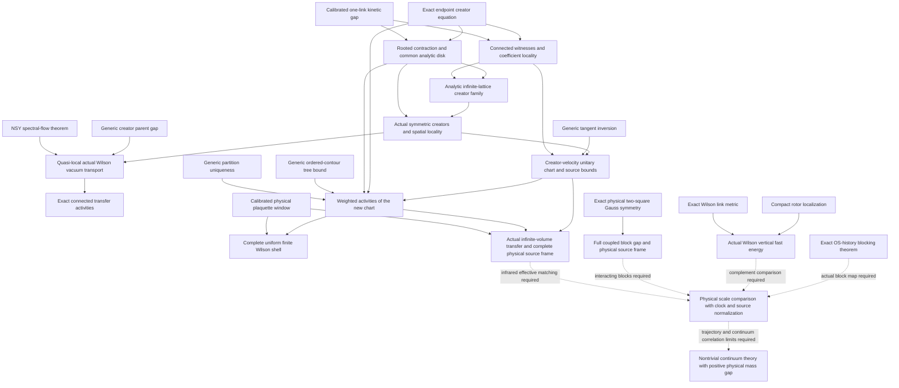

# Current research map

This is the maintained entry point for the September continuation. The
[frontier](../FRONTIER.md) supplies live verification counts and gap routes;
the [result register](../ledger/results.yaml) supplies precise analytic
statements, hypotheses, proof sources, and dependencies. The dated manuscripts
and sealed runs retain the claims and open questions of their own stage.

The governing objective is the Clay Yang-Mills existence and mass gap
problem. Read the [goal and remaining obligations](research_goal.md) for
the connection between this construction, physical spectral control and
the spatial continuum target.

## Established starting point

The [September C2 derivation](decisions/0024-the-corner-cluster-from-a-third-implementation-and-the-ledger-that-was-here.md)
resolves the historical fourth-order discrepancy. The
[symbolic all-rank assembly](decisions/0027-the-all-rank-shape-coefficient-is-assembled.md),
with the later [degree-bound argument](decisions/0029-the-degree-bound-is-proved-by-removing-it.md),
is established. The fixed-spacing Hamiltonian G18 construction already
provides the physical band and source frame in its stated regime; its
[carrier bridge](../paper/research_notes/G18_FIXED_SPACING_CARRIER_BRIDGE_INSERT.tex)
and [relative-gap continuation](../paper/research_notes/G18_RELATIVE_GAP_BRIDGE_20260904.tex)
are inputs to subsequent Wilson matching. Query `workhouse why C2`,
`workhouse why G18`, and `workhouse why G19` before selecting work.

These results form the wider program. They are not extra hypotheses of the
abstract creator contraction below. Its direct inputs are local creator
algebra, bounded plaquette interactions, and the additive kinetic gap.

## What the Wilson continuation establishes

| Result | Mathematical consequence | Proof |
|---|---|---|
| Calibrated kinetic window | The neutral physical free spectrum below `5 C_F/2` is `{0,2 C_F}`; the one-link excited gap is at least `C_F/2`. | [Window, §§2–3](../paper/research_notes/G19_UNIFORM_WILSON_WINDOW_20260904.md) |
| Second-order chart | Complete connected/disconnected decomposition, uniform full-operator coefficient bound, and block-independent generators. | [Second-order chart](../paper/research_notes/G18_SECOND_ORDER_WILSON_VACUUM_CHART_20260905.md) |
| Fixed-order recursion | Local vacuum anchoring and uniform full-operator bounds at every fixed magnetic degree. | [Recursion](../paper/research_notes/G18_VACUUM_CHART_RECURSION_20260905.md) |
| Vacuum compression | `F=A+[D,S]=QAQ`; the sharpened quadratic bound is `118872 f_star^2/125`. | [Compression](../paper/research_notes/G18_VACUUM_COMPRESSION_BOUND_20260905.md) |
| Endpoint creator equation | The actual vacuum equation becomes `v=R_tau N_tau(u,v)`; disconnected components factor before the creation logarithm. | [Endpoint equation, §§2–5a](../paper/research_notes/G18_WILSON_ENDPOINT_GAUGE_AND_MAJORANT_20260905.md) |
| Transfer resolvent estimate | Entire-spectrum unweighted `O(tau)` and energy-weighted `O(tau^2)` matching, with the weighted domain hypothesis explicit. | [Resolvent bounds](../paper/research_notes/G19_TRANSFER_RESOLVENT_UNIFORM_BOUNDS_20260905.md) |
| Rooted contraction | A unique fixed point in the stated creator ball on an explicit common analytic disk, uniform in volume and temporal mesh. | [Contraction](../paper/research_notes/G18_ROOTED_WILSON_CONTRACTION_20260905.md) |
| Coefficient locality | Degree `n` uses a connected witness of at most `n` plaquettes and `3n+1` links; rooted Taylor coefficients stabilize exactly. | [Limit, §2](../paper/research_notes/G18_WILSON_CREATOR_THERMODYNAMIC_LIMIT_20260905.md) |
| Infinite-lattice creator limit | Stabilized coefficients form a bounded analytic family with a quantitative local finite-volume error. | [Limit, §§3–4](../paper/research_notes/G18_WILSON_CREATOR_THERMODYNAMIC_LIMIT_20260905.md) |
| Actual symmetric creators | Half magnetic flow restores the actual Wilson vacuum with nonzero normalization and rooted norm at most `1/8`. | [Parent theorem, §1](../paper/research_notes/G18_WILSON_CREATOR_PARENT_AND_SPECTRAL_FLOW_20260905.md) |
| Generic creator parent gap | The exact parent obeys `H^2 >= (1-K1-M1^2)H`; the Wilson specialization has unique vacuum and gap at least `247/256`. | [Parent theorem, §2](../paper/research_notes/G18_WILSON_CREATOR_PARENT_AND_SPECTRAL_FLOW_20260905.md) |
| GNS parent realization | Quasi-local annihilators and the closure of the local parent form realize the actual vacuum, with parent interaction bound `17/128`. | [Parent theorem, §§3–4](../paper/research_notes/G18_WILSON_CREATOR_PARENT_AND_SPECTRAL_FLOW_20260905.md) |
| Quasi-local vacuum transport | A spectral-flow automorphism gives the selected actual Wilson state on all bounded local observables; it is pure and locally normal. | [Parent theorem, §5](../paper/research_notes/G18_WILSON_CREATOR_PARENT_AND_SPECTRAL_FLOW_20260905.md) |
| Exact connected transfer activities | Induced-subsystem partition subtraction gives the exact disjoint expansion, self-adjoint local vacuum annihilation, and zero activities on disconnected plaquette supports. | [Activity extraction, §§2–3](../paper/research_notes/G18_WILSON_ACTIVITY_EXTRACTION_20260905.md) |
| Creator-velocity inversion | A real-linear Neumann inverse gives an exact local anti-Hermitian vacuum-line generator; its phase is explicit. | [Cardinality chart, §2](../paper/research_notes/G18_WILSON_CARDINALITY_UNITARY_CHART_20260905.md) |
| Wilson chart with support bounds | A holomorphic doubled system and connected active witnesses bound assigned operator supports and transport local sources with cardinality and spatial weights. | [Cardinality chart, §§3–5](../paper/research_notes/G18_WILSON_CARDINALITY_UNITARY_CHART_20260905.md) |
| Ordered-contour activity bound | Disjoint ordered shuffles and a rooted-tree supersolution turn a primitive interaction bound into a full connected-activity bound without a representation cutoff. | [Weighted activities, §4](../paper/research_notes/G18_WILSON_WEIGHTED_ACTIVITY_BOUND_20260905.md) |
| Uniform Wilson activity norm | In the new chart, `sup_i sum 2^|X| ||F_X||<=1/2500` on `|u|<=u_star/1252800000`, uniformly in volume and temporal mesh. | [Weighted activities, §§1–5](../paper/research_notes/G18_WILSON_WEIGHTED_ACTIVITY_BOUND_20260905.md) |
| Complete uniform finite Wilson shell | The actual normalized transfer differs from its free product by at most `1/998`; the complete neutral physical odd shell has rank `3 L^3` on the admitted periodic lattices. | [Weighted activities, §§1, 5](../paper/research_notes/G18_WILSON_WEIGHTED_ACTIVITY_BOUND_20260905.md) |
| Complete infinite-volume physical Wilson band | The actual transfer has a vacuum gap; its entire isolated odd band is present in the Euclidean reconstruction and is spanned by the projected literal sources, with Gram between `9/16` and `81/64` on one common interval. | [Complete band and source theorem](../paper/research_notes/G18_WILSON_INFINITE_VOLUME_PHYSICAL_BAND_20260905.md) |
| Exact physical history blocking | A true reflection/time-covariant pushforward gives an OS isometry and `T_f J=J T_c^(1/b)`. A separate eliminated-mode bound is needed for the full fine gap. | [History intertwiner and reverse mass matching](../paper/research_notes/G19_OS_BLOCKING_AND_REVERSE_MASS_MATCHING_20260905.md) |
| Correct conditional-gradient recursion | The quotient metric and centered score give a sharp Gaussian-saturated two-by-two bound; a strict fiber separation permits a square-summable score budget. | [Conditional-gradient repair](../paper/research_notes/G19_CONDITIONAL_GRADIENT_REPAIR_20260905.md) |
| Actual Wilson block obstruction | The action/Haar score starts at `g^2`, but the intrinsic score is generally `O(g)`; for `N>=5` a rare center well makes the raw compact-fiber diffusion gap exponentially small. | [Exact block geometry and failed premises](../paper/research_notes/G19_WILSON_BLOCK_SCORE_AND_FIBER_OBSTRUCTION_20260905.md) |
| Compact-group physical rotor | A faithful character potential has one nondegenerate minimum; the invariant quadratic is the first class excitation, giving twice the unrestricted oscillator gap. | [Compact rotor theorem, §§1–2](../paper/research_notes/G19_WILSON_PHYSICAL_FIBER_FAST_GAP_20260905.md) |
| Actual Wilson vertical fast energy | The constrained bouquet and strip class gaps are `4 sqrt(u)` and `2 sqrt(5) sqrt(u)` to leading order, with uniform bounds on a fixed coarse neighborhood. Their physical scale is `1/a`. | [Exact fiber factors and form inequality, §§3–6](../paper/research_notes/G19_WILSON_PHYSICAL_FIBER_FAST_GAP_20260905.md) |
| Full coupled two-square physical shells | Exact Gauss/inversion cancellation proves gap `2 sqrt(3) sqrt(u)+O_N(u^(1/4))`, three simple low physical shells, and an onto projected frame of three real Wilson sources. | [Full physical block and source theorem](../paper/research_notes/G19_WILSON_TWO_SQUARE_PHYSICAL_SHELLS_20260905.md) |
| Actual strip ground and effective first term | The normalized vertical ground, Born-Huang energy and exact on-shell self-energy retain the true metric; the two-strip angular correction is `11/80`. | [Ground and effective-energy proof, §§1–6](../paper/research_notes/G19_WILSON_STRIP_BO_AND_TWO_STRIP_SPLITTING_20260905.md) |
| Actual two-strip physical splitting | On the specified four-face graph, an exact radial doublet lies below the mixed singlet by `(54N^2-15)/(160N)+O_N(u^-1/4)`. Localized physical quasimodes prove the spectral remainder. | [Actual finite-graph theorem, §7](../paper/research_notes/G19_WILSON_STRIP_BO_AND_TWO_STRIP_SPLITTING_20260905.md) |
| Same-weight obstruction | Arbitrary disjoint active SU(3) plaquette families disprove the unrestricted undamped same-weight estimate. | [Obstruction](../paper/research_notes/G18_SAME_WEIGHT_CREATOR_OBSTRUCTION_20260905.md) |

The fixed-order unitary chart and the convergent nonunitary creator family
are distinct constructions. The latter resolves nonlinear creator convergence.
The parent spectral flow now provides a quasi-local vacuum chart without
requiring convergence of the former's ordered unitary product.
The creator-velocity chart is a further construction with a direct
cardinality bound. It has the same actual vacuum line as parent spectral
flow, but its action on excited vectors and its transfer activities are
not asserted to be the same. Its full transfer bound supplies the
previously missing sufficient estimate for uniform finite Wilson isolation.
The earlier endpoint note's proposed same-weight inequality is historical:
the successful proof uses the full resolvent to restore a moving support weight.

## The mechanism and graph connections

For exact excited supports `X`, write
`||v||_mu = sup_l sum_(X contains l) exp(mu |X|) ||v_X||`.
Creators on intersecting supports multiply to zero. A four-link plaquette
therefore sees a nilpotent touching-creator sum with fifth power zero, and
its conjugated vector field has degree at most eight. Excitations outside
the active plaquette survive every nonzero term. That support accounting
provides the rooted estimates.

The magnetic flow loses weight at rate `gamma/2`. The entire reduced
resolvent `R_tau,X=tau/(exp(tau K_X)-1)` restores that loss through
`x/(2 sinh(x/2))<=1`. For `mu>=gamma tau0/2`, bounded plaquette norm
`J_star>0`, one-link excited gap `gamma>0`, and `0<tau<=tau0`, put

```text
u_star = min(9 gamma / (309680 J_star exp(4mu)),
             9 / (8450 tau0 J_star exp(4mu))).
```

The exact map contracts the ball `||v||_mu<=1/16` by at most `1/2` for
`|u|<=u_star`. The scalar normalizer is nonzero on this domain. The actual
real Wilson Perron identification additionally uses the stated compact,
self-adjoint, positivity-improving kernel premise.

For the parent continuation, choose
`mu>=max(gamma tau0/2,log(2)+gamma tau0/4)`.
The actual symmetric creator family is `w=F_(tau/2)(u,v)` and obeys
`||w||_(mu-gamma tau0/4)<=1/8`. With
`a_X=|w_X><Omega_X|` and `b_i=q_i-sum_(X contains i)a_X`, its exact
annihilators define `H_parent=sum_i b_i^dagger b_i`. The generic gap proof
uses commuting idempotents and orthogonal support blocks; it does not
estimate an extensive global similarity condition number.

The connected witnesses also control spatial extent. On the smaller disk
`|u|<=u_star/8`, both creators and their derivatives along `s` to `su`
have positive spatial weights and locally uniform coefficient limits.
Together with the parent gap these verify the hypotheses of the
[NSY spectral-flow theorem](https://arxiv.org/abs/1810.02428), including its
infinite-dimensional on-site setting. Open boxes use the lattice metric;
periodic interiors use intrinsic torus metrics and local boundary comparison.
The resulting automorphism gives the full bounded-local-observable limit
`omega_W=omega_0 composed with alpha`. Convergence is uniform on each local
unit ball, which proves local normality. This is automorphic GNS transport;
it does not posit a global implementing unitary in the original free
representation.

The exact transfer object was made explicit by partition Möbius
inversion of every induced subsystem's dressed, Perron-normalized transfer,
using the same mesh, block power and spectral-flow convention. Products
with overlapping support vanish in a formal square-free support algebra;
disjoint coefficients commute. The resulting partition cumulants reconstruct
the dressed transfer exactly. The unit vacuum eigenvector cancels their
vacuum components, while real component factorization cancels disconnected
supports. This requires no multivariate analytic spectral-flow extension.

The new chart solves `b-T_w b=dot w`, where
`T_w b=Q exp(-W) B^dagger exp(W) Omega`. Exact support deletion by a
lowering operator yields a strict rooted contraction. A doubled system
with independent conjugate creator coordinates makes that inverse
holomorphic in plaquette couplings. Its coefficient of degree `n` uses
one connected active witness with at most `3n+1` links. Assigning the
operator to this full witness footprint preserves its dependence on
induced-subsystem couplings, even when its exact excited support shrinks.

The actual Perron logarithm has the same connected witness property.
Combine both unitary legs, magnetic insertions and this scalar logarithm
in an ordered contour with kinetic contraction factors. Disjoint
components factor by ordered shuffles; a rooted-tree majorant bounds the
connected components. At `|u|<=u_star/1252800000` it gives activities
with weight `2^|X|` and norm at most `1/2500`. Partition uniqueness then
identifies those components with the activities of the new chart.
The existing operator bridge gives the actual-transfer bound `1/998`
and the complete finite-volume physical odd shell on that common interval.



Solid arrows display established proof inputs; dashed arrows display
dependencies of open work. The result register also links every source
and its scoped verification evidence. The obstruction motivates retaining
kinetic smoothing; it is not a premise of the contraction theorem.

If all clusters through order `N` fit around a root, the limit theorem gives
local error at most `(1/8) q^(N+1)/(1-q)`, with `q=|u|/r<1` and `r<u_star`.
This permits controlled local coefficient calculations on finite boxes.
It does not imply convergence of zero-extended boxes in the global
supremum-over-roots norm, or a bounded infinite-volume creator exponential.

## The next concrete target

The actual infinite-volume transfer, complete Riesz band and onto literal-
source frame are now established. Every surviving anchored activity meets
the finite excited support, giving an absolutely convergent strong operator
limit. Source labels retained through the local commutator expansion give
a bound on the entire synthesis operator, not just its separate columns.
A close-projection inverse proves completeness. Reflection-positive history
completion then contains the entire band, identifying the actual OS and
quantum GNS spectral objects without assuming equality of their full
high-energy spaces.

The scale package now supplies an exact OS-history intertwiner under the
actual pushforward, reflection and time-covariance hypotheses. It also
repairs the reversed averaging estimate and computes the actual Wilson
horizontal score. The rare diffusion well is compatible with a fast physical
rotor: its potential height is order `u`, above the physical low energies
of order `sqrt(u)`. The full adjacent-two-square calculation goes further,
retaining the shared-edge coupling and proving its low physical spectrum
and complete real-source frame. Its special inversion cancellation is not
asserted for arbitrary blocks.
The two-strip continuation also computes the first actual physical
splitting after the leading harmonic degeneracy: the radial doublet is
lower than the mixed singlet. This finite graph has additive strip
Hamiltonians with a common gauge constraint, so its result supplies a
physical multi-holonomy control without an interaction between the strips.

The central next target is the actual OS-history complement comparison for
coupled or overlapping blocks: retain surrounding plaquettes, generated
interactions, changing ground energy and the physical clock. Match the
infrared effective transfer and renormalized source synthesis to the
controlled small-u endpoint while the microscopic coordinate `u=g_H^-4`
tends to infinity. The [goal map](research_goal.md) keeps the resulting
continuum correlation, finite positive mass and source-weight obligations
separate. The [external glueball guide](../paper/research_notes/G19_GLUEBALL_REVERSE_TARGET_DATA_20260905.md)
explains why a charge-even scalar source should accompany the odd band;
its numerical mass ratios are not theorem dependencies.

The activity norm already has a cardinality margin: connected supports
satisfy `diameter(X)<=|X|-1`, so its weight `2^|X|` also controls
`(5/4)^|X| exp(log(8/5) diameter(X))`. The new source chart has a matching
cardinality and spatial estimate. These are available inputs for spatially
rooted contour limits and sharp projected `h, G, S` kernels. The bound on
the earlier common-filter activities has not been asserted; the new chart
supplies a sufficient replacement.

Existing scalar vacuum and unprojected correlation results remain inputs.
The new transfer construction now also identifies all finite multi-time
bounded local correlations and the full physical isolated band. G18 remains
open for spatially weighted sharp-kernel matching and its internal-sheet
questions. Temporal matching and spatial cutoff removal have distinct
energy-domain and scale hypotheses; neither follows just from a gap in
electric-time units at fixed spatial spacing.

## Reproduce and continue

```bash
workhouse why RESULT:WILSON_ENDPOINT_EQUATION
workhouse why RESULT:WILSON_ROOTED_CONTRACTION
workhouse why RESULT:WILSON_CREATOR_LIMIT
workhouse why RESULT:WILSON_SYMMETRIC_CREATORS
workhouse why RESULT:CREATOR_PARENT_GAP
workhouse why RESULT:WILSON_PARENT_GNS
workhouse why RESULT:WILSON_VACUUM_SPECTRAL_FLOW
workhouse why RESULT:WILSON_ACTIVITY_EXTRACTION
workhouse why RESULT:CREATOR_VELOCITY_INVERSION
workhouse why RESULT:WILSON_CARDINALITY_CHART
workhouse why RESULT:ORDERED_CONTOUR_ACTIVITIES
workhouse why RESULT:WILSON_WEIGHTED_ACTIVITIES
workhouse why RESULT:WILSON_UNIFORM_FINITE_SHELL
workhouse why RESULT:WILSON_SAME_WEIGHT_OBSTRUCTION
workhouse why RESULT:OS_HISTORY_BLOCK_INTERTWINER
workhouse why RESULT:CONDITIONAL_GRADIENT_REPAIR
workhouse why RESULT:WILSON_BLOCK_SCORE_OBSTRUCTION
workhouse why RESULT:COMPACT_ROTOR_FAST_GAP
workhouse why RESULT:WILSON_VERTICAL_FAST_ENERGY
workhouse why RESULT:WILSON_TWO_SQUARE_PHYSICAL_SHELLS
workhouse why RESULT:WILSON_STRIP_BO_FIRST_TERM
workhouse why RESULT:WILSON_TWO_STRIP_PHYSICAL_SPLITTING
workhouse why G18
make verify
make check
make lean
```

The [physical scale-block run](../runs/continuum_wilson_block_2026-09-05/README.md),
[complete physical-band run](../runs/wilson_physical_band_2026-09-05/README.md),
[weighted-activity run](../runs/wilson_weighted_activities_2026-09-05/README.md),
[parent and spectral-flow run](../runs/wilson_creator_parent_2026-09-05/README.md),
[rooted-contraction run](../runs/wilson_rooted_contraction_2026-09-05/README.md),
[chart run](../runs/wilson_vacuum_chart_2026-09-05/README.md), and
[compression run](../runs/wilson_vacuum_compression_2026-09-05/README.md)
preserve original evidence. Analytic proof, exact finite control, numerical
diagnostic, and Lean theorem each have an explicit scope. Current totals
belong in the generated catalogue, not in duplicated snapshot counts here.
