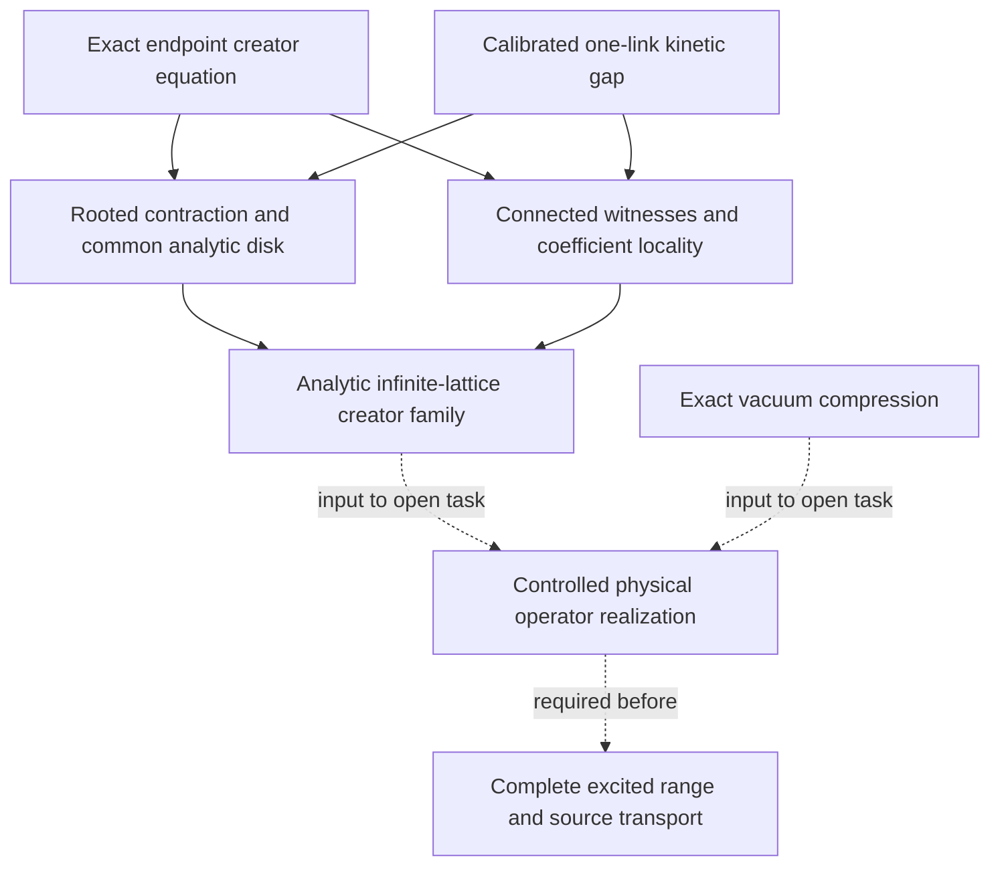

# Current research map

This is the maintained entry point for the September continuation. The
[frontier](../FRONTIER.md) supplies live verification counts and gap routes;
the [result register](../ledger/results.yaml) supplies precise analytic
statements, hypotheses, proof sources, and dependencies. The dated manuscripts
and sealed runs retain the claims and open questions of their own stage.

## Established starting point

The [September C2 derivation](decisions/0024-the-corner-cluster-from-a-third-implementation-and-the-ledger-that-was-here.md)
resolves the historical fourth-order discrepancy. The
[symbolic all-rank assembly](decisions/0027-the-all-rank-shape-coefficient-is-assembled.md),
with the later [degree-bound argument](decisions/0029-the-degree-bound-is-proved-by-removing-it.md),
is established. The fixed-spacing Hamiltonian G18 construction already
provides the physical band and source frame in its stated regime; its
[carrier bridge](../paper/research_notes/G18_FIXED_SPACING_CARRIER_BRIDGE_INSERT.tex)
and [relative-gap continuation](../paper/research_notes/G18_RELATIVE_GAP_BRIDGE_20260904.tex)
are inputs to subsequent Wilson matching. Query `workhouse why C2`,
`workhouse why G18`, and `workhouse why G19` before selecting work.

These results form the wider program. They are not extra hypotheses of the
abstract creator contraction below. Its direct inputs are local creator
algebra, bounded plaquette interactions, and the additive kinetic gap.

## What the Wilson continuation establishes

| Result | Mathematical consequence | Proof |
|---|---|---|
| Calibrated kinetic window | The neutral physical free spectrum below `5 C_F/2` is `{0,2 C_F}`; the one-link excited gap is at least `C_F/2`. | [Window, §§2–3](../paper/research_notes/G19_UNIFORM_WILSON_WINDOW_20260904.md) |
| Second-order chart | Complete connected/disconnected decomposition, uniform full-operator coefficient bound, and block-independent generators. | [Second-order chart](../paper/research_notes/G18_SECOND_ORDER_WILSON_VACUUM_CHART_20260905.md) |
| Fixed-order recursion | Local vacuum anchoring and uniform full-operator bounds at every fixed magnetic degree. | [Recursion](../paper/research_notes/G18_VACUUM_CHART_RECURSION_20260905.md) |
| Vacuum compression | `F=A+[D,S]=QAQ`; the sharpened quadratic bound is `118872 f_star^2/125`. | [Compression](../paper/research_notes/G18_VACUUM_COMPRESSION_BOUND_20260905.md) |
| Endpoint creator equation | The actual vacuum equation becomes `v=R_tau N_tau(u,v)`; disconnected components factor before the creation logarithm. | [Endpoint equation, §§2–5a](../paper/research_notes/G18_WILSON_ENDPOINT_GAUGE_AND_MAJORANT_20260905.md) |
| Transfer resolvent estimate | Entire-spectrum unweighted `O(tau)` and energy-weighted `O(tau^2)` matching, with the weighted domain hypothesis explicit. | [Resolvent bounds](../paper/research_notes/G19_TRANSFER_RESOLVENT_UNIFORM_BOUNDS_20260905.md) |
| Rooted contraction | A unique fixed point in the stated creator ball on an explicit common analytic disk, uniform in volume and temporal mesh. | [Contraction](../paper/research_notes/G18_ROOTED_WILSON_CONTRACTION_20260905.md) |
| Coefficient locality | Degree `n` uses a connected witness of at most `n` plaquettes and `3n+1` links; rooted Taylor coefficients stabilize exactly. | [Limit, §2](../paper/research_notes/G18_WILSON_CREATOR_THERMODYNAMIC_LIMIT_20260905.md) |
| Infinite-lattice creator limit | Stabilized coefficients form a bounded analytic family with a quantitative local finite-volume error. | [Limit, §§3–4](../paper/research_notes/G18_WILSON_CREATOR_THERMODYNAMIC_LIMIT_20260905.md) |
| Same-weight obstruction | Arbitrary disjoint active SU(3) plaquette families disprove the unrestricted undamped same-weight estimate. | [Obstruction](../paper/research_notes/G18_SAME_WEIGHT_CREATOR_OBSTRUCTION_20260905.md) |

The fixed-order unitary chart and the convergent nonunitary creator family
are distinct constructions. The latter resolves nonlinear creator convergence;
convergence of the former's ordered unitary product remains an operator task.
The earlier endpoint note's proposed same-weight inequality is historical:
the successful proof uses the full resolvent to restore a moving support weight.

## The mechanism and graph connections

For exact excited supports `X`, write
`||v||_mu = sup_l sum_(X contains l) exp(mu |X|) ||v_X||`.
Creators on intersecting supports multiply to zero. A four-link plaquette
therefore sees a nilpotent touching-creator sum with fifth power zero, and
its conjugated vector field has degree at most eight. Excitations outside
the active plaquette survive every nonzero term. That support accounting
provides the rooted estimates.

The magnetic flow loses weight at rate `gamma/2`. The entire reduced
resolvent `R_tau,X=tau/(exp(tau K_X)-1)` restores that loss through
`x/(2 sinh(x/2))<=1`. For `mu>=gamma tau0/2`, bounded plaquette norm
`J_star>0`, one-link excited gap `gamma>0`, and `0<tau<=tau0`, put

```text
u_star = min(9 gamma / (309680 J_star exp(4mu)),
             9 / (8450 tau0 J_star exp(4mu))).
```

The exact map contracts the ball `||v||_mu<=1/16` by at most `1/2` for
`|u|<=u_star`. The scalar normalizer is nonzero on this domain. The actual
real Wilson Perron identification additionally uses the stated compact,
self-adjoint, positivity-improving kernel premise.



Solid arrows display established proof inputs; dashed arrows display
dependencies of open work. The result register also links every source
and its scoped verification evidence. The obstruction motivates retaining
kinetic smoothing; it is not a premise of the contraction theorem.

If all clusters through order `N` fit around a root, the limit theorem gives
local error at most `(1/8) q^(N+1)/(1-q)`, with `q=|u|/r<1` and `r<u_star`.
This permits controlled local coefficient calculations on finite boxes.
It does not imply convergence of zero-extended boxes in the global
supremum-over-roots norm, or a bounded infinite-volume creator exponential.

## The next concrete target

Realize the convergent creator coordinates in the established physical
state/GNS construction with a controlled operator chart or a justified
equivalent metric. Use compression to obtain locally vacuum-annihilating
activities on the full Hilbert space, and bound their total activity in
the norm required by the
[excited-window operator bridge](../paper/research_notes/G18_EXCITED_WINDOW_OPERATOR_BRIDGE_20260904.md).
That bridge gives `eta<=1/400` as one sufficient threshold. The missing
argument must construct the realization and prove its operator and spatially
weighted source bounds, rather than assume they follow from `||v||_mu`.

After that, establish thermodynamic transport of the complete Riesz range
and source frame, including source totality and weighted sharp-shell
matching. Existing scalar vacuum/GNS and unprojected correlation results
remain available; this task is their identification with these convergent
coordinates and the complete excited operator construction. G18 stays open.
Temporal Wilson matching and the spatial continuum passage retain their
own hypotheses and G19 routes.

## Reproduce and continue

```bash
workhouse why RESULT:WILSON_ENDPOINT_EQUATION
workhouse why RESULT:WILSON_ROOTED_CONTRACTION
workhouse why RESULT:WILSON_CREATOR_LIMIT
workhouse why RESULT:WILSON_SAME_WEIGHT_OBSTRUCTION
workhouse why G18
make verify
make check
make lean
```

The [rooted-contraction run](../runs/wilson_rooted_contraction_2026-09-05/README.md),
[chart run](../runs/wilson_vacuum_chart_2026-09-05/README.md), and
[compression run](../runs/wilson_vacuum_compression_2026-09-05/README.md)
preserve original evidence. Analytic proof, exact finite control, numerical
diagnostic, and Lean theorem each have an explicit scope. Current totals
belong in the generated catalogue, not in duplicated snapshot counts here.
