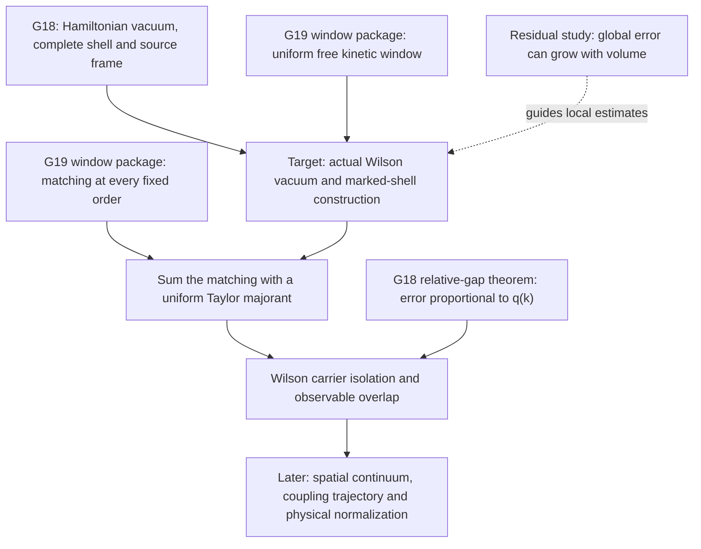

# Next path from the theory graph: uniform Wilson transfer matching

Completed continuation: [fixed-observable expansion through carrier transport](../derivations/wilson-marked-shell-transport.md).
The selection and open-target language below describe the earlier checkpoint.
The continuation imports the existing September 5 actual Wilson construction,
proves its complex operator/weighted-kernel bridge, and sums temporal matching
under the stated calibrated-window and G18 hypotheses. Spatial continuum work
remains open.

The next research target is the **uniform discrete-time vacuum and marked-shell construction for the actual symmetric Wilson transfer operator**. It connects the existing G18 Hamiltonian carrier construction to the Wilson side of G19. The missing result is a convergent local expansion with constants independent of temporal step and spatial volume, together with identification of its sums as the actual vacuum, spectral shell, and source frame.

This is a research-priority judgment from the current graph and the proofs it points to. The target remains open. Its most precise existing statement is [the Wilson window note, section 10](../../paper/research_notes/G19_UNIFORM_WILSON_WINDOW_20260904.md#10-the-remaining-actual-wilson-matching-estimate), equations (22)-(24). That statement already exists; this report selects it and breaks it into a concrete continuation task.

The relevant graph walk uses `G17`, `G18`, `G19`, `G23`, `RUN:uniform_wilson_window_2026-09-04`, `RUN:relative_gap_wilson_matching_2026-09-04`, and `STUDY:YM:derive-volume-residual-budget`. The two run nodes have native evidence edges to G18/G19; the residual study has native relevance edges to G17/G23. The connection from that residual study to the proposed Wilson construction is a methodological inference: both require error control that remains local as volume grows. It is not an established implication between their theorems.



The diagram is a proposed research path. Its target and later continuum nodes are obligations, not completed results or new native graph records.

## Inputs already available

| Input | What the repository supplies | Where to start |
|---|---|---|
| Hamiltonian carrier and source frame | The fixed-spacing construction and the weighted, coupling-analytic shell symbol; totality and source bounds are part of this upstream analytic construction. | [G18 fixed-spacing bridge](../../paper/research_notes/G18_FIXED_SPACING_CARRIER_BRIDGE_INSERT.tex) and [weighted shell construction](../../paper/research_notes/G18_INTERNAL_BBDAGGER_SHEET_CLOSURE_20260830.tex). |
| Uniform free Wilson window | For each fixed SU(N), N >= 3, a lower bound for every irrep excludes high-representation pollution of the low-energy window, uniformly in periodic spatial volume. Its small temporal-step threshold is existential. | [Wilson window note](../../paper/research_notes/G19_UNIFORM_WILSON_WINDOW_20260904.md), sections 2-4. |
| Actual Wilson coefficients | Exact SU(3) multipliers, the calibrated clock, second-order shell hopping and scalar term, and the first source Gram coefficient. | [Executable Wilson checks](../../src/workhouse/invariants/wilson_step.py); note sections 5-7. |
| Matching at each fixed order | Energy, Gram and source coefficients match with error `A_(n,mu) epsilon^2` in a spatially weighted norm, for each fixed order. Growth of `A_(n,mu)` with order is uncontrolled. | Wilson window note, section 8, Theorem 4. |
| Carrier stability under weighted matching | Centering converts a weighted kernel error into an error proportional to `q(k)`; the Hamiltonian internal gap has the same factor. This permits one coupling interval for all nonzero momenta. | [Relative-gap bridge](../../paper/research_notes/G18_RELATIVE_GAP_BRIDGE_20260904.tex). |

The exact Wilson algebra has T1 checks. The uniform analytic constructions are research-note proofs with explicit upstream hypotheses; a passing coefficient check does not formalize those analytic theorems. Existing Lean results remain available at their stated scopes.

## Keep the operator fixed

Use the fundamental-character clock and the actual symmetric transfer family:

\[
\tau(\epsilon)=-\frac{2}{C_F}\log\lambda_F(\epsilon),\qquad
T_{\epsilon,L}(u)=e^{\tau uV_L/2}e^{-\tau K_{\epsilon,L}}e^{\tau uV_L/2},
\qquad
\mathcal H^W_{\epsilon,L}(u)=-\tau^{-1}\log T_{\epsilon,L}(u).
\]

The spatial Wilson coefficient is `beta_s = 2 N u tau`. Here `K_epsilon` is the calibrated Wilson kinetic operator, and `C_F=(N^2-1)/(2N)`.

The auxiliary family `K_epsilon-uV` already has a uniform small-coupling matching argument in section 9 of the window note. At nonzero temporal step it differs from the generator above. The exact second-order calculation makes the difference explicit:

\[
d_\tau(\Delta)=\frac{\tau}{2}\coth\frac{\tau\Delta}{2},\qquad
t_W=\frac5{612}+\frac{175}{280908}\epsilon^2+O(\epsilon^3).
\]

The next proof must retain this transfer operator and its clock throughout.

## The theorem to attempt

Start with fixed spatial spacing and SU(3), the setting of the existing complete G18 carrier construction. On a common small complex coupling disc, construct the vacuum and full continued shell of the actual transfer family, including the source synthesis map. After subtracting the vacuum energy and expressing the shell in the common frame, write the energy, Gram, and source kernels as

\[
\Phi^W_{\epsilon,L}(u)=\sum_{n\ge0}u^n\Phi^W_{\epsilon,L,n},
\qquad \Phi\in\{h,G,S\}.
\]

Here `G` means the shell Gram kernel, not the full transfer generator. The target is common positive constants `epsilon_0, M, R, mu`, independent of spatial volume, such that

\[
\sup_{0<\epsilon<\epsilon_0,\,L}
\|\Phi^W_{\epsilon,L,n}\|_{\mu,\sharp}
\le M R^{-n}.
\tag{W1}
\]

Use the same admissible periodic-volume conventions and quotient/thermodynamic construction as the upstream shell argument; the proof must also control wrapping clusters when their order grows with `L`. The finite-order nonwrapping condition alone is insufficient for (W1).

The second part of the target is identification: the summed kernels describe the actual vacuum, complete Riesz shell and total source frame, with a common positive Gram lower bound. A bound on a formal series without that identification does not complete this task.

## First decisive work package

1. **Write the exact expansion with a fixed source mark.** Expand the symmetric magnetic factors, retain the kinetic propagation between insertions, and normalize by the vacuum contribution. Derive how disconnected vacuum components cancel before taking absolute values. For disconnected spatial components, the transfer operator factorizes; use that identity to test the normalization and connected expansion.
2. **Prove a bound on propagation between insertions that stays finite as the time step shrinks.** A starting estimate, already in the window note, is

   \[
   \tau\sum_{j\ge0}e^{-\gamma j\tau}
   =\frac{\tau}{1-e^{-\gamma\tau}}
   \le\gamma^{-1}+\tau,\qquad \gamma,\tau>0.
   \]

   The task is to extend this control to the required operators and marked contour resolvents, including high-energy states. Establish which insertion factors cancel each small transfer denominator. Any unexplained factor proportional to `1/tau` or total volume is an obstruction in the proposed estimate.
3. **Sum connected clusters rooted at the mark.** For the precisely defined activities from step 1, seek an exponential bound in magnetic order on the sum of their weighted norms. Include embedding counts, time sums, repeated insertions, source factors and periodic wrapping. This must produce the same radius `R` for energy, Gram and synthesis kernels. A scalar geometric-series estimate by itself does not supply this bound.
4. **Identify the sums and then take the limit.** Construct the vacuum and Riesz projection, prove source totality and its positive Gram bound, and transport the uniform estimates through the spatial-volume limit. Only then combine (W1) with the existing coefficientwise matching.

The first concrete deliverable is the operator estimate in step 2 inside an explicitly defined, vacuum-normalized marked expansion. More low-order coefficients can test that expansion, but cannot replace its bound at arbitrary order. Exact cancellation and normalization identities are suitable next T1/Lean targets once this expansion is written. The full analytic majorant remains a separate proof obligation.

## What success would give

After choosing a common majorant for the Wilson and Hamiltonian kernels, the existing fixed-order theorem yields, for `r=|u|/R<1`,

\[
\|\Phi^W_{\epsilon}(u)-\Phi^H(u)\|_{\mu,\sharp}
\le\epsilon^2\sum_{n=0}^{m} A_{n,\mu}|u|^n
  +\frac{2M r^{m+1}}{1-r}.
\]

Taking `epsilon -> 0` at fixed `m`, and then `m -> infinity`, gives summed weighted matching. A summed `O(epsilon^2)` rate would need an additional summability bound on the constants `A_(n,mu)`; convergence without that rate is already useful.

The relative-gap theorem then transfers the carrier. Its Hamiltonian lower bound is

\[
E_1(k,u)-E_0(k,u)\ge c_H(u)q(k),\qquad
c_H(u)=u^2(t_3-2K|u|)>0,\quad t_3=5/612.
\]

If the weighted energy-kernel matching error is `eta_epsilon(u)`, symmetry and weighted centering give a Wilson lower bound

\[
E^W_1(k,u)-E^W_0(k,u)
\ge\bigl(c_H(u)-2\gamma_\mu\eta_\epsilon(u)\bigr)q(k),
\quad
\gamma_\mu=\frac{\pi^2}{2e^2\mu^2}.
\]

For each fixed nonzero `u` in the common small-coupling interval, sufficiently small `epsilon` makes the coefficient positive. Matching of the synthesis and Gram kernels carries the observable overlap as well. This is the internal carrier separation for `k != 0`; the cubic triplet still meets at Gamma.

## How the new source-derived routes affect the choice

The [residual derivation, GST-9](../derivations/yangmills-weighted-curvature.md#gst-9-an-exact-volume-accumulation-falsifier) gives a decisive calibration: for `n` independent quartic copies, the global trial residual certificate is `(1-n/4) hbar Omega`, although applying the one-body result and tensorizing preserves the positive bound `3 hbar Omega/4`. This supports choosing local estimates and exact cancellation of extensive vacuum contributions. It does not by itself establish the Wilson cluster estimate.

| Route | Decision from the current graph |
|---|---|
| Uniform actual-Wilson marked construction | First priority: the operator, clock, free window, fixed-order comparison, Hamiltonian construction and downstream carrier-stability theorem are already specified. The missing estimate has a precise statement. |
| G23 physical trial state and local residual comparison | Keep as a complementary route. It needs a gauge-compatible physical trial state, its kinetic metric/domain, a weighted gap, and local residual control. Its finite algebra and quartic calibration already exist. |
| G22 transverse confinement | Useful for controlling finite-model flat valleys. Passing to the physical gauge operator and a vacuum-subtracted, volume-uniform gap introduces further work. |
| Electric-flux Griffiths monotonicity | The native G19 route is recorded dead as a gap-transport method: the checked monotonic direction gives the wrong bound. Its current formulation is not the next task. |

The native G19 plan currently lists the dead monotonicity route, while its `uniform_wilson_window_2026_09_04` field and linked run describe the live mathematical frontier. This report records the proposed continuation without changing a gap status or regenerating native graph records. Rank-by-degree alone would miss that distinction.

The selected target advances the **temporal Wilson bridge at fixed spatial spacing and small coupling**. The later spatial continuum problem still needs control along the large-`u` trajectory, physical normalization and a nontrivial limiting spectral measure. The [continuum bridge insert](../../paper/research_notes/G19_CONTINUUM_BRIDGE_INSERT.tex) already proves why a finite strong-coupling Taylor polynomial cannot perform that crossing.

## Reproduce the route audit

```text
workhouse why G18
workhouse why G19
workhouse why RUN:uniform_wilson_window_2026-09-04
workhouse why RUN:relative_gap_wilson_matching_2026-09-04
workhouse why STUDY:YM:derive-volume-residual-budget
workhouse verify --only "the four shared-link channels of the second-order" --only "the exact SU(3) Wilson multipliers" --only "the second-order C-odd shell of the symmetric Wilson" --only "global residual budget loses"
```

The graph snapshot, selected edges, file hashes and fresh targeted check results are recorded in [the route audit](../validation/next-path-wilson-transfer-2026-09-08.json). These checks reproduce inputs to the decision; they do not prove the open target (W1).
