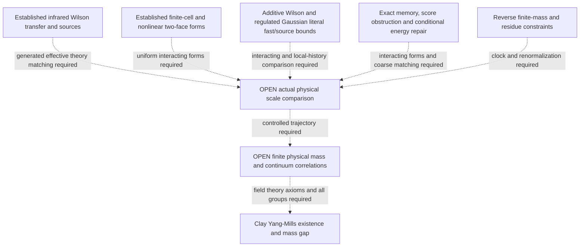

# Research goal and the path to it

The objective is the Clay Yang-Mills existence and mass gap problem. The
[official statement](https://www.claymath.org/wp-content/uploads/2022/06/yangmills.pdf)
asks for a nontrivial quantum Yang-Mills theory on four-dimensional Euclidean
space, for every compact simple gauge group, satisfying the required field
theory axioms and possessing a strictly positive mass gap.

This is the governing research objective, established by the maintainer on
5 September 2026. A research iteration should remove an explicit obligation
on a route to that theorem, establish a necessary mechanism, or resolve a
specific failed step so the route can continue. Counting checks or adding
Taylor coefficients is not a measure of distance to the objective.

## What the present advance changes

The [complete Wilson construction](../paper/research_notes/G18_WILSON_INFINITE_VOLUME_PHYSICAL_BAND_20260905.md)
proves an actual infinite-volume transfer, a vacuum gap, and a complete
physical isolated odd band with a uniformly invertible literal-source frame
on one explicit small-coupling interval. The reconstructed Euclidean band
is the same entire spectral range. Its proof combines the nonlinear vacuum
coordinates, local unitary transport, anchored transfer activities, and a
bound on the whole source synthesis operator.

This finishes the actual Wilson infinite-volume and source-identification
stage in that regime. It turns the existing local calculations into a
controlled physical spectral object that a scale argument can act on.
The full theorem has analytic evidence; the exact controls certify their
declared finite identities and constants.

The [physical scale package](../paper/research_notes/G19_OS_BLOCKING_AND_REVERSE_MASS_MATCHING_20260905.md)
now adds an exact OS-history blocking intertwiner with the physical clock
retained. Its range and any remaining complement must be determined from
the actual history map; the new Gaussian observability theorem makes this
distinction explicit. A [corrected conditional-gradient theorem](../paper/research_notes/G19_CONDITIONAL_GRADIENT_REPAIR_20260905.md)
and [actual Wilson block calculation](../paper/research_notes/G19_WILSON_BLOCK_SCORE_AND_FIBER_OBSTRUCTION_20260905.md)
locate the failed raw averaging and diffusion premises.

The constructive replacement uses physical quantum energy. The
[compact rotor theorem](../paper/research_notes/G19_WILSON_PHYSICAL_FIBER_FAST_GAP_20260905.md)
proves a fast vertical scale `1/a` for the specified Wilson blocks. The
[full coupled two-square theorem](../paper/research_notes/G19_WILSON_TWO_SQUARE_PHYSICAL_SHELLS_20260905.md)
also proves the entire block's physical gap and three lowest excited shells,
with real Wilson sources spanning that complete range. These supply a
physical local spectrum and source map for the scale comparison; they do
not yet identify the modes removed by an actual OS blocking map.
The [two-strip continuation](../paper/research_notes/G19_WILSON_STRIP_BO_AND_TWO_STRIP_SPLITTING_20260905.md)
determines the first physical radial/mixed splitting with a controlled
remainder on an actual four-face graph. Its strips share a gauge constraint
and have additive Hamiltonians; surrounding interactions remain to be added.

The ultraviolet input now goes beyond isolated rotors and two-square
examples. A full physical finite-cell theorem gives the complete first
cluster from the original-link curl spectrum, while all-size planar and periodic three-dimensional
harmonic decompositions retain actual interfaces. The planar source frame
keeps its frequency weights; the three-dimensional link proof respects
Bianchi constraints and retains torus harmonic directions. The small curl frequencies on growing disks are
retained slow modes, so the theorem does not demand an impossible uniform
lower bound on the entire growing block's gap.

The [global vertical barrier](../paper/research_notes/G19_WILSON_GLOBAL_VERTICAL_BARRIER_20260905.md) supplies
a nonlinear comparison for every coarse holonomy of the actual two-face
blocks, with a full-fiber fast term and scalar coarse potential. The
[ground-bundle theorem](../paper/research_notes/G19_WILSON_GROUND_BUNDLE_RELATIVE_FORM_20260905.md) also controls
the true local projected coarse form with relative `O(g^2)` magnetic
error. The
[actual adjacent-strip complement](../paper/research_notes/G19_WILSON_ACTUAL_BLOCK_FAST_COMPLEMENT_20260905.md) now
also has a proved fast floor above the true full vacuum, and a closed
normalized Schur realization at fixed u. These remove specific single-block
premises. Uniform interacting-volume compression, coarse matching and
the actual source/history comparison remain the scale obligation.

The true-vacuum literal construction now resolves the projection choice
for additive Wilson blocks. It identifies the actual quantum marginal
and keeps the exact vacuum in the coarse source range. A complete
spectral argument gives a fast lower floor and an onto low source frame
uniformly over finitely or countably many copies, including a single
common Gauss constraint and its cross-block singlets. Separately, the
harmonic interface bound now controls the entire regulated Gaussian
quantum complement with the correctly weighted literal coordinate source.

These advances connect the source to the same vacuum and energy form as
the fast estimate. The exact central SU(2) score identity now disproves the proposed global
sublinear Fisher estimate. The remaining interacting comparison must
control the true-ground score on the relevant energy space and compare
the true coarse marginal. A small conditional fiber-ground derivative or
a raw Wilson Gibbs estimate is not that bound.

Exact Gaussian history reconstruction also repairs the object being
compared across scales. Reducing equal-time variables can leave the whole
fine physical history space observable. The useful successor is therefore
a controlled approximation of the actual generated transfer or memory,
with a proved low-energy projection and source map. A bound on the actual
OS complement is still useful when that complement exists; it is not the
general definition of eliminated configuration modes.

Dashed arrows identify remaining hypotheses or constructions. The established
infrared theory and ultraviolet finite-block inputs meet at the open scale
comparison; neither is being presented as a continuum proof.

## Remaining obligations for the Clay theorem

| Obligation | Established input | What must still be proved |
|---|---|---|
| Remove the spatial lattice cutoff | The actual small-u Wilson transfer and source band; exact history intertwining; finite-cell physical spectra; all-size planar and three-dimensional harmonic interface comparisons. | Realize the interacting fast/source and generated-history comparison for the local Wilson block, prove uniform nonlinear physical form bounds with the harmonic constraints, flat variables and interfaces retained, and control approximation errors along a specified trajectory. |
| Retain a finite, positive physical mass | There is a positive transfer gap in electric-time units at each admitted fixed spatial scale. | Control the energy normalization and spectrum along that trajectory so a positive finite-energy physical excitation survives and the vacuum remains separated from all excitations. |
| Obtain a nontrivial continuum field theory | Actual Wilson multi-time correlations and their reflection-positive reconstruction are available at fixed spacing; the literal-source band is nonzero. | Produce renormalized limiting correlation distributions with nonzero physical content, the required regularity, full Euclidean symmetry and reconstruction axioms. |
| Control the physical observable space | The complete fixed-scale odd-band sources, finite-block real source shells, complete additive common-Gauss literal frames, and entire regulated Gaussian source bounds with their frequency weights. | Match actual gauge-invariant source algebras and renormalized spectral measures across scales, retain a nonzero physical residue, and control the intended channel. Exact vector observability alone need not imply cyclicity of every chosen invariant subalgebra. |
| Cover every compact simple gauge group | The finite-cell physical theorem applies to a faithful unitary representation of each stated compact connected group with simple Lie algebra, under its fixed-complex hypotheses. | Supply the interacting all-scale continuum construction for those groups. The current fixed-spacing odd-band route still has its own SU(N), N>=3 scope. |

The existing [continuum bridge](../paper/research_notes/G19_CONTINUUM_BRIDGE_INSERT.tex)
already identifies the central scale mismatch: in its Hamiltonian coordinate
u=g_H^-4, an asymptotically free trajectory reaches u tending to infinity,
whereas the proved analytic chart has a bounded small-u domain. It also
derives the required essential exponential behavior under its explicit
matching assumptions. These are established inputs, not reasons to stop.
They determine which kind of new estimate is needed.

## The next central target

The latest step joins three established mechanisms. The
[complete endpoint theorem](../paper/research_notes/G19_LITERAL_ENDPOINT_COMPLETE_WINDOW_20260905.md)
transports the entire additive physical low spectrum with high retained
sources controlled. The [actual local score theorem](../paper/research_notes/G19_TRUE_GROUND_LOCALIZED_WILSON_SCORE_20260905.md)
and [excitation-support localization](../paper/research_notes/G19_LOCAL_GRADIENT_EXCITATION_SUPPORT_20260905.md)
give a uniform selected-source Schur estimate. The
[local covariant path block](../paper/research_notes/G19_LOCAL_COVARIANT_AVERAGED_PATH_SOURCES_20260905.md)
gives an actual spatially local observation with the required uniform
transverse tangent and full regulated Gaussian source mechanism.

The remaining step is the actual interacting nonlinear fast/source and
generated-law comparison for that geometry. Endpoint positivity alone
does not erase memory, create a local Markov logarithm or assemble a
compatible scale hierarchy. A selected static source estimate alone does
not control its entire retained Schur complement. The conditional endpoint
clock budget states sufficient summable losses for a full gap, with those
interacting and hierarchy hypotheses still open.

The exact true-vacuum projection eliminates the additive product-vacuum
mismatch, and its common-Gauss fast floor survives without a copy-count
loss. Ambient interactions destroy the exact support decomposition used
in that proof. The next step is therefore a uniform comparison of the
interacting true-vacuum marginal and its complementary form, retaining
the actual metric and generated memory. The global sublinear Fisher candidate fails. The surviving criterion
requires coarse-gradient energy localization and an actual full-Q bound,
with high retained energies controlled before a full-gap conclusion.
Those uniform nonlinear Wilson estimates remain to be established. Flat harmonic directions still need
their actual quantization; a bound uniform in a positive Gaussian
regulator does not construct a vacuum at zero regulator.

Prove the uniform nonlinear energy comparison for the actual coupled Wilson
block family, using the retained harmonic slow space and interface bound as
inputs. Keep the generated temporal memory, induced kinetic mass, varying
vacuum energy and literal-source frequency factors. Specify the genuine
reflection/time-compatible history map and its invariant observable algebra.
Then compare its low-energy transfer and renormalized sources with the
controlled infrared endpoint, with errors summable in physical energy units.
The closed-form Schur theorem states sufficient form hypotheses and a
summable inverse-fast-energy budget. Their uniform Wilson realization,
including the full normalized coarse gap, remains the decisive open estimate.

The full two-square operator includes its real shared-edge coupling. Its
exact physical inversion symmetry improves the localization remainder but
is special to that graph; arbitrary blocks can retain cubic magnetic terms.
The next comparison must prove its own cancellations or bounds. The single
block's fast energy of order `1/a` is the desired eliminated scale, not a
finite continuum glueball mass.

Pursue the reverse direction alongside this construction: start from the
necessary behavior of a finite positive physical glueball mass and a
nonzero renormalized source spectral weight, then derive what an
intermediate coarse theory must preserve. Numerical continuum mass ratios
can distinguish candidate mechanisms but do not establish these bounds.
The Clay gap concerns every physical excitation; the present complete odd
band supplies a controlled sector and a nonzero source, not an identification
of the lightest continuum scalar glueball.

A proposed contraction must be tested on functions pulled back from coarse
variables. A small derivative of the forward block map is not automatically
a small derivative of conditional expectation. If this step fails, repair
the metric or covariance estimate and record the strongest valid recursion
before using the affine cascade. Reflection positivity and the physical
transfer identification must survive the chosen blocking operation.

Sharp temporal band-kernel matching remains an available supporting route
where it supplies the required clock or energy normalization. It is not
interchangeable with removing the spatial cutoff. New coefficient work is
justified when it settles a named obligation in this scale comparison.

## How progress is reported

Each update should state: the obligation being attacked; the exact new
statement or failed step; the proof or reproducible artifact; its downstream
consequence; and the next decisive calculation. Distinguish established,
conditional, numerically suggested and open statements, and separately
state whether their repository records are local, pushed or merged.

If no currently available route permits further progress, report that
inability and its precise mathematical obstruction. Exhausting the present
methods is not a proof that no future mathematical direction exists.
