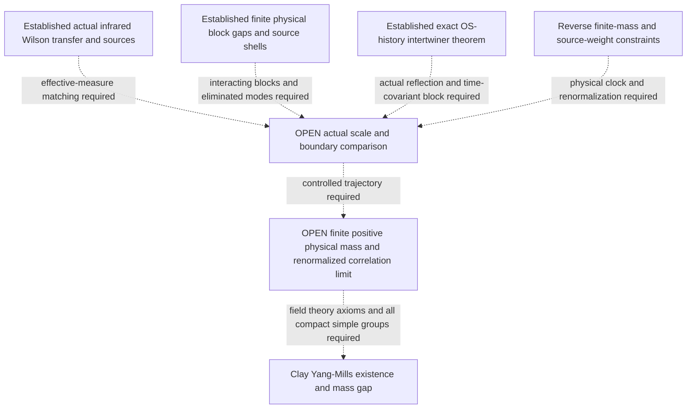

# Research goal and the path to it

The objective is the Clay Yang-Mills existence and mass gap problem. The
[official statement](https://www.claymath.org/wp-content/uploads/2022/06/yangmills.pdf)
asks for a nontrivial quantum Yang-Mills theory on four-dimensional Euclidean
space, for every compact simple gauge group, satisfying the required field
theory axioms and possessing a strictly positive mass gap.

This is the governing research objective, established by the maintainer on
5 September 2026. A research iteration should remove an explicit obligation
on a route to that theorem, establish a necessary mechanism, or resolve a
specific failed step so the route can continue. Counting checks or adding
Taylor coefficients is not a measure of distance to the objective.

## What the present advance changes

The [complete Wilson construction](../paper/research_notes/G18_WILSON_INFINITE_VOLUME_PHYSICAL_BAND_20260905.md)
proves an actual infinite-volume transfer, a vacuum gap, and a complete
physical isolated odd band with a uniformly invertible literal-source frame
on one explicit small-coupling interval. The reconstructed Euclidean band
is the same entire spectral range. Its proof combines the nonlinear vacuum
coordinates, local unitary transport, anchored transfer activities, and a
bound on the whole source synthesis operator.

This finishes the actual Wilson infinite-volume and source-identification
stage in that regime. It turns the existing local calculations into a
controlled physical spectral object that a scale argument can act on.
The full theorem has analytic evidence; the exact controls certify their
declared finite identities and constants.

The [physical scale package](../paper/research_notes/G19_OS_BLOCKING_AND_REVERSE_MASS_MATCHING_20260905.md)
now adds an exact OS-history blocking intertwiner with the physical clock
retained. It identifies a separate eliminated-mode estimate as the missing
spectral input. A [corrected conditional-gradient theorem](../paper/research_notes/G19_CONDITIONAL_GRADIENT_REPAIR_20260905.md)
and [actual Wilson block calculation](../paper/research_notes/G19_WILSON_BLOCK_SCORE_AND_FIBER_OBSTRUCTION_20260905.md)
locate the failed raw averaging and diffusion premises.

The constructive replacement uses physical quantum energy. The
[compact rotor theorem](../paper/research_notes/G19_WILSON_PHYSICAL_FIBER_FAST_GAP_20260905.md)
proves a fast vertical scale `1/a` for the specified Wilson blocks. The
[full coupled two-square theorem](../paper/research_notes/G19_WILSON_TWO_SQUARE_PHYSICAL_SHELLS_20260905.md)
also proves the entire block's physical gap and three lowest excited shells,
with real Wilson sources spanning that complete range. These supply a
physical local spectrum and source map for the scale comparison; they do
not yet identify the modes removed by an actual OS blocking map.
The [two-strip continuation](../paper/research_notes/G19_WILSON_STRIP_BO_AND_TWO_STRIP_SPLITTING_20260905.md)
determines the first physical radial/mixed splitting with a controlled
remainder on an actual four-face graph. Its strips share a gauge constraint
and have additive Hamiltonians; surrounding interactions remain to be added.

Dashed arrows identify remaining hypotheses or constructions. The established
infrared theory and ultraviolet finite-block inputs meet at the open scale
comparison; neither is being presented as a continuum proof.

## Remaining obligations for the Clay theorem

| Obligation | Established input | What must still be proved |
|---|---|---|
| Remove the spatial lattice cutoff | The actual Wilson theory and physical spectral band exist in the stated small-u regime; exact history blocking specifies how a true scale map would transport them. | Construct the actual block/effective-measure trajectory and compare its eliminated OS modes with controlled physical local energies, including interactions between blocks. |
| Retain a finite, positive physical mass | There is a positive transfer gap in electric-time units at each admitted fixed spatial scale. | Control the energy normalization and spectrum along that trajectory so a positive finite-energy physical excitation survives and the vacuum remains separated from all excitations. |
| Obtain a nontrivial continuum field theory | Actual Wilson multi-time correlations and their reflection-positive reconstruction are available at fixed spacing; the literal-source band is nonzero. | Produce renormalized limiting correlation distributions with nonzero physical content, the required regularity, full Euclidean symmetry and reconstruction axioms. |
| Control the physical observable space | Literal plaquette sources span the complete fixed-scale odd band; real Wilson sources span the first three physical shells of the full two-square block. | Control renormalized or smeared source spectral measures across scales, retaining nonzero normalized weight and the intended scalar or other physical channel. |
| Cover every compact simple gauge group | The odd-shell construction uses SU(N), N at least 3; the compact-rotor theorem applies to faithful unitary representations of compact connected simple groups. The finite two-square real sources also cover SU(2). | Extend the appropriate interacting physical sectors and continuum construction beyond the present odd-shell regime. A generic one-rotor result does not construct a full all-group Yang-Mills theory. |

The existing [continuum bridge](../paper/research_notes/G19_CONTINUUM_BRIDGE_INSERT.tex)
already identifies the central scale mismatch: in its Hamiltonian coordinate
u=g_H^-4, an asymptotically free trajectory reaches u tending to infinity,
whereas the proved analytic chart has a bounded small-u domain. It also
derives the required essential exponential behavior under its explicit
matching assumptions. These are established inputs, not reasons to stop.
They determine which kind of new estimate is needed.

## The next central target

Derive the scale comparison for actual coupled or overlapping Wilson blocks,
starting from the now-proved local physical spectrum. Specify the true
reflection/time-covariant history block and retain its generated effective
measure. Bound the eliminated OS modes by the vacuum-subtracted physical
block energy while controlling surrounding plaquettes, cross terms and
changing ground energy. Then match the infrared effective transfer and
renormalized source synthesis to the controlled endpoint, with errors
summable in physical energy units along a specified trajectory.

The full two-square operator includes its real shared-edge coupling. Its
exact physical inversion symmetry improves the localization remainder but
is special to that graph; arbitrary blocks can retain cubic magnetic terms.
The next comparison must prove its own cancellations or bounds. The single
block's fast energy of order `1/a` is the desired eliminated scale, not a
finite continuum glueball mass.

Pursue the reverse direction alongside this construction: start from the
necessary behavior of a finite positive physical glueball mass and a
nonzero renormalized source spectral weight, then derive what an
intermediate coarse theory must preserve. Numerical continuum mass ratios
can distinguish candidate mechanisms but do not establish these bounds.
The Clay gap concerns every physical excitation; the present complete odd
band supplies a controlled sector and a nonzero source, not an identification
of the lightest continuum scalar glueball.

A proposed contraction must be tested on functions pulled back from coarse
variables. A small derivative of the forward block map is not automatically
a small derivative of conditional expectation. If this step fails, repair
the metric or covariance estimate and record the strongest valid recursion
before using the affine cascade. Reflection positivity and the physical
transfer identification must survive the chosen blocking operation.

Sharp temporal band-kernel matching remains an available supporting route
where it supplies the required clock or energy normalization. It is not
interchangeable with removing the spatial cutoff. New coefficient work is
justified when it settles a named obligation in this scale comparison.

## How progress is reported

Each update should state: the obligation being attacked; the exact new
statement or failed step; the proof or reproducible artifact; its downstream
consequence; and the next decisive calculation. Distinguish established,
conditional, numerically suggested and open statements, and separately
state whether their repository records are local, pushed or merged.

If no currently available route permits further progress, report that
inability and its precise mathematical obstruction. Exhausting the present
methods is not a proof that no future mathematical direction exists.
