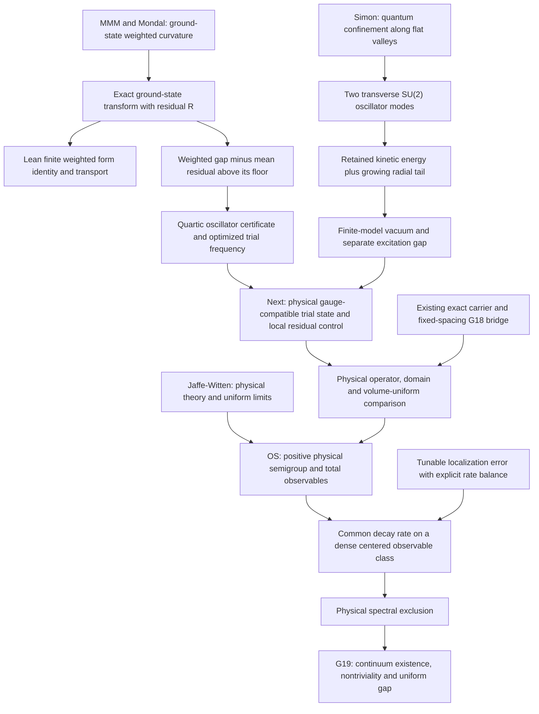

# From source relations to verified mathematical interfaces

This page retains the initial three-derivation program and its source-intake
snapshot. For the expanded program and subsequent results, start with
[current research](../../docs/current_research.md), the
[derivation proof map](../../docs/derivation_formalization.md), and the
[formalization workflow](../../docs/formalization_workflow.md). The initial
Lean bridge note below is a historical scope record; the generated proof map
is the current theorem inventory. Acquisition counts below describe this stage.

The source collection now feeds three reconstructed derivations, exact symbolic checks, and Lean lemmas. The most productive connection is a **trial-state residual method**: weighted geometry can bound a physical Hamiltonian's gap even when the exact vacuum is unknown, provided the residual error is controlled. Simon's transverse confinement supplies a complementary way to understand flat valleys. OS reconstruction specifies the physical observable space and time parameter on which either mechanism must act.

The supplied Clay PDF is the same byte-pinned document as the first attachment. Its bibliography guides the construction requirements and candidate mechanisms. The repository's established flux-band, fourth-order, and fixed-spacing carrier results remain inputs to this program.

## The three derivations

| Derivation | Concrete result | Evidence and remaining analytic input |
|---|---|---|
| [Ground-state transform](../../docs/derivations/yangmills-weighted-curvature.md) | `U^-1 H U = -c L_S + R`, with `R=(H psi)/psi`; a weighted gap `gamma` gives the residual budget `gap(H) >= gamma - (mean R - inf R)` | Exact differential identities, a finite matrix identity, Gaussian calibrations, and Lean algebra/form lemmas. Analytic use needs the common form domain, a weighted Poincare inequality, and valid residual bounds. |
| [Flat-direction confinement](../../docs/derivations/yangmills-simon-flat-directions.md) | For the normalized finite SU(2) matrix model, `H_m(g) >= T/2 + g sqrt(m-1) sum_i |A_i|`; the retained derivatives and growing tail imply compact resolvent | Reconstructed oscillator and compactness argument; exact checks and finite-sum Lean identities. The explicit lower bound is on unshifted `E0`, not a quantitative vacuum-subtracted mass gap. |
| [Physical reconstruction](../../docs/derivations/yangmills-reconstruction.md) | Positive spectral measures turn uniform physical-time decay on a dense centered set into spectral exclusion; a tunable localization bound yields rate `eta beta/(alpha+beta)` | Analytic spectral-measure proof, exact reflection-kernel/frame examples, and checked optimization. Yang-Mills density, a physical operator identification, and uniform localization estimates remain separate obligations. |

## A worked certificate from the curvature route

For the one-dimensional pure quartic oscillator

\[
 H=-\frac{\hbar^2}{2m}\frac{d^2}{dx^2}+\lambda x^4,
 \qquad \psi(x)\propto\exp[-m\Omega x^2/(2\hbar)],
 \qquad \Omega^3=6\lambda\hbar/m^2,
\]

the residual square completion gives `inf R=hbar Omega/8`, while exact Gaussian moments give `mean R=3 hbar Omega/8`. The Gaussian weighted gap is `gamma=hbar Omega`. The comparison therefore yields

\[
 \operatorname{gap}(H)\ge\frac34\hbar\Omega.
\]

The residual is unbounded above. Controlling its mean above its lower floor is sufficient, and sharper than insisting on bounded oscillation. The exact residual, moments, and optimization of the Gaussian frequency are reproduced; the companion note states the functional-analytic argument. The Lean scope note separates its proved algebra from the analytic premises.

This calibration suggests an actionable Yang-Mills operation: choose a positive, gauge-compatible trial state for the **specified physical Hamiltonian**, derive its residual under the actual kinetic metric, and compare the weighted Poincare floor with the residual budget. A guessed curvature constant without that operator/measure calculation does not implement this method.

The global residual budget can accumulate with volume even when the true product-model gap stays positive. The companion derivation tests this explicitly on independent quartic copies. A volume-uniform Yang-Mills use therefore calls for local or tensorized estimates and controlled interactions, rather than simply summing the one-body residual error.

## How the relations fit



The arrows label mathematical dependencies, not completed continuum implications. In the native graph, paper statements and derivation summaries remain T3 note records. The separate `CHK:` and `LEAN:` nodes expose what is actually checked, with precise source locators and hypotheses. This prevents a theorem about a finite matrix, a formal differential identity, or a source citation from silently becoming a four-dimensional existence theorem.

## Concrete continuation interfaces

1. **Physical trial state.** Specify `H`, its kinetic metric, gauge sector and closed form domain; construct a positive `psi` and compute `R=(H psi)/psi`. Start with finite regulators where all quantities have explicit definitions. Test the residual at commuting valleys and large-field tails before making a global bound.
2. **Local error control.** Establish a weighted Poincare floor and a residual comparison that survives additional cells. Independent product oscillators provide a compulsory calibration. Perturbative coupling corrections must have a stated norm and uniform constant.
3. **Observable and clock map.** Reuse the existing fixed-spacing carrier frame and transport. Identify its relation to the physical transfer operator under the actual temporal normalization, then address the full complement or a dense centered observable family.
4. **Decay and limits.** Either derive physical-time clustering directly or prove the stated comparison from the weighted form. If localization is used, verify a decaying bad-event error together with the growth cost of localization. Carry the constants through volume and regulator limits required by the Clay source.

Each interface has a falsifier in its detailed derivation. The new gap routes in `ledger/gaps.yaml` distinguish completed finite/algebraic steps from the next analytic steps.

## Reproduce and navigate

All acquired source pages are searchable through the [777-page locator index](extraction/README.md). Its topic and theorem-label hits are discovery aids, not reviewed claims. The collection still records 37 sources without local full text and one preview; those access gaps remain visible.

```text
uv run --no-sync workhouse why STUDY:YM:derive-ground-state-residual
uv run --no-sync workhouse why STUDY:YM:derive-simon-transverse
uv run --no-sync workhouse why STUDY:YM:derive-adaptive-localization
uv run --no-sync workhouse why LEAN:finite_ground_state_residual_identity
uv run --no-sync workhouse why G23
uv run --no-sync workhouse verify --only "pure quartic oscillator Gaussian residual certificate"
```

From `lean/`, `lake build --wfail` checks the formal development. The initial bridge inventory and scope are in [the formal bridge note](../../docs/derivations/yangmills-formal-bridges.md), with that stage's validation under `docs/validation/`. Follow the current proof map and formalization workflow linked above for subsequent theorems and their exact source dependencies.
