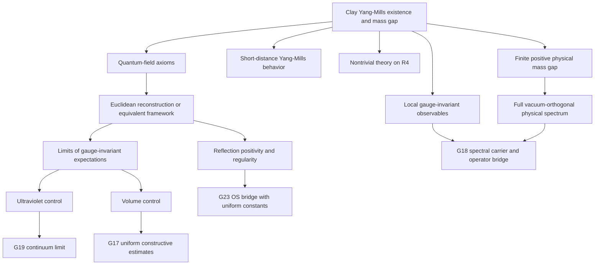
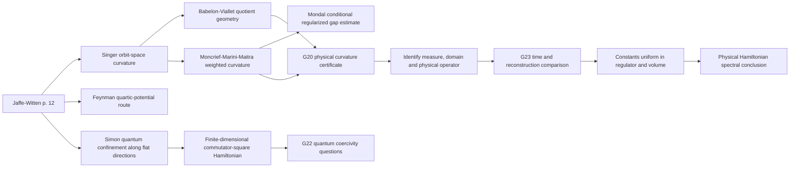
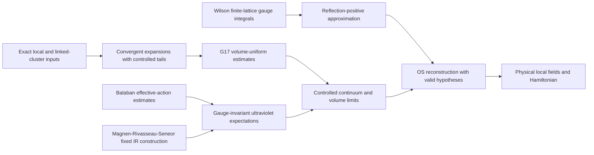

# Reading the Yang-Mills theory graph

The native graph is generated from `theory_graph.yaml` and the literature register. These diagrams give a compact reading route through it. Every statement has its own source locator and explicit links in the YAML; the diagrams do not assign new proof tiers.

## The construction target



Arrows run from a target to its requirements or related repository task. The group quantifier is every compact simple gauge group. The exact SU(N) results remain inputs with their demonstrated rank scope.

## The geometric route



The first three branches are explicit in the supplied document. Later-paper connections are recorded from inspected bibliographies. The final chain is a research route whose additional hypotheses are spelled out in the study nodes.

Simon supplies a particularly concrete comparison: section 7 of the 1983 paper treats a finite-dimensional compact-semisimple commutator-square model. Its discrete-spectrum conclusion addresses a quantum operator with classical flat directions. Spatial field modes, limiting measures, and uniform constants remain separate questions when using this result in a field theory. Configuration-space flat directions and a momentum-space flat band are different objects; the operator definitions determine their possible connection.

## The constructive route



This diagram is one organized route, rather than a claim that every construction must use precisely this order. The appendix to an approximation must say which constants depend on lattice spacing, volume, coupling, rank, observable support, and truncation order. The native links lead directly to the existing G17-G19 work and its checks.

The OS source pair has an important version relation: the 1975 paper corrects and extends the 1973 reconstruction argument. The MRS paper is also recorded with its own qualifications about proof detail, the infrared cutoff, topology, and unestablished OS properties. These records make the next hypotheses concrete without discarding the progress those sources contain.

## Reproduce and extend

These commands rewrite source metadata and generated views. They are for
deliberate acquisition maintenance after preserving prior outputs and reviewing
the source inputs, not ordinary reading setup. See the
[collection guide](README.md#maintaining-local-extraction) for local extraction
prerequisites and [current research](../../docs/current_research.md) for later
results beyond this source map.

```text
uv run --no-sync python scripts/build_yangmills_sources.py
uv run --no-sync workhouse index -w
uv run --no-sync workhouse frontier --write
uv run --no-sync workhouse certified --write
uv run --no-sync workhouse atlas
```

Use `workhouse why STUDY:YM:target`, `workhouse why STUDY:YM:matrix-commutator-model`, or `workhouse why G23` to move from these diagrams to the native graph. Source acquisition states and corrected bibliographic details are in `COVERAGE.md`; raw citations, URLs, source hashes, and selected-page reading records are in the JSON manifests.
