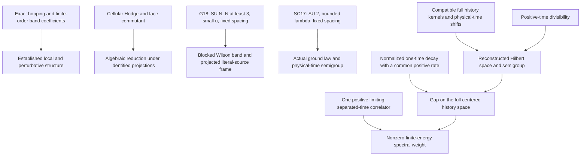

# Gemini's surviving pillars: corrected review and usable continuation

September 11, 2026. Review of the [received synthesis](../../INBOX/gemini-pillars_20260911/pasted-text.txt), against canonical `REPO` at `b9651bea3d772d3968eaddce72f0c6ad316928db` and live GitHub main initially observed at `60728319516c6af49c700b7791f52ecf772f4bc3`. Main advanced during review to `ffff7bb2e67b976ba50fe5cf7184966dd581535f`; the exact reviewed revision remains pinned.

**The review points to substantial established mathematics. Its strongest useful conclusion survives: exact local structure, a fixed-spacing Wilson band, the SC17 physical semigroup, and the conditional moving-time kernel criterion are reusable inputs. Its presentation needs repair before it can serve as a proof map.** It misstates one exact coefficient, mixes historical and assembled kernels, conflates transfer clocks and gauge groups, and gives seven graph locators that do not exist as written.

This package supplies those repairs and a concrete acceptance test for the next continuum estimate. It does not change the original review, canonical scientific sources, graph statuses, or another agent's work. The analytical results below retain their source hypotheses; unfamiliarity or lack of whole-statement Lean coverage is not a reason to reject a valid proof.

## 1. What to retain and what to correct

| Item in Gemini | Review finding and correction |
|---|---|
| 439 Lean theorems, 611/611 checks | Matches the saved canonical snapshot, and **611/611 checks passed in this review's fresh verifier execution**. Live main initially reported 618/618 after the odd-order addition, then 621/621 after the concurrent G9 merge. The additional ten checks were not rerun here. See [verification](verification-summary.json). No Lean rebuild was performed in this review. |
| All-rank hopping and G24 | Retain the exact formula and its representation-theoretic derivation. The cited `t_N_pos_of_ge_three` is absent. `Workhouse.hopping_three`, `rank_law_numerator`, and the exact Weingarten check are actual locators. Positivity for every real N>=3 follows from the signs of all five factors; the replay verifies those signs symbolically. ADR 0021 concerns fourth-order shared-link assembly, not the original G24 derivation. |
| Third-order flatness | Retain the SU(3), through-order-u^3 statement and its displayed coefficients. The implication `B(k)^* psi(k)=0` applies in the defined Bloch/cellular carrier; it does not establish all-order flatness of a physical continuum sector. The two purported result IDs are not registered as written. |
| Fourth-order adjudication | Retain the missing-orderings explanation and exact shift `+25/1024`. Correct the decimal and the kernel as detailed below. The adjudication-harness suite includes passing checks that certify limitations of historical tools; its 16 passes are not 16 proofs of the entire physical theorem. |
| ADR 0046 | Retain the exact N^-7 cumulants and N^-3/N^-5 cancellations, in eight clusters and two sectors, as recorded by the five T1 checks. Retain rank-uniform matched scaling **through fourth order**. Neither all-order convergence nor G16's overlap theorem follows. Use a distinct symbol for the bare coupling beta and the fourth-order coefficient also called beta_N in parts of the corpus. |
| Cellular Hodge and tetrahedral commutant | Retain the corrected cellular identities and `Comm(S4)=span(P,Q)` on the four-face representation. This is not an identification of physical Haar/Fierz states, their projected histories, or a physical Hamiltonian. A scalar compression may depend on momentum. The repaired source explicitly retains that obligation. |
| G18 infinite-volume Wilson band | Retain the established small-u, fixed-spacing, fixed-N>=3 band and onto **projected** literal-source map `Pi J`. Correct the blocked operator, interacting decay rate, and Gram inequalities below. The band frame is total in `Ran Pi`; it is not automatically total in the full physical vacuum complement. |
| SC17 thermodynamic and physical time | Retain the actual SU(2), unit-S3-metric construction at fixed spatial spacing, epsilon>0, and 0<=lambda<=lambda_c. Its law is the actual ground law `mu=Omega^2 dU`, not an arbitrary Gibbs measure. Its form carries epsilon and its gap is at least `4 epsilon/3`. P8 identifies the physical-time semigroup; it is not merely an auxiliary stochastic clock. |
| Moving-time MT1–MT5 | Retain the analytic implication. MT2 also needs `||f_n-v_n|| -> 0` and vague convergence of the intended spectral measures. The full-space version needs actual spectral identification and a total centered family. The logarithmic time is an optimal choice for MT4's power-law budget, not the only permitted moving-time schedule. |
| Compatible kernels K1–K11 | Retain the quotient construction, log-convex passage, positive-time continuity mechanism, and nontriviality bound. Kernel convergence alone is insufficient: fixed-time compatibility and continuity, or full positive-time divisibility, are indispensable. The source explicitly says the whole theorem is analytic, not Lean formalized. |
| W6 antipodal coercivity | The registered result concerns the finite-square magnetic Hessian at its antipodal minimum orbit, with its specified inverse original-edge cometric. It does not prove a uniform logarithmic-ground-score bound, M10, or interacting growing-volume W6. |
| Dimension-five vanishing | Retain the stated symmetry and dimension-counting scope. Canonical dimension-six scaling `L^-2=1/9` is not an established nonlinear RG contraction estimate. The check support explicitly separates them. |

The phrase “most comprehensive ... ever assembled” was not verified by a worldwide comparison. It adds no support to these results and is omitted from the corrected synthesis.

## 2. Fourth-order repair: positivity survives the corrected coefficient

[ADR 0024](../../REPO/docs/decisions/0024-the-corner-cluster-from-a-third-implementation-and-the-ledger-that-was-here.md), especially findings 2–4, and `Workhouse.cShp_assembled_value` give

\[
C_{\rm shp}=C_{\rm historical}+\frac{25}{1024}
=-\frac{13035490122347}{550663802582400}
=-0.02367232068136\ldots.
\]

Gemini prints `-0.0202133...`, which does not equal the exact adjudicated value. Its displayed cross coefficient `17607806155349/1101327605164800` is `Q4_CROSS`, the **historical** coefficient in `constants.py`. Within the same generalized Hodge-pencil convention, the assembled cross coefficient is

\[
b=2A+4C_{\rm shp}
=\frac{15644916262153}{137665950645600}
=b_{\rm historical}+\frac{25}{256},\qquad A=\frac5{48}.
\]

Thus the consistent assembled polynomial is

\[
Q_{4,\rm assembled}
=\frac5{48}\sum_i L_i^2+b\sum_{i<j}L_iL_j
=\frac{13035490122347}{275331901291200}\sum_i L_i^2
+\frac{15644916262153}{275331901291200}\left(\sum_i L_i\right)^2.
\]

Both coefficients in the last expression are strictly positive. The quadratic-form eigenvalues are

\[
\frac{29985119454403}{137665950645600}\quad(1\text{ copy}),\qquad
\frac{13035490122347}{275331901291200}\quad(2\text{ copies}).
\]

This is an exact correction and a useful retained conclusion: the corrected polynomial remains positive definite in real L variables, hence positive on the intended carrier amplitudes. It does not certify an all-orders Hamiltonian or a continuum gap. The historical formula is retained in the repository for provenance; it should not be overwritten as though it were an accidental stale constant.

## 3. The correct G18 and SC17 statements

The [G18 theorem](../../REPO/paper/research_notes/G18_WILSON_INFINITE_VOLUME_PHYSICAL_BAND_20260905.md), section 1, defines a blocked time `s=m tau`, a creator-velocity chart, and an actual Perron normalization. Its operator is `G_infinity`, the limit of those **blocked, chart-conjugated** transfers. With

\[
q_0=\frac45+\frac1{998}=\frac{3997}{4990}<1,
\]

the source proves `||G_infinity|Omega-perp||<=q0` and the electric-time decay bound

\[
\Delta_{\rm el}\ge-\log(q_0)/s_1>0.
\]

The separate `gamma=C_F/2` calibrates the fundamental link energy and free-shell window. Substituting it for the interacting transfer decay bound changes the theorem. In particular the block bound cannot be copied onto every arbitrarily short one-step transfer.

The literal-source statement is stronger and more precise than Gemini's lower bound:

\[
\frac{312481}{419904}I\le J^*\Pi J\le\frac{81}{64}I,
\qquad\frac{312481}{419904}>\frac9{16}.
\]

The upper bound is stated non-strictly. `Pi J` is a bounded bijection onto the complete odd plaquette island. The small coupling radius is indeed `u_star/(10022400000 N)`, with the source's additional temporal-window and kinetic premises. None of these premises may be dropped.

The [SC17 thermodynamic source](../../REPO/docs/derivations/wilson-sc17-thermodynamic-limit.md) instead uses the SU(2) link product, ground law and form

\[
\mathcal E_\mu(f,g)=\epsilon\sum_{e,a}\int X_e^af\,X_e^ag\,d\mu,
\qquad K_\mu\big|_{1^\perp}\ge4\epsilon/3.
\]

For `D=24 pi lambda` and the centered elementary plaquette, it supplies nonzero spectral weight at least `exp(-D)/8` in `[4 epsilon/3,32 epsilon exp(D)]`. This is a finite-energy interval, not an asserted arbitrarily narrow band near the lower gap.

The [physical-time source](../../REPO/docs/derivations/wilson-sc17-physical-time-limit.md), P8–P10, identifies the thermodynamic physical semigroup and extends the endpoint by a summable weight. It does not state the displayed arbitrary `tau -> 0` transfer-power theorem attributed to it in Gemini. The spatial continuum path has lambda proportional to g^-4 and eventually leaves this bounded SC17 interval.

## 4. Replace the five-step ladder with scoped inputs

The missing arrows are specific work: identify physical projected histories for the cellular algebra; establish actual Wilson kernel convergence and compatibility on the weak-coupling trajectory; obtain the one-time decay estimates on a defining history family; and supply the Euclidean covariance/locality/regularity requirements of the intended field theory. G18 and SC17 remain established inputs in their own regimes. No automatic implication between their different gauge groups or coupling windows is asserted.

Whole-statement analytic proofs and Lean support must also remain separate. `closed_extension_of_integration_by_parts` proves closability from a densely defined formal adjoint on actual Hilbert spaces. It does not construct the SU(2) law or prove the complete SC17 theorem. `SpectralReconstruction.lean` supplies real spectral-measure and localization results; the MT and compatible-kernel sources explicitly retain their unformalized limit arguments. Hodge's elementary duality and scalar-compression lemmas similarly consume hypotheses; the full face-commutant argument is in the corrected Hodge source.

## 5. What can actually be done next with Gemini's useful idea

The most direct continuation from this synthesis is to use the existing kernel theorem as an acceptance test for an **actual normalized Wilson correlation estimate**. Do not ask the microscopic results to supply an unidentified continuum limit.

For a proposed bound

\[
K_n(t)\le A a_n^{-p}e^{-mt}+B a_n^r,\qquad
|\alpha_n|\ge c_\alpha a_n^s,
\]

first preserve the actual source approximation, physical clock, source family, and available horizon. Under the existing MT4 premises, a desired rate `0<M<m` can be certified by an observation time `t_n=c log(1/a_n)` exactly when a positive c can be chosen satisfying

\[
\frac{p+2s}{m-M}\le c\le\frac{r-2s}{M},\qquad c\le c_{\max}.
\]

This is simply the two branches of MT4 rearranged, not a new independent theorem. At equality one still excludes every E<M and obtains support in `[M,infinity)`. Algebraically the interval width is

\[
\frac{r-2s}{M}-\frac{p+2s}{m-M}
=\frac{(p+r)(M_*-M)}{M(m-M)},\qquad
M_*=\frac{m(r-2s)}{p+r}.
\]

For the source's example `p=1,r=5,s=1,m=2`, target `M=1` forces `c=3`; a horizon `c_max=2` can instead certify `M=1/2`. This makes the next estimate falsifiable before an expensive calculation. If `r<=2s`, or the available horizon is too short, the budget gives no positive guarantee; this is not a no-gap theorem for the underlying model.

The finite-energy part can use the source's stronger floor `C/(2-C/V)` rather than only `C/2`, once an actual limiting separated-time `C>0` and `V=||f_c||^2` are known. The remaining field-theory and Wilson hypotheses are unchanged. No values of p,r,s,m,C,V for the spatial continuum trajectory were derived in this review.

## 6. Evidence and verification

Completed: **611/611 canonical invariant checks and 13/13 exact review controls passed**. Start and end graph snapshots are matched, with identical fingerprints and input-manifest digests. Canonical HEAD and its working files remained unchanged by this task. No shared graph or Lean writer was started here.

- [Exact replay](audit.py) and [13 exact findings](exact-findings.json): corrected coefficient, assembled-kernel positive definiteness and sum of squares, hopping signs, transfer and frame arithmetic, Hodge identities, SC17 root bracket, and the moving-time target-rate rearrangement.
- [Graph crosswalk](graph-crosswalk.json): all 15 received RESULT/DERIV names checked against the saved graph, including seven nonresolving names and existing replacement locators. A replacement is a retrieval route, not a manufactured whole-theorem equivalence.
- [Reviewed source identities](reviewed-source-manifest.json), [Git observation](git-observation.json), and [intake manifest](../../INBOX/gemini-pillars_20260911/manifest.json).
- [Task record](TASK.md), [start snapshot](start.json), [end snapshot](end.json), [canonical invariant execution](verify.json), and [verification summary](verification-summary.json).

Reproduce the exact review with `C:/WORKHOUSE/REPO/.venv/Scripts/python.exe C:/WORKHOUSE/research/gemini-pillars-review_20260911/audit.py`. The script writes only this review package and its intake manifest. Its finite examples and algebra do not replace independent full audits of every G18/SC17 analytic argument. No new full Lean verification, publication, or continuum closure is claimed.
