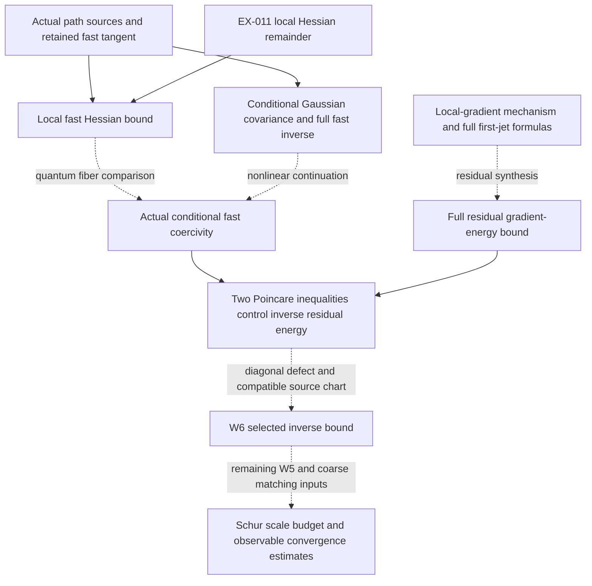

# A path through the theory graph to the W6 residual estimate

9 September 2026 UTC. Read-only graph audit and analytic continuation.

**Continuation:** the subsequent [quantum attempt](../w6_quantum_attempt_20260909/QUANTUM_CONTINUATION.md)
proves that the unrestricted vertical-gap surrogate fails for an actual
SU(2) bouquet quantum conditional, and gives an exact model in which the
proposed residual derivative bound fails while W6 holds. The conditional
implications below remain valid with their hypotheses, but those hypotheses
have not been established for the coupled Wilson family. The continuation
therefore redirects the application toward the full fast energy dual norm.

**Finding:** there is a concrete research path joining the actual path-source
geometry, the older local Hessian estimate, the Gaussian fast inverse, and
the local-gradient mechanism. Two analytic implications can be established
along this path. An additional coupled quantum fast theorem is still needed
before the route reaches W6. No completed proof path to W6 was found in the
examined graph records and their sources.

## 1. The graph is split across checkouts

The checkout containing the current W6 derivation,
`C:/WORKHOUSE/ALL THEORY/WORKHOUSE`, has no `RESULT:` nodes. The autonomous
checkout contains 55, and the flat-holonomy checkout contains 57. The 55
shared result records agree in statement, hypotheses/scope detail, status
and evidence. The latter checkout adds the flat-background source theorem
and physical source rank repair. Its graph therefore exposes analytic
dependencies absent from the W6 checkout's route summaries.

This is a representation difference, not evidence that a missing theorem is
proved. The snapshot audit preserves each checkout separately, including
hashes and original edge types. No graph statuses or source proofs were edited.
The W6 checkout changed during this session; the final machine-readable audit
pins the exact bytes it read rather than treating an earlier count as current.

`depends_on` points from a result to its premise. `bears_on` means relevance;
it is not a derivation. A result with `status: proven`, `evidence: analytic`
retains its stated analytic theorem status even though its full-statement
machine tier is T3. Finite controls and Lean statements certify their own scope.

## 2. The usable existing branches

These six dependency edges were checked literally in the flat-holonomy graph:

| Result | Native `depends_on` premise |
|---|---|
| `WILSON_FLAT_BACKGROUND_FAST_SOURCES` | `WILSON_COVARIANT_BLOCK_SOURCES` |
| `WILSON_PHYSICAL_SOURCE_RANK_REPAIR` | `WILSON_FLAT_BACKGROUND_FAST_SOURCES` |
| `CONDITIONAL_QUANTUM_PATH_COVARIANCE` | `WILSON_COVARIANT_BLOCK_SOURCES` |
| `DYNAMIC_CONDITIONAL_CUBIC_ENERGY` | `CONDITIONAL_QUANTUM_PATH_COVARIANCE` |
| `GAUSSIAN_FULL_FAST_GREEN` | `GAUSSIAN_PATH_ENDPOINT_BASELINE` |
| `LOCAL_GRADIENT_EXCITATION_SUPPORT` | `WILSON_COMMON_GAUSS_LITERAL_FAST_COMPLEMENT` |

All identifiers in this table have the `RESULT:` prefix. The first branch
supplies actual local matrix observations, retained harmonic directions and
the fast tangent floor. The Gaussian branch supplies the correctly compressed
inverse and a uniform synthesis estimate for its stated localized cubic
forces. The local-gradient branch shows how local energy estimates avoid a
copy-count factor in its product setting.

Other necessary nodes are `RESULT:WILSON_CUBIC_GROUND_TRANSFER`, which supplies
the finite-cell first ground/source correction; `RESULT:GROUND_MARGINAL_SCHUR_SCORE`,
which identifies the true-ground cross form; and
`RESULT:FORM_SCHUR_SCALE_COMPARISON`, which supplies the conditional downstream
gap/source comparison. Their relevance does not supply the missing nonlinear
uniformity by itself.

The proposed progression is below. The solid arrows describe the application
order of established ingredients; dashed arrows mark applications not yet
proved for the coupled Wilson family. This is a research diagram, not a new
set of native graph edges.



## 3. First established connection: fast restriction removes the old radius loss

The archived graph node
`NOTE:EXTRACT_2026-09-01:ex-011-matrix-hinge-chain-md-6c86da`, section 3,
records the linkwise local estimate

\[
 \operatorname{Hess}S(U)\ge\alpha\bigl(K-CrI\bigr),\qquad
 C=2\nu M_3.                                                   \tag{G1}
\]

Here \(r\) is the maximum link distance from the identity, \(M_3\) bounds
the normalized single-plaquette third derivative in the specified chart,
\(\nu\) bounds the number of plaquettes meeting a link, and \(\alpha\)
is the common positive action/Hessian coefficient. Metrics and Hessians at
different configurations must use the same stated tangent transport.

The proof is local: on a four-link face, the configuration displacement is
at most \(2r\). The third-derivative bound gives an error
\(2M_3r\|X_{\partial p}\|^2\), and summing faces gives
\(2\nu M_3r\|X\|^2\). The argument uses bounded incidence, so it applies
to the spatial three-dimensional lattice with \(\nu=4\); the archived
four-dimensional value \(\nu=6\) must not be copied as its incidence count.

The actual path-source theorem gives, on the fixed identity-background
physical fast tangent \(E_F\),

\[
 \langle X,KX\rangle\ge\kappa_L\|X\|^2,
 \qquad\kappa_L\ge\frac1{33L^2}.                              \tag{G2}
\]

Combining (G1) and (G2) proves

\[
 \boxed{\operatorname{Hess}S(U)[X,X]
 \ge\frac{\alpha\kappa_L}{2}\|X\|^2\quad(X\in E_F),\qquad
 r\le\min\{r_\star,\kappa_L/(2C)\}.}                         \tag{G3}
\]

This local radius is independent of the coupling and volume, for fixed
block size and group. The old full-space estimate had to absorb its error
on directions where \(K=0\) using only a coupling-independent Ricci floor,
which forced its radius to shrink inversely with coupling. The retained
fast restriction changes that calculation.

**Scope:** (G3) is a fixed-tangent classical action/potential statement. It
does not identify the Hessian of the true quantum conditional measure,
control curved nonlinear source fibers or their second fundamental terms,
or prove that all links lie in the chart with high probability. The
flat-holonomy source theorem supplies (G2) at other flat backgrounds; the
corresponding transported Taylor/fiber comparison still needs to be included
before claiming that extended nonlinear conclusion. This is a new analytic
connection here, not an already registered graph theorem.

## 4. Second established connection: local derivatives suffice without product independence

This provides a shorter sufficient route than first proving every connected
covariance kernel bound.

Let \(D\) be the nonnegative self-adjoint operator of an independently
controlled fast Dirichlet form \(\ell\), acting on the conditional-mean-zero
space. Suppose

\[
 D\ge\lambda I,\qquad A_g=F_g-z\ge\kappa D,
 \quad\lambda,\kappa>0.                                      \tag{G4}
\]

The second inequality is a closed-form comparison with its domain inclusion.
It must include the spectral shift \(z\). Both operators must act on the
same fast Hilbert space after a proved ground/source identification; sharing
coordinate names does not identify the literal \(Q\) with conditional
mean-zero functions. If exact kinetic square completion gives \(F_g\ge D\),
then on \(0\le z\le z_\star<\lambda\) one may take
\(\kappa=1-z_\star/\lambda\), since \(D-zI\ge\kappa D\).
For a Hilbert-space residual
\(\rho_p\in D(D^{1/2})\), the spectral theorem proves

\[
 \boxed{\langle\rho_p,A_g^{-1}\rho_p\rangle
 \le\kappa^{-1}\langle\rho_p,D^{-1}\rho_p\rangle
 \le\frac{\ell[\rho_p]}{\kappa\lambda^2}.}                    \tag{G5}
\]

Indeed \(s^{-1}\le\lambda^{-2}s\) for \(s\ge\lambda\). Equivalently,
apply inverse order, then the fast gap twice. A general form-dual residual
needs the weaker dual criterion from the preceding W6 note; (G5) is a
sufficient smoother-residual route, not an assertion that every residual
has this regularity.

To control \(\ell[\rho_p]\), disintegrate the actual ground measure as
\(d\nu(y,k)=d\mu(y)d\nu_y(k)\), with \(y\) retained and \(k\) fast.
Assume an exact representation

\[
 \rho_p(y,k)=g\sum_x a_x(p;y)\xi_x(y,k),\qquad
 \int\xi_x(y,k)d\nu_y(k)=0.                                  \tag{G6}
\]

The coefficients are constant under fast differentiation. Suppose the
actual vertical form is a sum of squared derivative fields \(Y_e\) and
each \(Y_e\) differentiates at most \(m\) of the profiles \(\xi_x\).
Require the uniform conditional derivative bound
\[
 \int\sum_e|Y_e\xi_x|^2d\nu_y\le J,
 \qquad \int\sum_x|a_x(p;y)|^2d\mu(y)\le C_B b[p].            \tag{G7}
\]
Then pointwise Cauchy-Schwarz at each derivative gives
\[
 \ell[\rho_p]\le g^2mJC_B b[p],\qquad
 \langle\rho_p,A_g^{-1}\rho_p\rangle
 \le\frac{mJC_B}{\kappa\lambda^2}g^2b[p].                    \tag{G8}
\]

**No product factorization of \(\nu_y\) is used in this proof.** Correlations
between different variables need not vanish. What must be local is the
derivative representation of the full residual, with the correct metric
and bounded conditional moments. Factors such as \(1/2\) in the physical
Dirichlet form belong in the normalization of \(Y_e\), \(D\), and \(\lambda\).
All constants must be uniform in the same parameter range required by W6.

This implication is a useful extension in direction from
`LOCAL_GRADIENT_EXCITATION_SUPPORT`: it replaces product support orthogonality
by bounded overlap of differentiated profiles. It does not extend every
conclusion of the product theorem, such as its exact complete-window frame.

An exact correlated Gaussian family demonstrates the distinction. For any
path size \(M\), let \(Q_M=I+\theta L_M\), \(\theta>0\), where \(L_M\)
is the path graph Laplacian. The measure with covariance \(Q_M^{-1}\) is
nonproduct, but its gradient form has gap at least one. For a linear local
residual \(g\sum a_ix_i\), its inverse energy is
\(g^2a^TQ_M^{-2}a\le g^2\|a\|^2\), uniformly in \(M\). For the centered
local squares \(x_i^2-(Q_M^{-1})_{ii}\), derivative overlap is still one,
and their gradient synthesis is at most \(4\sum_i|a_i|^2\). The adjacent
checker verifies exact correlated linear and nonlinear examples. This is
a calibration of the bridge, not a Wilson approximation claim.

## 5. Join to W6 and the exact next theorem

Use the actual compatible chart, full first force and reference graph:
\[
 t=t_1p=QW_1J_zp,\quad u_0=A_0^{-1}t,\quad
 \rho_p=A_gu_0-t.
\]
The previous continuation establishes
\[
 \langle t,(A_g^{-1}-A_0^{-1})t\rangle
 =-d_g[u_0,u_0]+\langle\rho_p,A_g^{-1}\rho_p\rangle.           \tag{G9}
\]
Thus all hypotheses of section 4, including the smoother residual domain,
(G4), (G6)-(G7), and
\( |d_g[u_0,u_0]|\le a|g|b[p]\) imply W6 with
\[
 C=a+\frac{mJC_Bg_0}{\kappa\lambda^2}.
\]
Here \(g_0>0\) is fixed and every hypothesis is uniform for \(0<|g|\le g_0\).
For form-domain mismatches use the compatible weak mixed pairing described
in the [preceding note](../w6_continuation_20260909/W6_PATH_FORWARD.md).

The next theorem to prove is now concrete: **for the actual coupled quantum
Wilson vacuum, construct the fast conditional form and full residual in the
same redundant source chart, and establish (G4), (G6)-(G7) and the diagonal
defect bound uniformly in volume and the required retained energies.**

The graph supplies the Gaussian version of fast coercivity, the finite-cell
source/ground jets and the local-gradient mechanism. It does not yet supply
the actual coupled quantum version. Raw Wilson Gibbs conditionals and the
ground of a separately constrained fiber are different measures. A full
physical gap must not be assumed to prove the fast estimate. Coarse barriers
or localization may be necessary where a uniform conditional gap fails;
the high retained contribution must then be controlled separately.

In particular, (G3) alone does not imply (G4): the true conditional amplitude
inherits horizontal dynamics from the full ground equation. Establishing
that passage, together with full-residual derivative synthesis, is the
specific remaining mathematical connection.

## 6. Other graph paths examined

**Witten/Combes-Thomas route.** EX-011 sections 4-5 correctly identify a
two-link failure of taking kernel bounds from a Loewner comparator. The
decay theorem must be applied to the actual relevant operator. If the
true ground transform is \(cD=c(-L)\), and the Witten operator \(\mathcal B\)
has the gradient intertwining on the required domains, then for centered
\(f,h\) and the positive inverse on the closed exact-one-form subspace,
\[
 \langle f,(cD)^{-1}h\rangle
 =c^{-1}\langle df,\mathcal B^{-2}dh\rangle.
\]
The inverse is squared; a single inverse gives ordinary covariance. A
positive inverse on all one-forms is an alternative sufficient assumption;
gradient intertwining by itself does not establish it. A
locality/gap theorem for the actual Witten operator could therefore supply
another residual route. For the quantum measure its potential is
\(-2\log\Omega\), whose Hessian is not known to be finite range merely
because the Wilson Hamiltonian is local. Compatible fast compression and
weight-invariant domains also require proof. The direct derivative route
(G5)-(G8) avoids requesting this stronger kernel theorem when its simpler
hypotheses can be established.

**Rooted creators and parent gap.** The graph contains the completed sequence
through `WILSON_ROOTED_CONTRACTION`, `WILSON_SYMMETRIC_CREATORS`,
`CREATOR_PARENT_GAP` and `WILSON_VACUUM_SPECTRAL_FLOW`. These are useful
methods for cancellation and physical vacuum transport, but their present
Wilson application assumes small \(|u|\), additive tensor kinetics and
bounded local perturbations. The W6 scaling is \(u=g^{-4}\), with small
\(g\). The conditional Gaussian is correlated in local spatial variables;
diagonalizing it loses the original local supports. No native edge proves
the needed transplantation to this regime or a comparison of the physical
fast form with that auxiliary parent.

**Global curvature and trial residual.** The current G23 graph records the
global classical-curvature route as dead and the physical local-trial
residual route as live. The finite Lean residual identities are usable;
they do not construct the required physical trial state or its uniform
coupled bounds. Simon's matrix-model confinement route likewise does not
provide the required regulator-uniform Wilson comparison.

## 7. Evidence and reproduction

`graph_audit.json` preserves three graph snapshots, selected source hashes,
node records, original edge witnesses, and six checked dependency edges.
`bridge_checks.json` records seven exact controls, including a nonproduct
Gaussian inverse-energy calculation and the inverse-square distinction.
The all-volume analytic arguments and the still-open Wilson hypotheses are
explicit above. No new Lean proof, full repository test pass, graph closure,
or continuum construction is claimed.

```powershell
& 'C:\Users\Alex\.cache\codex-runtimes\codex-primary-runtime\dependencies\python\python.exe' 'C:\WORKHOUSE\research\w6_graph_path_20260909\audit_graph.py'
$env:SYMPY_GROUND_TYPES='python'
& 'C:\WORKHOUSE\ALL THEORY\WORKHOUSE\.venv\Scripts\python.exe' 'C:\WORKHOUSE\research\w6_graph_path_20260909\verify_bridges.py'
```

The graph read avoids the existing pyflint import failure in `workhouse why`;
it does not bypass a failed mathematical check or change the environment.
Source documents remain at their original paths, recorded in the audit.
